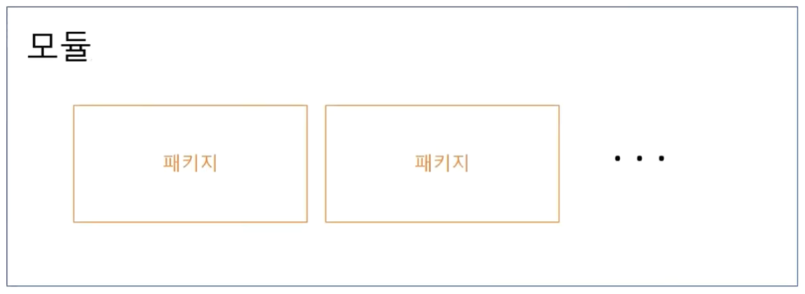

# 16장. 모듈과 패키지

## 모듈

---

### 모듈의 역사

---

- Go 1.11 이전 - 모듈은 없었다
    - `GOPATH` 폴더 하위에 모든 코드를 다 넣었어야 했다.
- Go 1.11 - 모듈이 소개됨. 하지만 미완성
- Go 1.13 - 모듈의 완성
- Go 1.16 - 모듈이 기본(default) 사양이 됨.

### 모듈은 패키지의 모음

---



- 1개의 모듈에 1개 이상의 패키지가 포함되어 있다.

## 패키지란

---

- 코드를 묶는 단위
- 모든 코드는 반드시 패키지로 묶여야 한다.

### 프로그램이란

---

- 실행 시작 지점을 포함한 패키지
    - 즉 `main` 함수를 포함한 `main` 패키지

- 프로그램을 더블클릭 하면 OS는 얘를 프로세스가 메모리에 로드해서 적재, 실행한다.
    - 프로세스: OS에서 실행되고 있는 인스턴스(주체). 독립적인 상태를 가지고 있다.

### Main 패키지가 아닌 그외 패키지

---

- 실행 시작 지점을 포함하지 않은 패키지로,
    - 프로그램의 보조 패키지로 동작

### 예를 들면

---


### 패키지 사용하기

---

- ex16.1.go
    
    ```go
    package main
    
    import (
    	"fmt"
    	"math/rand"
    )
    
    func main() {
    	fmt.Println(rand.Int())
    }
    ```
    
- 실행
    
    ```powershell
    yoonhee@Yoonhee ex16.1 % ./ex16.1
    9195771400414183026
    ```
    
    - 외부 패키지를 가져와서 쓸 때는 `import`를 통해서 가져온다.

### 겹치는 패키지명

---


- 별칭을 부여해서 쓸 수 있다.

### 사용하지 않는 패키지 포함하기

---


- 왜 사용하지 않는 패키지를 포함해야 하는가?
    - 패키지 초기화에 따른 부가효과를 위해서

### 따라하기

---

- Go 모듈 만들고 외부 패키지 활용하기
1. goprojects/usepkg 폴더 생성
2. `go mod init goprojects/usepkg`
3. `mkdir custompkg`
4. Custompkg.go
5. `mkdir program`
6. usepkg.go
7. `go mod tidy`: 필요한 외부 패키지들 다운로드
    
    ```powershell
    yoonhee@Yoonhee usepkg % go mod tidy
    go: finding module for package github.com/tuckersGo/musthaveGo/ch16/expkg
    go: finding module for package github.com/guptarohit/asciigraph
    go: downloading github.com/tuckersGo/musthaveGo v1.0.0
    go: downloading github.com/guptarohit/asciigraph v0.7.1
    go: downloading github.com/tuckersGo/musthaveGo/ch16/expkg v0.0.0-20231030141649-380a04ad7102
    go: found github.com/guptarohit/asciigraph in github.com/guptarohit/asciigraph v0.7.1
    go: found github.com/tuckersGo/musthaveGo/ch16/expkg in github.com/tuckersGo/musthaveGo/ch16/expkg v0.0.0-20231030141649-380a04ad7102
    ```
    
    ```powershell
    yoonhee@Yoonhee program % go env
    ...
    # 다운받은 패키지들은 여기 하위로 간다.
    GOPATH='/Users/yoonhee/.gvm/pkgsets/system/global'
    ...
    ```
    
    
    
8. `go build` 후 실행
    
    
    
    ```go
    package custompkg
    
    import "fmt"
    
    func PrintCustom() {
    	fmt.Println("This is custom package")
    }
    ```
    
    ```go
    package main
    
    import (
    	"fmt"
    	"goprojects/usepkg/custompkg"
    
    	"github.com/guptarohit/asciigraph"
    	"github.com/tuckersGo/musthaveGo/ch16/expkg"
    )
    
    func main() {
    	custompkg.PrintCustom()
    	expkg.PrintSample()
    
    	data := []float64{3, 4, 5, 6, 9, 7, 5, 8, 5, 10, 2, 7, 2, 5, 6}
    	graph := asciigraph.Plot(data)
    	fmt.Println(graph)
    }
    ```
    
    ```powershell
    yoonhee@Yoonhee usepkg % cd program
    yoonhee@Yoonhee program % go build
    yoonhee@Yoonhee program % ./program
    This is custom package
    This is Github expkg Sample
     10.00 ┤        ╭╮
      9.00 ┤   ╭╮   ││
      8.00 ┤   ││ ╭╮││
      7.00 ┤   │╰╮││││╭╮
      6.00 ┤  ╭╯ │││││││ ╭
      5.00 ┤ ╭╯  ╰╯╰╯│││╭╯
      4.00 ┤╭╯       ││││
      3.00 ┼╯        ││││
      2.00 ┤         ╰╯╰╯
    ```
    

## 패키지 외부 공개

---

- 패키지 내 타입, 전역변수, 상수, 함수, 메서드 등을 외부로 공개해서 사용할 수 있다.
    - 대문자로 시작하면 외부 공개
    - 소문자로 시작하면 비공개
- 함수명, 변수명을 한글이 아닌 영어로 해야 한다. (외부에서 인식이 안됨)

## 패키지 초기화

---

- 패키지가 프로그램에 포함되어 초기화 될 때
    - 패키지 내 `init()`가 한 번만 호출된다.
- `init()`를 통해서 패키지 내 전역 변수를 초기화 한다.

### 따라하기

---

- usepkg 하위에 exinit 만들고 그 하위에 exinit.go 만든다.
    
    ```go
    package exinit
    
    import "fmt"
    
    var (
    	a = c + b
    	b = f()
    	c = f()
    	d = 3
    )
    
    func init() {
    	d++
    	fmt.Println("exinit.init function")
    }
    
    func f() int {
    	d++
    	fmt.Println("f() d:", d)
    	return d
    }
    
    func PrintD() {
    	fmt.Println("d:", d)
    }
    ```
    
- usepkg/program 하위에 usepkg.go 수정 실행한다.
    
    ```go
    package main
    
    import (
    	"goprojects/usepkg/custompkg"
    	"goprojects/usepkg/exinit"
    )
    
    func main() {
    	custompkg.PrintCustom()
    
    	exinit.PrintD()
    }
    ```
    
    ```powershell
    yoonhee@Yoonhee program % ./program 
    f() d: 4
    f() d: 5
    exinit.init function
    This is custom package
    d: 6
    ```
    
    - 패키지 초기화 하려고 변수, 함수 찾아간다.
    - `This is custom package`: 초기화 끝난 후 `main` 함수 실행한다.
- `init()`: 한 번만 호출된다.
    - 서로가 서로를 `import`하면 `import cycle not allowed` 에러 뜬다.