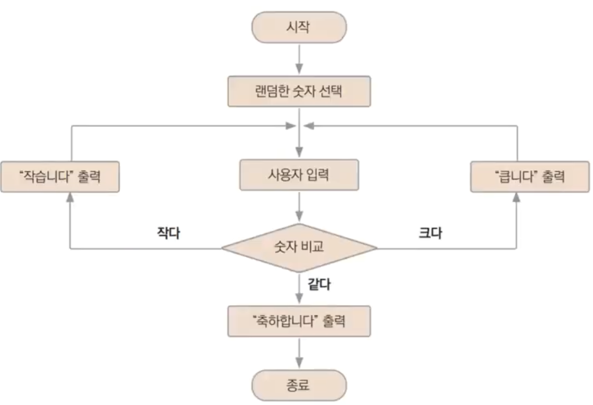

# 17장. 숫자맞추기 게임

## 만들려는 것

---

1. 0~99 사이 랜덤한 숫자 생성
2. 사용자 입력
3. 입력값이 크면 “큽니다” 작으면 “작습니다” 출력 - 2번 반복
4. 입력값이 같으면 프로그램 종료

## 순서도

---



## 랜덤

---

- “`math/rand`” 패키지 사용
- `rand.Seed(seed int64)` 함수로 랜덤 시드(Seed) 설정
- `rand.Intn(n int) int` 함수로 0~(n-1) 사이의 값 생성

### 무엇을 랜덤 시드로 하면 좋은가?

---

- 프로그램 실행시마다 계속 변화하는 값: 시각
    - “`time`” 패키지는 시간과 관련된 기능 제공
    - `time.Now()`: Time 현재 시각 제공
    - `func (t Time) UnixNano() int64`: Time 객체 t의 1970년 1월 1일부터 현재까지 경과된 시간을 nano seconds 단위로 반환

## `time` 패키지

---

- 시각을 나타내는 `Time` 객체
- 시간을 나타내는 `Duration` 객체
- 타임존을 나타내는 `Location`

- 예제: [https://play.golang.org](https://go.dev/play/) 실행
    
    ```go
    package main
    
    import (
    	"fmt"
    	"time"
    )
    
    func main() {
    	loc, _ := time.LoadLocation("Asia/Seoul")
    	const longForm = "Jan 2, 2006 at 3:04pm"
    	t1, _ := time.ParseInLocation(longForm, "Jun 13, 2021 at 10:00pm", loc)
    	fmt.Println(t1, t1.Location(), t1.UTC())
    
    	const shortForm = "2006-Jan-02"
    	t2, _ := time.Parse(shortForm, "2021-Jun-14")
    	fmt.Println(t2, t2.Location())
    
    //	t3, err := time.Parse("2006-06-01 15:20:21", "2021-06-14 20:04:05")
    	t3, err := time.Parse("2006-01-02 15:04:05", "2021-06-14 20:04:05")
    	if err != nil {
    		fmt.Println(err)
    	}
    	fmt.Println(t3, t3.Location())
    
    	d := t2.Sub(t1)
    	fmt.Println(d)
    }
    ```
    
    ```powershell
    2021-06-13 22:00:00 +0900 KST Asia/Seoul 2021-06-13 13:00:00 +0000 UTC
    # 2021-06-14 00:00:00 +0000 UTC UTC
    # parsing time "2021-06-14 20:04:05": month out of range
    2021-06-14 00:00:00 +0000 UTC UTC
    0001-01-01 00:00:00 +0000 UTC UTC
    11h0m0s
    ```
    

## 게임

---

- ex17.4.go
    
    ```go
    package main
    
    import (
    	"bufio"
    	"fmt"
    	"math/rand"
    	"os"
    	"time"
    )
    
    const (
    	Balance       = 1000
    	EarnPoint     = 500
    	LosePoint     = 300
    	VictoryPoint  = 5000
    	GameoverPoint = 0
    )
    
    var stdin = bufio.NewReader(os.Stdin)
    
    func InputIntValue() (int, error) {
    	var n int
    	_, err := fmt.Scanln(&n) // ❶ int 타입값을 입력받습니다.
    	if err != nil {
    		stdin.ReadString('\n') // ❷ 에러 발생시 입력스트림을 비웁니다.
    	}
    	return n, err
    }
    
    func main() {
    	rand.Seed(time.Now().UnixNano())
    
    	balance := Balance
    
    	for {
    		fmt.Print("1~5사이의 값을 입력하세요:")
    		n, err := InputIntValue()
    		if err != nil {
    			fmt.Println("숫자만 입력하세요.")
    		} else if n < 1 || n > 5 {
    			fmt.Println("1~5사이의 값만 입력하세요.")
    		} else {
    			r := rand.Intn(5) + 1
    			if n == r {
    				balance += EarnPoint
    				fmt.Println("축하합니다. 맞추셨습니다. 남은 돈:", balance)
    				if balance >= VictoryPoint {
    					fmt.Println("게임 승리")
    					break
    				}
    			} else {
    				balance -= LosePoint
    				fmt.Println("꽝 아쉽지만 다음 기회를.. 남은 돈:", balance)
    				if balance <= GameoverPoint {
    					fmt.Println("게임 오버")
    					break
    				}
    			}
    		}
    	}
    }
    ```
    
- 실행
    
    ```powershell
    yoonhee@Yoonhee ex17.4 % ./ex17.4
    1~5사이의 값을 입력하세요:2
    꽝 아쉽지만 다음 기회를.. 남은 돈: 700
    1~5사이의 값을 입력하세요:2
    꽝 아쉽지만 다음 기회를.. 남은 돈: 400
    1~5사이의 값을 입력하세요:2
    꽝 아쉽지만 다음 기회를.. 남은 돈: 100
    1~5사이의 값을 입력하세요:2
    축하합니다. 맞추셨습니다. 남은 돈: 600
    1~5사이의 값을 입력하세요:2
    꽝 아쉽지만 다음 기회를.. 남은 돈: 300
    1~5사이의 값을 입력하세요:2
    축하합니다. 맞추셨습니다. 남은 돈: 800
    1~5사이의 값을 입력하세요:2
    꽝 아쉽지만 다음 기회를.. 남은 돈: 500
    1~5사이의 값을 입력하세요:2
    꽝 아쉽지만 다음 기회를.. 남은 돈: 200
    1~5사이의 값을 입력하세요:2
    축하합니다. 맞추셨습니다. 남은 돈: 700
    1~5사이의 값을 입력하세요:2
    꽝 아쉽지만 다음 기회를.. 남은 돈: 400
    1~5사이의 값을 입력하세요:2
    꽝 아쉽지만 다음 기회를.. 남은 돈: 100
    1~5사이의 값을 입력하세요:`
    숫자만 입력하세요.
    1~5사이의 값을 입력하세요:2
    꽝 아쉽지만 다음 기회를.. 남은 돈: -200
    게임 오버
    ```