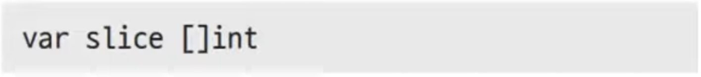

# 18장. 슬라이스

## 슬라이스

---

- 슬라이스는 Go에서 제공하는 동적 배열 타입입니다.
    - 배열의 사이즈가 계속 바뀔 수 있다.
    - ex> 자바의 `ArrayList`

### 슬라이스 선언

---



- slice: 변수명
    - `slice := []int{….}`: 이렇게 선언해도 된다.

- ex18.1.go - bug 버전
    
    ```go
    package main
    
    import "fmt"
    
    func main() {
    	var slice []int
    
    	if len(slice) == 0 {
    		fmt.Println("slice is empty", slice)
    	}
    
    	slice[1] = 10
    	fmt.Println(slice)
    }
    ```
    
- 실행
    
    ```powershell
    yoonhee@Yoonhee ex18.1 % ./ex18.1
    slice is empty []
    panic: runtime error: index out of range [1] with length 0
    
    goroutine 1 [running]:
    main.main()
            /Users/yoonhee/kyh1126/goprojects/ex18.1/ex18.1.go:12 +0x84
    ```
    
- ex18.1.go - 개선 버전
    
    ```go
    package main
    
    import "fmt"
    
    func main() {
    	slice := []int{1, 2, 3}
    
    	if len(slice) == 0 {
    		fmt.Println("slice is empty", slice)
    	}
    
    	slice[1] = 10
    	fmt.Println(slice)
    }
    ```
    
- 실행
    
    ```powershell
    yoonhee@Yoonhee ex18.1 % ./ex18.1
    [1 10 3]
    ```
    

### 슬라이스 초기화

---


- 배열 선언을 주의해야 한다.

### `Make()`를 이용한 초기화

---


- `Make()`: Go 내장함수 cf> `New()`, `len()`, `append()`

### 슬라이스 순회

---


### 슬라이스 요소 추가 - `append()`

---

- 슬라이스에 요소를 추가한 슬라이스 반환
    
    
    
    ex18.2.go
    
    - Go 내장함수
- 실행
    
    ```powershell
    yoonhee@Yoonhee ex18.2 % ./ex18.2
    [1 2 3]
    [1 2 3 4]
    ```
    

### 여러 요소 추가

---


### 슬라이스 동작원리

---


- 파이썬의 `slice`랑은 다르다.
- 내부는 `struct` 타입으로 되어 있다.
    - `len`: 현재 (쓰고있는) 요소 개수
    - `cap`: 최대 몇 개까지 쓸수 있나?
- 슬라이스는 Go에서 제공하는 배열을 가리키는 포인터 타입입니다.

## `make()` 함수

---

- 기본값(`0`)으로 초기화
    
    
    

- 배열 길이 주고 `len`만큼 초기화
    
    
    

## 슬라이스 vs 배열

---

- ex18.4.go
    
    ```go
    package main
    
    import "fmt"
    
    func changeArray(array2 [5]int) {
    	array2[2] = 200
    }
    
    func changeSlice(slice2 []int) {
    	slice2[2] = 200
    }
    
    func main() {
    	array := [5]int{1, 2, 3, 4, 5}
    	slice := []int{1, 2, 3, 4, 5}
    
    	changeArray(array)
    	changeSlice(slice)
    
    	fmt.Println(array)
    	fmt.Println(slice)
    }
    ```
    
- 실행
    
    ```powershell
    yoonhee@Yoonhee ex18.4 % ./ex18.4
    [1 2 3 4 5]
    [1 2 200 4 5]
    ```
    
    - 슬라이스: 배열 길이와 상관없이 항상 똑같은 사이즈가 복사된다.(24byte 고정)
        - 보통 배열에 비해 복사되는 양이 훨씬 작다.

## `append()`

---

### 동작원리1

---

- `append()`는 슬라이스에 요소를 추가한 새로운 슬라이스를 반환
- 기존 슬라이스가 바뀔수도 있고 아닐수도 있다.


- 빈공간이 충분한지 판단하는 방법
    
    
    
    - 기존꺼에 값(`4, 5`) 추가해서 반환한다.
    
    
    
    - `1, 100, 3, 4, 5` 된다.
    
    
    
    - slice1 기준으로 4번째 자리에 넣을 차례이므로 아래와 같이 바꾸게 된다.
    
    
    

❗공간이 부족한 경우에는 공간을 새로 만들기 때문에 기존 배열이 안바뀔 수도 있다.

- 또 다른 슬라이스가 같이 참조하고 있는 경우, 의도치않게 값이 바뀔 수 있다.

### 동작원리2

---


- 독립된 배열이므로 따로 바뀐다.


### 흔히 하는 실수

---

- 예제: [https://go.dev/play/](https://go.dev/play/) 실행
    
    ```go
    package main
    
    import (
    	"fmt"
    )
    
    func addNum(slice []int) {
    	slice = append(slice, 4)
    }
    
    func main() {
    	slice := []int{1, 2, 3}
    	addNum(slice)
    
    	fmt.Println(slice)
    }
    ```
    
    ```powershell
    [1 2 3]
    ```
    
    - addNum의 슬라이스와는 서로 다른 공간이다.

- 예제 - 바꾸고자 하는 버전1
    
    ```go
    package main
    
    import (
    	"fmt"
    )
    
    func addNum(slice *[]int) {
    	*slice = append(*slice, 4)
    }
    
    func main() {
    	slice := []int{1, 2, 3}
    	addNum(&slice)
    
    	fmt.Println(slice)
    }
    ```
    
    ```powershell
    [1 2 3 4]
    ```
    
- 예제 - 바꾸고자 하는 버전2
    
    ```go
    package main
    
    import (
    	"fmt"
    )
    
    func addNum(slice []int) []int {
    	return append(slice, 4)
    }
    
    func main() {
    	slice := []int{1, 2, 3}
    	slice = addNum(slice)
    
    	fmt.Println(slice)
    }
    ```
    
    ```powershell
    [1 2 3, 4]
    ```
    
- 일반적으론 `return` 방식이 더 좋다.
    - 슬라이스는 값 타입이기 때문에 값 타입답게 쓰는게 좋다.
    - 포인터 형태로 쓰지마라.

## 슬라이싱

---

- 슬라이싱은 배열의 일부를 집어내는 기능
- 슬라이싱의 결과가 슬라이스이다.

### 슬라이싱 사용법

---


- 파이썬 슬라이싱하는 방법과 똑같다.
- 시작주소 가리키는 곳 변경해준다.

- ex18.7.go
    
    ```go
    package main
    
    import "fmt"
    
    func main() {
    	array := [5]int{1, 2, 3, 4, 5}
    	slice := array[1:2]
    
    	fmt.Println("array:", array)
    	fmt.Println("slice:", slice, len(slice), cap(slice))
    
    	array[1] = 100
    	fmt.Println("After change second element")
    	fmt.Println("array:", array)
    	fmt.Println("slice:", slice, len(slice), cap(slice))
    
    	slice = append(slice, 500)
    	fmt.Println("After append 500")
    	fmt.Println("array:", array)
    	fmt.Println("slice:", slice, len(slice), cap(slice))
    }
    ```
    
- 실행
    
    ```powershell
    yoonhee@Yoonhee ex18.7 % ./ex18.7
    array: [1 2 3 4 5]
    slice: [2] 1 4
    After change second element
    array: [1 100 3 4 5]
    slice: [100] 1 4
    After append 500
    array: [1 100 500 4 5]
    slice: [100 500] 2 4
    ```
    
    
    
    
    

## 슬라이스를 슬라이싱

---


## 파이썬의 슬라이싱과 다르다!

---


- 파이썬은 슬라이싱하면 새로운 배열이 나온다.

## 처음부터 슬라이싱

---


## 끝까지 슬라이싱

---


## 전체 슬라이싱

---


- 배열있는데 슬라이스로 바꾸고 싶을 때

## 캡사이즈 조절 슬라이싱

---


- `Data`: [2,4], `Len`: 2, `Cap`: 3

## 유용한 슬라이싱 기능 - 복사

---


- ex18.8.go
    
    ```go
    package main
    
    import "fmt"
    
    func main() {
    	slice1 := []int{1, 2, 3, 4, 5}
    	// slice2 := append([]int{}, slice1...)
    	slice2 := make([]int, len(slice1)) // slice1과 같은 길이의 슬라이스 생성
    
    	// copy(slice2, slice1)
    	for i, v := range slice1 { // slice1의 모든 요소값 복사
    		slice2[i] = v
    	}
    
    	slice1[1] = 100 // slice1 요솟값 변경
    	fmt.Println(slice1)
    	fmt.Println(slice2)
    }
    ```
    
- 실행
    
    ```powershell
    yoonhee@Yoonhee ex18.8 % ./ex18.8 
    [1 100 3 4 5]
    [1 2 3 4 5]
    ```
    

### 그냥

---


### `copy()` 사용

---


## 요소 삭제

---


- ex18.10.go - 버전1: `for`
    
    ```go
    package main
    
    import "fmt"
    
    func main() {
    	slice := []int{1, 2, 3, 4, 5, 6}
    	idx := 2 // 삭제할 인덱스
    
    	for i := idx + 1; i < len(slice); i++ { // 요소 앞당기기
    		slice[i-1] = slice[i]
    	}
    	slice = slice[:len(slice)-1] // 슬라이스로 마지막 값을 잘라줍니다.
    
    	fmt.Println(slice)
    }
    ```
    
- 실행
    
    ```powershell
    yoonhee@Yoonhee ex18.10 % ./ex18.10
    [1 2 4 5 6]
    ```
    

### 한줄로

---


- ex18.10.go - 버전2: `append`
    
    ```go
    package main
    
    import "fmt"
    
    func main() {
    	slice := []int{1, 2, 3, 4, 5, 6}
    	idx := 2 // 삭제할 인덱스
    
    	slice = append(slice[:idx], slice[idx+1:]...)
    
    	// for i := idx + 1; i < len(slice); i++ { // 요소 앞당기기
    	// 	slice[i-1] = slice[i]
    	// }
    	// slice = slice[:len(slice)-1] // 슬라이스로 마지막 값을 잘라줍니다.
    
    	fmt.Println(slice)
    }
    ```
    
- 실행
    
    ```powershell
    yoonhee@Yoonhee ex18.10 % ./ex18.10
    [1 2 4 5 6]
    ```
    
- ex18.10.go - 버전3: `copy`
    
    ```go
    package main
    
    import "fmt"
    
    func main() {
    	slice := []int{1, 2, 3, 4, 5, 6}
    	idx := 2 // 삭제할 인덱스
    
    	copy(slice[idx:], slice[idx+1:])
     	slice = slice[:len(slice)-1]
    
    	fmt.Println(slice)
    }
    ```
    
- 실행
    
    ```powershell
    yoonhee@Yoonhee ex18.10 % ./ex18.10
    [1 2 4 5 6]
    ```
    

## 요소 삽입

---


- ex18.11.go - 버전1: `for`
    
    ```go
    package main
    
    import "fmt"
    
    func main() {
    	slice := []int{1, 2, 3, 4, 5, 6}
    
    	// 맨 뒤에 요소 추가
    	slice = append(slice, 0)
    
    	idx := 2 // 추가하려는 위치
    
    	// 맨 뒤부터 추가하려는 위치까지 값을 하나씩 옮겨줍니다.
    	for i := len(slice) - 2; i >= idx; i-- {
    		slice[i+1] = slice[i]
    	}
    
    	// 값 변경
    	slice[idx] = 100
    	fmt.Println(slice)
    }
    ```
    
- 실행
    
    ```powershell
    yoonhee@Yoonhee ex18.11 % ./ex18.11
    [1 2 100 3 4 5 6]
    ```
    

### 한줄로

---


- ex18.11.go - 버전2: `append`
    
    ```go
    package main
    
    import "fmt"
    
    func main() {
    	slice := []int{1, 2, 3, 4, 5, 6}
    	idx := 2 // 추가하려는 위치
    
    	// 맨 뒤에 요소 추가
    	slice = append(slice[:idx], append([]int{100}, slice[idx:]...)...)
    
    	fmt.Println(slice)
    }
    ```
    
- 실행
    
    ```powershell
    yoonhee@Yoonhee ex18.11 % ./ex18.11
    [1 2 100 3 4 5 6]
    ```
    
    - `append([]int{100}, slice[idx:]...)`: 임시버퍼
        - 중간에 메모리 한 번 더 쓴다.
        - `for`문 방식은 메모리 더 안 썼다.

### 불필요한 메모리 할당 없이

---


- ex18.11.go - 버전3: `copy`
    
    ```go
    package main
    
    import "fmt"
    
    func main() {
    	slice := []int{1, 2, 3, 4, 5, 6}
    	idx := 2 // 추가하려는 위치
    
    	slice = append(slice, 0)
    	copy(slice[idx+1:], slice[idx:])
    	slice[idx] = 100
    
    	fmt.Println(slice)
    }
    ```
    
- 실행
    
    ```powershell
    yoonhee@Yoonhee ex18.11 % ./ex18.11
    [1 2 100 3 4 5 6]
    ```
    
    - `for`문 방식처럼 불필요한 메모리 할당이 없다.

## 슬라이스 정렬

---

### `int` 슬라이스

---

- ex18.12.go
    
    ```go
    package main
    
    import (
    	"fmt"
    	"sort"
    )
    
    func main() {
    	s := []int{5, 2, 6, 3, 1, 4} // 정렬되지 않은 슬라이스
    	sort.Ints(s)                 // 정렬
    	fmt.Println(s)
    }
    ```
    
- 실행
    
    ```powershell
    yoonhee@Yoonhee ex18.12 % ./ex18.12 
    [1 2 3 4 5 6]
    ```
    

### 구조체 슬라이스

---


- primitive type: `int`, `float`, `string`

- ex18.13.go
    
    ```go
    package main
    
    import (
    	"fmt"
    	"sort"
    )
    
    type Student struct {
    	Name string
    	Age  int
    }
    
    // []Student의 별칭 타입 Students
    type Students []Student
    
    func (s Students) Len() int           { return len(s) }
    func (s Students) Less(i, j int) bool { return s[i].Age < s[j].Age } // 나이 비교
    func (s Students) Swap(i, j int)      { s[i], s[j] = s[j], s[i] }
    
    func main() {
    	s := []Student{
    		{"화랑", 31}, {"백두산", 52}, {"류", 42},
    		{"켄", 38}, {"송하나", 18}}
    
    	sort.Sort(Students(s)) // 정렬
    	fmt.Println(s)
    }
    // Sort sorts data in ascending order as determined by the Less method.
    // It makes one call to data.Len to determine n and O(n*log(n)) calls to
    // data.Less and data.Swap. The sort is not guaranteed to be stable.
    //
    // Note: in many situations, the newer [slices.SortFunc] function is more
    // ergonomic and runs faster.
    // func Sort(data Interface) {
    // 	n := data.Len()
    // 	if n <= 1 {
    // 		return
    // 	}
    // 	limit := bits.Len(uint(n))
    // 	pdqsort(data, 0, n, limit)
    // }
    ```
    
- 실행
    
    ```powershell
    yoonhee@Yoonhee ex18.13 % ./ex18.13 
    [{송하나 18} {화랑 31} {켄 38} {류 42} {백두산 52}]
    ```
    
    - `Len`, `Less`, `Swap` 3개 메소드 정의가 되면 정렬 가능하다.