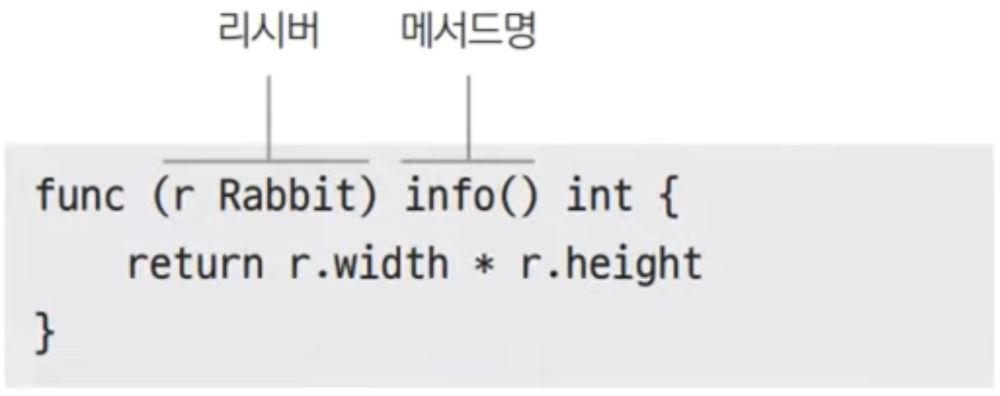

# 19장. 메서드

## 메서드

---

- 메서드는 타입에 속한 함수 입니다.

### 메서드 선언

---



- 리시버는 모든 패키지 지역 타입이 가능하다.
    - 구조체, 별칭 타입 등

- ex19.1.go
    
    ```go
    package main
    
    import "fmt"
    
    type account struct {
    	balance int
    }
    
    func withdrawFunc(a *account, amount int) {
    	a.balance -= amount
    }
    
    func (a *account) withdrawMethod(amount int) {
    	a.balance -= amount
    }
    
    func main() {
    	a := &account{100} // *account
    	withdrawFunc(a, 30)
    	a.withdrawMethod(30)
    	fmt.Println(a.balance)
    }
    
    ```
    
- 실행
    
    ```powershell
    yoonhee@Yoonhee ex19.1 % go mod init goprojects/ex19.1
    go: creating new go.mod: module goprojects/ex19.1
    go: to add module requirements and sums:
            go mod tidy
    yoonhee@Yoonhee ex19.1 % go build
    yoonhee@Yoonhee ex19.1 % ./ex19.1
    40
    ```
    

- ex19.2.go
    
    ```go
    package main
    
    import "fmt"
    
    type myInt int
    
    func (m myInt) Add(a int) myInt {
    	rst := int(m) + a
    	return myInt(rst)
    }
    
    func addFunc(m myInt, a int) myInt {
    	rst := int(m) + a
    	return myInt(rst)
    }
    
    func main() {
    	var a myInt
    	fmt.Println(a.Add(10))
    	fmt.Println(addFunc(a, 10))
    }
    ```
    
- 실행
    
    ```powershell
    yoonhee@Yoonhee ex19.2 % ./ex19.2
    10
    10
    ```
    
    - 패키지 지역 내의 타입(ex> 별칭 타입)들만 메소드를 가질 수 있다.

## 객체로 진화

---

- 객체(Object)란 데이터(State)와 기능(Function)을 묶은 것이다.

### 절차 중심에서 관계 중심으로

---


### 클래스간 상호 작용

---


- 메소드: 객체 사이의 관계(상호 작용)를 정의하는 것

## 포인터 타입 메서드 vs 값 타입 메서드

---

- ex19.3.go
    
    ```go
    package main
    
    import "fmt"
    
    type account struct {
    	balance   int
    	firstname string
    	lastname  string
    }
    
    func (a1 *account) withdrawPointer(amount int) {
    	a1.balance -= amount
    }
    
    func (a2 account) withdrawValue(amount int) {
    	a2.balance -= amount
    }
    
    func (a2 account) withdrawValue2(amount int) account {
    	a2.balance -= amount
    	return a2
    }
    
    func main() {
    	var mainA *account = &account{100, "joe", "park"}
    	mainA.withdrawPointer(30)
    	fmt.Println(mainA.balance)
    
    	mainA.withdrawValue(20) // (*mainA).withdrawValue(20)와 동일
    	fmt.Println(mainA.balance)
    
    	*mainA = mainA.withdrawValue2(20)
    	fmt.Println(mainA.balance)
    }
    
    ```
    
- 실행
    
    ```powershell
    yoonhee@Yoonhee ex19.3 % ./ex19.3
    70
    70
    50
    ```
    

### 언제 값타입을 쓰고 언제 포인터 타입을 쓰는가?

---

- `time` 패키지 내 `Time`와 `Timer`의 차이 (공홈 문서)
    - `Time`: 시각. 값 타입으로 주로 쓰인다.
    - `Timer`: 타이머. 포인터 타입으로 주로 쓰인다.

- Go에서는 생성자, 소멸자가 없다.
    - C++: 생성자, 소멸자 둘 다 있다. / Java: 생성자만 있고 소멸자가 없다.
    - 생성자처럼 작동하는 Timer 객체 인스턴스를 반환하는 함수를 만들어줘야 한다.
        
        
        

## Embedded field 메서드

---

- 예제: [https://go.dev/play/](https://go.dev/play/) 실행
    
    ```go
    package main
    
    import "fmt"
    
    type User struct {
    	Name string
    	Age  int
    }
    
    func (u User) String() string {
    	return fmt.Sprintf("%s, %d", u.Name, u.Age)
    }
    
    type VIPUser struct {
    	User // embedded field
    	VIPLevel int
    }
    
    func (v VIPUser) vipLevel() int {
    	return v.VIPLevel
    }
    
    // func (v VIPUser) String() string {
    // 	return fmt.Sprintf("%d", v.VIPLevel)
    // } // 얘가 존재하면 5가 찍힌다.
    
    func main() {
    	vip := VIPUser{User{"Hwarang", 34}, 5}
    	fmt.Println(vip.String())
    }
    ```
    
    ```powershell
    Hwarang, 34
    ```
    
    - `fmt`.`Sprintf`: 안 찍고 문자열을 반환한다.
    - embedded field의 메소드는 그냥 점 찍고 호출해도 호출이 된다.
        - 이름이 있으면 그 이름 통해서 호출해야 한다.

- Go에선 상속이 없다.
    - embedded field를 상속처럼 생각하면 큰일난다.