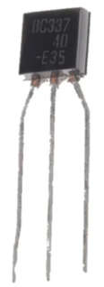

# 1장. 컴퓨터 원리

## 트랜지스터

---

- 컴퓨터를 이루는 가장 기본 소자
    
    
    

- 이전에 진공관: 최초의 컴퓨터 애니악이 진공관 통해서 만들어졌다.
    - 단점
        - 부피가 크고 무겁다.
        - 가격이 비싸다.
        - 전기를 많이 먹는다.
        - 고장이 잘 난다.
    - 하지만 오디오 분야에선 귀하신 몸

### 트랜지스터 원리

---

- n형 실리콘: Emitter(왼다리), Collector(오른다리)
- p형 실리콘: Base(가운데다리)
    - 방파제(댐) 역할
- 트랜지스터의 스위치 동작: base에 전압이 걸리냐(도체), 걸리지 않느냐(부도체)에 따라 전기가 흐를 수 있고 없고를 결정 → 반도체

### 1과 0

---

- 트랜지스터로 불이 켜졌다(1), 꺼졌다(0) 표현 가능 → 2진수

## 트랜지스터로 논리소자를

---

- AND, OR, XOR, NOT 등등

### AND

---

### OR

---

### XOR

---

### NOT

---

## 논리소자를 이용해서 계산기로

---

- 1비트 가산기(ADD)
    
    
    
    
    

### 1비트 가산기

---

### 정리하면

---

## 계산기에서 컴퓨터로

---

- 프로그램이란?
    - 정해진 연산을 정해진 순서대로 실행하는 것

## 튜링 머신

---

- 프로그램을 컴퓨터 즉, 중앙처리장치(CPU)가 읽어서 처리한다.

## 폰 노이만 구조

---

- 현재 컴퓨터의 구조

## 결국 컴퓨터는

---

## 프로그램 동작 구조

---

- 하드디스크에 실행파일이 있다.
- 명령어 및 근처 데이터를 메모리에서 읽어서 캐시에 갖다놓는다. 연산 속도가 빨라진다.
    - 캐시미스가 많이 일어나면 속도가 느려진다. 다시 메모리에서 캐시로 데이터 가져온다.
- 데이터 locality: 연관된 데이터가 묶여져 있는 것
- 레지스터: 8바이트(64비트)
    - 이전엔 4바이트(32비트) 컴퓨터가 있었다.
    - 레지스터 크기가 크면 연산 속도가 증가한다.