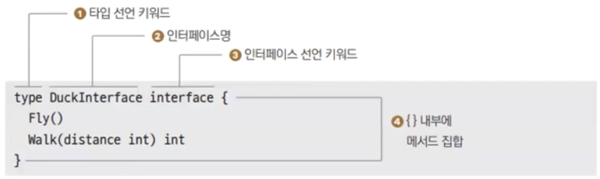

# 20장. 인터페이스

## 인터페이스

---

- 구체화된 객체(Conrete object)가 아닌 추상화된 상호작용으로 관계를 표현
    - Go는 Method로 관계를 표현한다. 그런데 구현이 있다보니 관계만 표현하진 않는다.
    - 인터페이스가 관계만을 표현한다.

### 인터페이스 선언

---



- 인터페이스도 타입이다.

### 인터페이스 규칙

---

1. 메서드는 반드시 메서드명이 있어야 합니다.
2. 매개변수와 반환이 다르더라도 이름이 같은 메서드는 있을 수 없습니다.
3. 인터페이스에서는 메서드 구현을 포함하지 않습니다.


- ex20.1.go
    
    ```go
    package main
    
    import "fmt"
    
    type Stringer interface {
    	String() string
    }
    
    type Student struct {
    	Name string
    	Age  int
    }
    
    func (s Student) String() string {
    	return fmt.Sprintf("안녕! 나는 %d살 %s라고 해", s.Age, s.Name)
    }
    
    func (s Student) GetAge() int {
    	return s.Age
    }
    
    func main() {
    	student := Student{"철수", 12}
    	var stringer Stringer
    
    	stringer = student
    	fmt.Printf("%s\n", stringer.String())
    
    	// stringer.GetAge() // interface의 함수만 호출할 수 있다.
    }
    ```
    
- 실행
    
    ```powershell
    yoonhee@Yoonhee ex20.1 % ./ex20.1 
    안녕! 나는 12살 철수라고 해
    ```
    
    - Student가 String()이라는 메소드를 구현하고 있으므로 인터페이스에 할당할 수 있다.

## 인터페이스 왜 쓰나?

---


### 예제

---

- ch20 디렉토리 만들고 fedex 디렉토리 만들고 fedex.go 작성
    
    ```go
    package fedex
    
    import "fmt"
    
    type FedexSender struct {
    	// ...
    }
    
    func (f *FedexSender) Send(parcel string) {
    	fmt.Printf("Fedex sends %s parcel\n", parcel)
    }
    ```
    
    ```powershell
    yoonhee@Yoonhee ch20 % go mod init goprojects/ch20
    go: creating new go.mod: module goprojects/ch20
    go: to add module requirements and sums:
            go mod tidy
    ```
    
- ex20.2 디렉토리 만들고 ex20.2.go 작성
    
    ```go
    package main
    
    import "goprojects/ch20/fedex"
    
    func SendBook(name string, sender *fedex.FedexSender) {
    	sender.Send(name)
    }
    
    func main() {
    	sender := &fedex.FedexSender{}
    	SendBook("어린 왕자", sender)
    	SendBook("그리스인 조르바", sender)
    }
    ```
    
    ```powershell
    yoonhee@Yoonhee ch20 % cd ex20.2
    yoonhee@Yoonhee ex20.2 % go build
    yoonhee@Yoonhee ex20.2 % ./ex20.2 
    Fedex sends 어린 왕자 parcel
    Fedex sends 그리스인 조르바 parcel
    ```
    
- 갑자기 더 싼 우체국 택배가 생겼다고 하자. koreaPost 디렉토리 만들고 post.go 작성
    
    ```go
    package koreapost
    
    import "fmt"
    
    type PostSender struct {
    	// ...
    }
    
    func (k *PostSender) Send(parcel string) {
    	fmt.Printf("우체국에서 택배 %s를 보냅니다.\n", parcel)
    }
    ```
    
- ex20.2.go 변경
    
    ```go
    package main
    
    import (
    	koreapost "goprojects/ch20/koreaPost"
    )
    
    // func SendBook(name string, sender *fedex.FedexSender) {
    // 	sender.Send(name)
    // }
    
    func SendBook(name string, sender *koreapost.PostSender) {
    	sender.Send(name)
    }
    
    func main() {
    	// sender := &fedex.FedexSender{}
    	sender := &koreapost.PostSender{}
    	SendBook("어린 왕자", sender)
    	SendBook("그리스인 조르바", sender)
    }
    ```
    
- 실행
    
    ```powershell
    yoonhee@Yoonhee ex20.2 % ./ex20.2
    우체국에서 택배 어린 왕자를 보냅니다.
    우체국에서 택배 그리스인 조르바를 보냅니다.
    ```
    
    → 산탄총 코드: 사용하는 부분을 전부 다 바꿔줘야 하는 코드
    

👉 인터페이스 방식으로 바꾸자

- ex20.2.go 변경
    
    ```go
    package main
    
    import (
    	"goprojects/ch20/fedex"
    	"goprojects/ch20/koreapost"
    )
    
    // func SendBook(name string, sender *fedex.FedexSender) {
    // 	sender.Send(name)
    // }
    
    type Sender interface {
    	Send(parcel string)
    }
    
    // func SendBook(name string, sender *koreapost.PostSender) {
    // 	sender.Send(name)
    // }
    
    func SendBook(name string, sender Sender) {
    	sender.Send(name)
    }
    
    func main() {
    	sender1 := &fedex.FedexSender{}
    	sender2 := &koreapost.PostSender{}
    
    	SendBook("어린 왕자", sender1)
    	SendBook("그리스인 조르바", sender1)
    
    	SendBook("어린 왕자", sender2)
    	SendBook("그리스인 조르바", sender2)
    }
    ```
    
- 실행
    
    ```powershell
    yoonhee@Yoonhee ex20.2 % ./ex20.2 
    Fedex sends 어린 왕자 parcel
    Fedex sends 그리스인 조르바 parcel
    우체국에서 택배 어린 왕자를 보냅니다.
    우체국에서 택배 그리스인 조르바를 보냅니다.
    ```
    

## 추상화란?

---

- 내부 동작을 감춰서 서비스 제공자와 사용자 모두에게 자유를 주는 방식을 추상화(Abstraction)라고 합니다.
    - 택배를 보낼 때 Fedex로 보내든, 우체국으로 보내든 내부 발송 과정을 자세히 몰라도 보낼 수 있듯이 추상화를 하면 의존성을 끊을 수 있습니다.

### 추상 계층

---


## 덕타이핑

---

- 만약 어떤 새를 봤는데 그 새가 오리처럼 걷고 오리처럼 날고 오리처럼 소리내면
    - 나는 그 새를 오리라고 부르겠다.
- 자바, 파이썬은 제공하지 않는 방식
    - `implements xx` 안해도 된다.


- 인터페이스 구현 여부를 타입 선언 시 하는게 아니라 인터페이스에 대입을 할 때(컴파일 타임)에 체크한다.
    - 런타임 체크가 아니라서 실행중에 성능을 쓰진 않는다.

### 사용자 중심의 코딩

---

- 인터페이스 구현 여부를 타입 선언시 하지 않고, 인터페이스가 사용될 때 결정하기 때문에 서비스 제공자는 구체화된 객체를 제공하고 사용자가 필요에 따라 인터페이스를 정의해서 사용할 수 있다.


## 인터페이스 사이즈

---


- 인터페이스가 가리키고 있는 인스턴스의 메모리 주소
- 어떤 타입을 가리키든, 16바이트다.

## 인터페이스 기능 더 알기

---

### 포함된 인터페이스

---


### 빈 인터페이스

---


- 모든 타입이 모두 가능하다.

- ex20.5.go
    
    ```go
    package main
    
    import "fmt"
    
    func PrintVal(v interface{}) { // 빈 인터페이스를 인수로 받는 함수
    	switch t := v.(type) {
    	case int:
    		fmt.Printf("v is int %d\n", int(t))
    	case float64:
    		fmt.Printf("v is float64 %f\n", float64(t))
    	case string:
    		fmt.Printf("v is string %s\n", string(t))
    	default:
    		// 그외 타입인 경우 타입과 값을 출력합니다.
    		fmt.Printf("Not supported type: %T:%v\n", t, t)
    	}
    }
    
    type Student struct {
    	Age int
    }
    
    func main() {
    	PrintVal(10)          // int
    	PrintVal(3.14)        // float64
    	PrintVal("Hello")     // string
    	PrintVal(Student{15}) // Student
    }
    ```
    
- 실행
    
    ```powershell
    yoonhee@Yoonhee ex20.5 % ./ex20.5
    v is int 10
    v is float64 3.140000
    v is string Hello
    Not supported type: main.Student:{15}
    ```
    

### 인터페이스 기본값

---

- `nil`

- ex20.6.go
    
    ```go
    // ch20/ex20.6/ex20.6.go
    package main
    
    type Attacker interface {
    	Attack()
    }
    
    func main() {
    	var att Attacker // 기본값은 nil입니다.
    	att.Attack()     // att가 nil이기 때문에 런타임 에러가 발생합니다.
    }
    ```
    
- 실행
    
    ```powershell
    yoonhee@Yoonhee ex20.6 % ./ex20.6
    panic: runtime error: invalid memory address or nil pointer dereference
    [signal SIGSEGV: segmentation violation code=0x2 addr=0x0 pc=0x1045148cc]
    
    goroutine 1 [running]:
    main.main()
            /Users/yoonhee/kyh1126/goprojects/ex20.6/ex20.6.go:10 +0x1c
    ```
    

### 인터페이스 타입 변환

---


- ex20.7.go
    
    ```go
    package main
    
    import "fmt"
    
    type Stringer interface {
    	String() string
    }
    
    type Student struct {
    	Age int
    }
    
    func (s *Student) String() string {
    	return fmt.Sprintf("Student Age:%d", s.Age)
    }
    
    func PrintAge(stringer Stringer) {
    
    	s := stringer.(*Student)       // *Student 타입으로 타입 변환
    	fmt.Printf("Age: %d\n", s.Age)
    
    }
    
    func main() {
    	s := &Student{15} // *Student 타입 변수 s 선언 및 초기화
    
    	PrintAge(s) // 변수 s 를 인터페이스 인수로 PrintAge() 함수 호출
    }
    ```
    
- 실행
    
    ```powershell
    yoonhee@Yoonhee ex20.7 % ./ex20.7
    Age: 15
    ```
    
    - 타입 변환 시 안맞으면 `panic` 런타임 에러가 난다.

### 인터페이스 변환시 컴파일 에러

---

- ex20.8
    
    ```go
    package main
    
    type Stringer interface {
    	String() string
    }
    
    type Student struct {
    }
    
    func main() {
    	var stringer Stringer
    	stringer.(*Student) // 빌드 타임 에러 발생. impossible type assertion: stringer.(*Student)
    	// *Student does not implement Stringer (missing method String) compiler-ImpossibleAssert
    }
    ```
    
    - 그 타입으로 인터페이스 사용 자체가 불가능하면 `panic` 컴파일 에러가 난다.

### 다른 인터페이스 타입으로 변환

---

- ex20.10
    
    ```go
    package main
    
    type Reader interface {
    	Read()
    }
    
    type Closer interface {
    	Close()
    }
    
    type File struct {
    }
    
    func (f *File) Read() {
    }
    
    func ReadFile(reader Reader) {
    	// Reader 인터페이스 변수를 Closer 인터페이스로 타입 변환합니다. 런타임 에러 발생
    	c := reader.(Closer)
    	c.Close()
    }
    
    func main() {
    	// File 포인터 인스턴스를 ReadFile() 함수의 인수로 사용합니다.
    	file := &File{}
    	ReadFile(file)
    }
    ```
    
- 실행
    
    ```powershell
    yoonhee@Yoonhee ex20.10 % ./ex20.10
    panic: interface conversion: *main.File is not main.Closer: missing method Close
    
    goroutine 1 [running]:
    main.ReadFile(...)
            /Users/yoonhee/kyh1126/goprojects/ex20.10/ex20.10.go:20
    main.main()
            /Users/yoonhee/kyh1126/goprojects/ex20.10/ex20.10.go:27 +0x64
    ```
    
    - `panic` 런타임 에러 발생
- Closer 인터페이스 구현하면 변환 가능해진다. 아래 추가 시 성공
    
    ```go
    func (f *File) Close() {
    	fmt.Println("Close()")
    }
    ```
    
    ```powershell
    yoonhee@Yoonhee ex20.10 % ./ex20.10
    Close()
    ```
    

### 타입 변환 성공 여부 반환

---


- ex20.10.go - 개선 버전 (성공)
    
    ```go
    package main
    
    import "fmt"
    
    type Reader interface {
    	Read()
    }
    
    type Closer interface {
    	Close()
    }
    
    type File struct {
    }
    
    func (f *File) Read() {
    }
    
    func (f *File) Close() {
    	fmt.Println("Close()")
    }
    
    func ReadFile(reader Reader) {
    	// Reader 인터페이스 변수를 Closer 인터페이스로 타입 변환합니다.
    	// 런타임 에러가 발생합니다.
    	c, ok := reader.(Closer)
    	fmt.Println(c, ok)
    
    	if ok {
    		c.Close()
    	}
    }
    
    func main() {
    	// File 포인터 인스턴스를 ReadFile() 함수의 인수로 사용합니다.
    	file := &File{}
    	ReadFile(file)
    }
    ```
    
    ```powershell
    yoonhee@Yoonhee ex20.10 % ./ex20.10
    &{} true
    Close()
    ```
    
- ex20.10.go - 개선 버전 (실패)
    
    ```go
    package main
    
    import "fmt"
    
    type Reader interface {
    	Read()
    }
    
    type Closer interface {
    	Close()
    }
    
    type File struct {
    }
    
    func (f *File) Read() {
    }
    
    func ReadFile(reader Reader) {
    	// Reader 인터페이스 변수를 Closer 인터페이스로 타입 변환합니다.
    	// 런타임 에러가 발생합니다.
    	c, ok := reader.(Closer)
    	fmt.Println(c, ok)
    
    	if ok {
    		c.Close()
    	}
    }
    
    func main() {
    	// File 포인터 인스턴스를 ReadFile() 함수의 인수로 사용합니다.
    	file := &File{}
    	ReadFile(file)
    }
    ```
    
    ```powershell
    yoonhee@Yoonhee ex20.10 % ./ex20.10
    <nil> false
    ```
    

### 관용 표현

---


- ex20.10.go - 개선 버전 (성공)
    
    ```go
    package main
    
    import "fmt"
    
    type Reader interface {
    	Read()
    }
    
    type Closer interface {
    	Close()
    }
    
    type File struct {
    }
    
    func (f *File) Read() {
    }
    
    func (f *File) Close() {
    	fmt.Println("Close()")
    }
    
    //	func ReadFile(reader Reader) {
    //		// Reader 인터페이스 변수를 Closer 인터페이스로 타입 변환합니다.
    //		// 런타임 에러가 발생합니다.
    //		c := reader.(Closer)
    //		c.Close()
    //	}
    func ReadFile(reader Reader) {
    	// Reader 인터페이스 변수를 Closer 인터페이스로 타입 변환합니다.
    	// 런타임 에러가 발생합니다.
    
    	if c, ok := reader.(Closer); ok {
    		c.Close()
    	}
    }
    
    func main() {
    	// File 포인터 인스턴스를 ReadFile() 함수의 인수로 사용합니다.
    	file := &File{}
    	ReadFile(file)
    }
    ```
    
    ```powershell
    yoonhee@Yoonhee ex20.10 % ./ex20.10
    Close()
    ```
