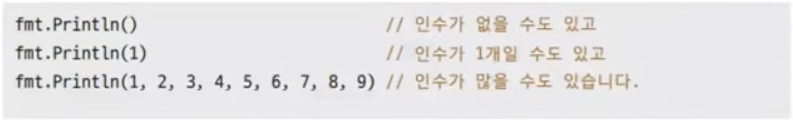

# 21장. 함수고급편

## 가변 인수 함수

---



- `...` 키워드 사용

- ex21.1.go
    
    ```go
    package main
    
    import "fmt"
    
    func sum(nums ...int) int { // 가변 인수를 받는 함수
    	sum := 0
    
    	fmt.Printf("nums 타입: %T\n", nums)
    	for _, v := range nums {
    		sum += v
    	}
    	return sum
    }
    
    func main() {
    	fmt.Println(sum(1, 2, 3, 4, 5))
    	fmt.Println(sum(10, 20))
    	fmt.Println(sum())
    }
    ```
    
- 실행
    
    ```powershell
    yoonhee@Yoonhee ex21.1 % ./ex21.1
    nums 타입: []int
    15
    nums 타입: []int
    30
    nums 타입: []int
    0
    ```
    

## 모든 타입은 빈인터페이스로

---


## `defer` 지연 실행

---


- 함수 종료 전에 실행을 보장

### 언제 쓰나?

---

- 주로 OS 자원을 반납해야 할 때 사용
    
    
    

- ex21.2.go
    
    ```go
    package main
    
    import (
    	"fmt"
    	"os"
    )
    
    func main() {
    
    	f, err := os.Create("test.txt") // 파일 생성
    	if err != nil {
    		fmt.Println("Failed to create a file")
    		return
    	}
    
    	defer fmt.Println("반드시 호출됩니다.") // 지연 수행될 코드
    	defer f.Close()                 // 지연 수행될 코드
    	defer fmt.Println("파일을 닫았습니다")  // 지연 수행될 코드
    
    	fmt.Println("파일에 Hello World를 씁니다.")
    	fmt.Fprintln(f, "Hello World") // 파일에 텍스트를 씁니다.
    }
    ```
    
- 실행
    
    ```powershell
    yoonhee@Yoonhee ex21.2 % ./ex21.2
    파일에 Hello World를 씁니다.
    파일을 닫았습니다
    반드시 호출됩니다.
    ```
    
    - 맨 마지막에 `defer`된 게 먼저 실행된다.(스택)

## 함수 타입 변수

---

- 함수 타입 변수란 함수를 값으로 갖는 변수
    
    
    

### 함수도 시작 주소를 가지고 있다

---

- 즉 함수도 숫자로 표현 가능하다.
    - 숫자이기 때문에 변수의 값으로 가질 수 있다.
- 문제는 타입!

### 함수 타입은 함수 시그니쳐로 표현

---

- 함수 이름과 구현을 제외한 함수 시그니쳐
    
    
    

- ex21.3.go
    
    ```go
    package main
    
    import "fmt"
    
    func add(a, b int) int {
    	return a + b
    }
    
    func mul(a, b int) int {
    	return a * b
    }
    
    func getOperator(op string) func(int, int) int { // op에 따른 함수 타입 반환
    	if op == "+" {
    		return add
    	} else if op == "*" {
    		return mul
    	} else {
    		return nil
    	}
    }
    
    func main() {
    	var operator func(int, int) int // int 타입 인수 2개를 받아서 int 타입 반환을 하는 함수 타입 변수
    	operator = getOperator("*")
    
    	var result = operator(3, 4) // 함수 타입 변수를 사용해서 함수 호출
    	fmt.Println(result)
    }
    ```
    
- 실행
    
    ```powershell
    yoonhee@Yoonhee ex21.3 % ./ex21.3
    12
    ```
    

### 별칭 타입으로 줄여쓰기

---


- ex21.3.go - 개선 버전
    
    ```go
    package main
    
    import "fmt"
    
    func add(a, b int) int {
    	return a + b
    }
    
    func mul(a, b int) int {
    	return a * b
    }
    
    type OpFn func(int, int) int
    
    func getOperator(op string) OpFn { // op에 따른 함수 타입 반환
    	if op == "+" {
    		return add
    	} else if op == "*" {
    		return mul
    	} else {
    		return nil
    	}
    }
    
    func main() {
    	var operator OpFn // int 타입 인수 2개를 받아서 int 타입 반환을 하는 함수 타입 변수
    	operator = getOperator("*")
    
    	var result = operator(3, 4) // 함수 타입 변수를 사용해서 함수 호출
    	fmt.Println(result)
    }
    ```
    
    - 함수 타입은 보통 별칭 타입으로 줄여서 많이 쓴다.

## 함수 리터럴 (람다)

---


- ex21.4.go
    
    ```go
    package main
    
    import "fmt"
    
    type opFunc func(a, b int) int
    
    func getOperator(op string) opFunc {
    	if op == "+" {
    
    		return func(a, b int) int { // 함수 리터럴을 사용해서 더하기 함수를 정의하고 반환
    			return a + b
    		}
    	} else if op == "*" {
    
    		return func(a, b int) int { // 함수 리터럴을 사용해서 곱하기 함수를 정의하고 반환
    			return a * b
    		}
    	} else {
    		return nil
    	}
    }
    
    func main() {
    	fn := getOperator("*")
    
    	result := fn(3, 4) // 함수 타입 변수를 사용해서 함수 호출
    	fmt.Println(result)
    }
    ```
    

### 함수 리터럴 내부 상태

---

- 일반 함수는 상태를 가질 수 없지만 함수 리터럴은 내부 상태를 가질 수 있다.

- ex21.5.go
    
    ```go
    package main
    
    import "fmt"
    
    func main() {
    	i := 0
    
    	f := func() {
    		i += 10
    	}
    
    	i++
    
    	f() // f 함수 타입 변수를 사용해서 함수 리터럴 실행
    
    	fmt.Println(i)
    }
    ```
    
- 실행
    
    ```powershell
    yoonhee@Yoonhee ex21.5 % ./ex21.5
    11
    ```
    
    - 외부 변수(i)를 캡쳐해서 내부 상태를 가질 수 있다.

### 캡쳐는 값 복사가 아닌 레퍼런스 복사

---

- 즉, 포인터가 복사된다고 볼 수 있다.

- ex21.6.go
    
    ```go
    package main
    
    import "fmt"
    
    func CaptureLoop() {
    	f := make([]func(), 3)
    	fmt.Println("CaptureLoop")
    	for i := 0; i < 3; i++ {
    		f[i] = func() {
    			fmt.Println(i)
    		}
    	}
    
    	for i := 0; i < 3; i++ {
    		f[i]()
    	}
    }
    
    func CaptureLoop2() {
    	f := make([]func(), 3)
    	fmt.Println("CaptureLoop2")
    	for i := 0; i < 3; i++ {
    		v := i
    		f[i] = func() {
    			fmt.Println(v)
    		}
    	}
    
    	for i := 0; i < 3; i++ {
    		f[i]()
    	}
    }
    
    func main() {
    	CaptureLoop()
    	CaptureLoop2()
    }
    ```
    
- 실행
    
    ```powershell
    yoonhee@Yoonhee ex21.6 % ./ex21.6 
    CaptureLoop
    0
    1
    2
    CaptureLoop2
    0
    1
    2
    ```
    
    - 책과 다르게 CaptureLoop 가 3 3 3 나오지 않았다.

## 의존성 주입

---

- 외부에서 로직을 주입하는 것을 의존성 주입이라고 한다.

- ex21.7.go
    
    ```go
    package main
    
    import (
    	"fmt"
    	"os"
    )
    
    type Writer func(string)
    
    func writeHello(writer Writer) {
    	writer("Hello World")
    }
    
    func main() {
    	f, err := os.Create("test.txt")
    	if err != nil {
    		fmt.Println("Failed to create a file")
    		return
    	}
    	defer f.Close()
    
    	writeHello(func(msg string) {
    		fmt.Fprintln(f, msg) // 함수 리터럴 외부 변수 f 사용
    	})
    }
    ```
    
- 실행: test.txt 파일에 Hello World 써있다.