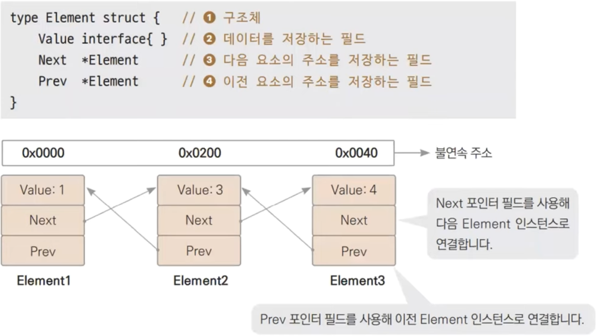

# 22장. 자료구조

## 자료구조(Data Structure)

---

- 자료들을 어떤 형태로 저장할 것인가를 나타냄
- 크게 배열, 리스트, 트리, 맵 등이 있음

### 리스트(list)

---

- 배열과 함께 가장 기본적인 선형 자료구조 중 하나

### 리스트의 형태

---



- Double Linked List라고도 한다.

- ex22.1.go
    
    ```go
    package main
    
    import (
    	"container/list"
    	"fmt"
    )
    
    func main() {
    	v := list.New()
    	e4 := v.PushBack(4)
    	e1 := v.PushFront(1)
    	v.InsertBefore(3, e4)
    	v.InsertAfter(2, e1)
    
    	for e := v.Front(); e != nil; e = e.Next() {
    		fmt.Print(e.Value, " ")
    	}
    
    	fmt.Println()
    	for e := v.Back(); e != nil; e = e.Prev() { // 각 요소 역순 순회
    		fmt.Print(e.Value, " ")
    	}
    }
    ```
    
- 실행
    
    ```powershell
    yoonhee@Yoonhee ex22.1 % ./ex22.1
    1 2 3 4 
    4 3 2 1 %                                                 
    ```
    
    - `v.Front()`: 맨 앞의 인스턴스를 반환한다.
    - `e = e.Next()`: 다음 노드로 간다.

### Big-O 표기법

---

- 알고리즘의 효율성을 나타내는 표기법 중 하나로 가장 많이 쓰인다.
- 상한선을 표시한다.

- 많이 사용되는 Big-O: O(1) < O(N) < O(N * log2*N) < O(N^2) < O(N^3)

## 배열 vs 리스트

---

### 맨 앞에 요소 삽입

---

- 배열
    
    
    
- 리스트
    
    
    

👉 맨 앞에 요소 삽입은 리스트가 빠르다.

### 특정 요소 접근하기(Random Access)

---

- 배열
    
    
    
- 리스트
    
    
    

👉 특정 요소 접근하기는 배열이 빠르다.

- 요소 삽입이나 삭제가 많은 경우 리스트가 유리하고 랜덤 접근이 많은 경우 배열이 유리하다.
    
    
    

## 데이터 지역성

---

- 데이터가 인접해 있을 수록 캐시 성공률이 올라가고 성능도 증가한다.
- 일반적으로 요소 수가 적은 경우 리스트보다 배열이 빠르다.
    - 1000개 까지는 배열이 빠르고, 1만개 넘어가면 고민해봐야 한다.

## 큐

---


- 선입선출(FIFO) 구조

- ex22.2.go
    
    ```go
    package main
    
    import (
    	"container/list"
    	"fmt"
    )
    
    type Queue struct {
    	v *list.List
    }
    
    func (q *Queue) Push(val interface{}) { // 요소 추가
    	q.v.PushBack(val)
    }
    
    func (q *Queue) Pop() interface{} { // 요소을 반환하면서 삭제
    	front := q.v.Front()
    	if front != nil {
    		return q.v.Remove(front)
    	}
    	return nil
    }
    
    func NewQueue() *Queue {
    	return &Queue{list.New()}
    }
    
    func main() {
    	queue := NewQueue()
    
    	for i := 1; i < 5; i++ {
    		queue.Push(i)
    	}
    	v := queue.Pop()
    	for v != nil {
    		fmt.Printf("%v -> ", v)
    		v = queue.Pop()
    	}
    }
    ```
    
- 실행
    
    ```powershell
    yoonhee@Yoonhee ex22.2 % ./ex22.2 
    1 -> 2 -> 3 -> 4 -> 
    ```
    

## 스택

---


- 선입후출(FILO) 구조

- ex22.3.go
    
    ```go
    package main
    
    import (
    	"container/list"
    	"fmt"
    )
    
    type Stack struct {
    	v *list.List
    }
    
    func NewStack() *Stack {
    	return &Stack{list.New()}
    }
    
    func (s *Stack) Push(val interface{}) {
    	s.v.PushBack(val)
    }
    
    func (s *Stack) Pop() interface{} {
    	back := s.v.Back()
    	if back != nil {
    		return s.v.Remove(back)
    	}
    	return nil
    }
    
    func main() {
    	stack := NewStack()
    	books := [5]string{"어린왕자", "겨울왕국", "노인과바다", "빨간머리앤", "짱구"}
    
    	for i := 0; i < 5; i++ {
    		stack.Push(books[i])
    	}
    
    	val := stack.Pop()
    	for val != nil {
    		fmt.Printf("%v -> ", val)
    		val = stack.Pop()
    	}
    }
    ```
    
- 실행
    
    ```powershell
    yoonhee@Yoonhee ex22.3 % ./ex22.3
    짱구 -> 빨간머리앤 -> 노인과바다 -> 겨울왕국 -> 어린왕자 ->
    ```
    

👉 큐는 보통 리스트로 만들고, 스택은 보통 배열로 만든다.

## 링(ring)

---


- 마지막의 요소가 첫번째로 연결된 것만 제외하고 리스트랑 동일하다.

- ex22.4.go
    
    ```go
    package main
    
    import (
    	"container/ring"
    	"fmt"
    )
    
    func main() {
    	r := ring.New(5)
    
    	n := r.Len()
    
    	for i := 0; i < n; i++ {
    		r.Value = 'A' + i // 순회하며 모든 요소에 값 대입
    		r = r.Next()
    	}
    
    	for j := 0; j < n; j++ {
    		fmt.Printf("%c ", r.Value)
    		r = r.Next()
    	}
    
    	fmt.Println()
    
    	for j := 0; j < n; j++ {
    		fmt.Printf("%c ", r.Value)
    		r = r.Prev() // 역순
    	}
    }
    ```
    
- 실행
    
    ```powershell
    yoonhee@Yoonhee ex22.4 % ./ex22.4
    A B C D E 
    A E D C B
    ```
    

### 링은 언제 쓸까?

---

- 일정한 갯수만 사용하고 오래된 요소가 지워져도 되는 경우에 보통 사용
    1. 실행 취소 기능: 문서 편집기 등에서 일정한 개수의 명령을 저장하고 실행 취소하는 경우
    2. 고정 크기 버퍼 기능: 데이터에 따라 버퍼가 증가되지 않고 고정된 길이로 쓸 때
    3. 리플레이 기능: 게임 등에서 최근 플레이 10초를 다시 리플레이할 때와 같이 고정된 길이의 리플레이 기능을 제공할 때

## 맵(map)

---

- 맵(map)은 키와 값 형태로 데이터를 저장하는 자료구조입니다.
    - 언어에 따라서 딕셔너리(dictionary), 해쉬테이블(hash table), 해쉬맵(hash map)등으로 부릅니다.
    - Go 내장된 타입이다.


### 맵(map) 사용법

---


- ex22.5.go
    
    ```go
    package main
    
    import "fmt"
    
    func main() {
    	m := make(map[string]string) // 맵 생성
    	m["이화랑"] = "서울시 광진구"
    	m["송하나"] = "서울시 강남구"
    	m["백두산"] = "부산시 사하구"
    	m["최번개"] = "전주시 덕진구"
    
    	m["최번개"] = "청주시 상당구" // 값 변경
    
    	fmt.Printf("송하나의 주소는 %s입니다.\n", m["송하나"])
    	fmt.Printf("백두산의 주소는 %s입니다.\n", m["백두산"])
    }
    ```
    
- 실행
    
    ```powershell
    yoonhee@Yoonhee ex22.5 % ./ex22.5
    송하나의 주소는 서울시 강남구입니다.
    백두산의 주소는 부산시 사하구입니다.
    ```
    

### 맵(map) 순회

---


- ex22.6.go
    
    ```go
    package main
    
    import "fmt"
    
    type Product struct {
    	Name  string
    	Price int
    }
    
    func main() {
    	m := make(map[int]Product) // 맵 생성
    
    	m[16] = Product{"볼펜", 500}
    	m[46] = Product{"지우개", 200}
    	m[78] = Product{"자", 1000}
    	m[345] = Product{"샤프", 3000}
    	m[897] = Product{"샤프심", 500}
    
    	for k, v := range m { // 맵 순회
    		fmt.Println(k, v)
    	}
    }
    ```
    
- 실행
    
    ```powershell
    yoonhee@Yoonhee ex22.6 % ./ex22.6
    897 {샤프심 500}
    16 {볼펜 500}
    46 {지우개 200}
    78 {자 1000}
    345 {샤프 3000}
    ```
    
    - Go의 맵은 순서 보장이 안된다.

### 요소 삭제와 존재 여부

---


- ex22.7.go
    
    ```go
    package main
    
    import "fmt"
    
    func main() {
    	m := make(map[int]int) // 맵 생성
    	m[1] = 0               // 요소 추가
    	m[2] = 2
    	m[3] = 3
    
    	delete(m, 3) // 요소 삭제
    	delete(m, 4) // 없는 요소 삭제 시도
    
    	v, ok := m[3]
    	fmt.Println(v, ok) // 삭제된 요소 값 출력
    	v, ok = m[1]
    	fmt.Println(v, ok) // 존재하는 요소 값 출력
    }
    ```
    
- 실행
    
    ```powershell
    yoonhee@Yoonhee ex22.7 % ./ex22.7
    0 false
    0 true
    ```
    

## 맵, 배열, 리스트 비교

---


- 맵이 메모리를 더 쓴다. 순서보장 X

### 맵의 원리

---

- 해쉬 함수 동작 이해
    - 해쉬란 잘게 부순다는 뜻이다.
    1. 같은 입력이 들어오면 같은 결과가 나온다.
    2. 다른 입력이 들어오면 되도록 다른 결과가 나온다.
    3. 입력값의 범위는 무한대이고 결과는 특정 범위를 갖는다.

- Sin 함수도 해쉬함수로 가능
- 일반적으로 나머지 연산을 주로 사용
    
    
    

## 해쉬로 맵을 만들어 보자

---

- 해쉬 함수 정의
    
    
    
- 배열 정의
    
    
    
- 키 23, 값 10의 요소 추가
    
    
    


- ex22.8.go
    
    ```go
    package main
    
    import "fmt"
    
    const M = 10 // 나머지 연산의 분모
    
    func hash(d int) int {
    	return d % M // 나머지 연산
    }
    
    func main() {
    	m := [M]int{} // 값을 저장할 배열 생성
    
    	m[hash(23)] = 10  // 키 23에 값 설정
    	m[hash(259)] = 50 // 키 259에 값 설정
    
    	fmt.Printf("%d = %d\n", 23, m[hash(23)])
    	fmt.Printf("%d = %d\n", 259, m[hash(259)])
    }
    ```
    
- 실행
    
    ```powershell
    yoonhee@Yoonhee ex22.8 % ./ex22.8
    23 = 10
    259 = 50
    ```
    

### 해쉬 충돌

---


