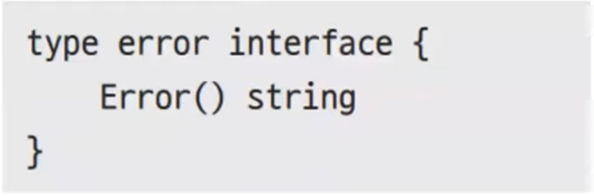

# 23장. 에러핸들링

## 에러는 언제 어디서나 발생한다

---

- 사느냐 죽느냐 그것이 문제이다.
- 에러 핸들링은 크게 두가지로
    - 빠르게 프로그램을 죽이는 방법이 있고
    - 에러를 처리해서 프로그램 지속시키는 방법이 있다.
- 에러마다, 개발 단계마다, 프로그램 성격마다 처리 방법이 다르다.

## 에러 반환

---

- ex23.1.go
    
    ```go
    package main
    
    import (
    	"bufio"
    	"fmt"
    	"os"
    )
    
    func ReadFile(filename string) (string, error) {
    	file, err := os.Open(filename) // 파일 열기
    	if err != nil {
    		return "", err // 에러나면 에러 반환
    	}
    	defer file.Close()          // 함수 종료 직전 파일 닫기
    	rd := bufio.NewReader(file) // 파일 내용 읽기
    	line, _ := rd.ReadString('\n')
    	return line, nil
    }
    
    func WriteFile(filename string, line string) error {
    	file, err := os.Create(filename) // 파일 생성
    	if err != nil {                  // 에러나면 에러 반환
    		return err
    	}
    	defer file.Close()
    	_, err = fmt.Fprintln(file, line) // 파일에 문자열 쓰기
    	return err
    }
    
    const filename string = "data.txt"
    
    func main() {
    	line, err := ReadFile(filename) // 파일 읽기 시도
    	if err != nil {
    		err = WriteFile(filename, "This is WriteFile") // 파일 생성
    		if err != nil {                                // 에러를 처리
    			fmt.Println("파일 생성에 실패했습니다.", err)
    			return
    		}
    		
    		line, err = ReadFile(filename) // 다시 읽기 시도
    		if err != nil {
    			fmt.Println("파일 읽기에 실패했습니다.", err)
    			return
    		}
    	}
    	fmt.Println("파일내용:", line) // 파일 내용 출력
    }
    ```
    
- 실행
    
    ```powershell
    yoonhee@Yoonhee ex23.1 % ./ex23.1
    파일내용: This is WriteFile
    ```
    

### 사용자 에러 반환

---

- `fmt.Errorf(formatter string, …interface{})` error 함수나
- `errors.New(text String)` error 함수 사용

- ex23.2.go
    
    ```go
    package main
    
    import (
    	"fmt"
    	"math"
    )
    
    func Sqrt(f float64) (float64, error) {
    	if f < 0 {
    		return 0, fmt.Errorf(
    			"제곱근은 양수여야 합니다. f:%g", f) // f가 음수이면 에러 반환
    	}
    	return math.Sqrt(f), nil
    }
    
    func main() {
    	sqrt, err := Sqrt(-2)
    	if err != nil {
    		fmt.Printf("Error: %v\n", err) // 에러 출력
    		return
    	}
    	fmt.Printf("Sqrt(-2) = %v\n", sqrt)
    }
    ```
    
- 실행
    
    ```powershell
    yoonhee@Yoonhee ex23.2 % ./ex23.2
    Error: 제곱근은 양수여야 합니다. f:-2
    ```
    

- ex23.2.go - `errors` 버전
    
    ```go
    package main
    
    import (
    	"errors"
    	"fmt"
    	"math"
    )
    
    func Sqrt(f float64) (float64, error) {
    	// if f < 0 {
    	// 	return 0, fmt.Errorf(
    	// 		"제곱근은 양수여야 합니다. f:%g", f) // f가 음수이면 에러 반환
    	// }
    	if f < 0 {
    		return 0, errors.New("제곱근은 양수여야 합니다.")
    	}
    	return math.Sqrt(f), nil
    }
    
    func main() {
    	sqrt, err := Sqrt(-2)
    	if err != nil {
    		fmt.Printf("Error: %v\n", err) // 에러 출력
    		return
    	}
    	fmt.Printf("Sqrt(-2) = %v\n", sqrt)
    }
    ```
    
- 실행
    
    ```powershell
    yoonhee@Yoonhee ex23.2 % ./ex23.2
    Error: 제곱근은 양수여야 합니다.
    ```
    

## 에러 타입

---



- ex23.3.go
    
    ```go
    package main
    
    import "fmt"
    
    type PasswordError struct { // 에러 구조체 선언
    	Len        int
    	RequireLen int
    }
    
    func (err PasswordError) Error() string { // Error() 메서드
    	return "암호 길이가 짧습니다."
    }
    
    func RegisterAccount(name, password string) error {
    	if len(password) < 8 {
    		// return fmt.Errorf("...")
    		// return errors.New("...")
    		return PasswordError{len(password), 8} // error 반환
    	}
    
    	return nil
    }
    
    func main() {
    	err := RegisterAccount("myID", "myPw")
    	if err != nil {
    		if errInfo, ok := err.(PasswordError); ok { // 인터페이스 변환
    			fmt.Printf("%v Len:%d RequireLen:%d\n",
    				errInfo, errInfo.Len, errInfo.RequireLen)
    		}
    	} else {
    		fmt.Println("회원 가입되었습니다.")
    	}
    }
    ```
    
- 실행
    
    ```powershell
    yoonhee@Yoonhee ex23.3 % ./ex23.3
    암호 길이가 짧습니다. Len:4 RequireLen:8
    ```
    
    - `Error()` 메서드가 있으므로 `fmt.Errorf`, `errors.New`, `PasswordError` 셋 다 error로 쓸 수 있다.

## 에러 랩핑(Wrapping)

---

- `fmt.Errorf()`의 `%w` 포맷터로 에러 랩핑 가능
- `errors.Is()` 함수와 `As()` 함수로 랩핑된 에러 체크 및 변환

- ex23.4.go
    
    ```go
    package main
    
    import (
    	"bufio"
    	"errors"
    	"fmt"
    	"strconv"
    	"strings"
    )
    
    func MultipleFromString(str string) (int, error) {
    	scanner := bufio.NewScanner(strings.NewReader(str)) // 스캐너 생성
    	scanner.Split(bufio.ScanWords)                      // 한 단어씩 끊어읽기
    
    	pos := 0
    	a, n, err := readNextInt(scanner)
    	if err != nil {
    		return 0, fmt.Errorf("Failed to readNextInt(), pos:%d err:%w", pos, err) // 에러 감싸기
    	}
    
    	pos += n + 1
    	b, n, err := readNextInt(scanner)
    	if err != nil {
    		return 0, fmt.Errorf("Failed to readNextInt(), pos:%d err:%w", pos, err)
    	}
    	return a * b, nil
    }
    
    // 다음 단어를 읽어서 숫자로 변환하여 반환합니다. 변환된 숫자, 읽은 글자수, 에러 반환
    func readNextInt(scanner *bufio.Scanner) (int, int, error) {
    	if !scanner.Scan() { // 단어 읽기
    		return 0, 0, fmt.Errorf("Failed to scan")
    	}
    	word := scanner.Text()
    	number, err := strconv.Atoi(word) // 문자열을 숫자로 변환
    	if err != nil {
    		return 0, 0, fmt.Errorf("Failed to convert word to int, word:%s err:%w", word, err) // 에러 감싸기
    	}
    	return number, len(word), nil
    }
    
    func readEq(eq string) {
    	rst, err := MultipleFromString(eq)
    	if err == nil {
    		fmt.Println(rst)
    	} else {
    		fmt.Println(err)
    		var numError *strconv.NumError
    		if errors.As(err, &numError) { // 감싸진 에러가 NumError인지 확인
    			fmt.Println("NumberError:", numError)
    		}
    	}
    }
    
    func main() {
    	readEq("123 3")
    	readEq("123 abc")
    }
    ```
    
- 실행
    
    ```powershell
    yoonhee@Yoonhee ex23.4 % ./ex23.4 
    369
    Failed to readNextInt(), pos:4 err:Failed to convert word to int, word:abc err:strconv.Atoi: parsing "abc": invalid syntax
    NumberError: strconv.Atoi: parsing "abc": invalid syntax
    ```
    

## 패닉

---

- 처리하기 힘든 에러를 만났을 때 프로그램을 조기 종료하는 방법
- 빠르게 종료시켜서 오류를 해결하기 위해서 사용

- ex23.5.go
    
    ```go
    package main
    
    import "fmt"
    
    func divide(a, b int) {
    	if b == 0 {
    		panic("b는 0일 수 없습니다") // Panic 발생
    	}
    	fmt.Printf("%d / %d = %d\n", a, b, a/b)
    }
    
    func main() {
    	divide(9, 3)
    	divide(9, 0) // Panic 발생
    }
    ```
    
- 실행
    
    ```powershell
    yoonhee@Yoonhee ex23.5 % ./ex23.5 
    9 / 3 = 3
    panic: b는 0일 수 없습니다
    
    goroutine 1 [running]:
    main.divide(0x9?, 0x3?)
            /Users/yoonhee/kyh1126/goprojects/ex23.5/ex23.5.go:7 +0xc8
    main.main()
            /Users/yoonhee/kyh1126/goprojects/ex23.5/ex23.5.go:14 +0x30
    ```
    

- ex23.5.go - `errors` 버전
    
    ```go
    package main
    
    import (
    	"errors"
    	"fmt"
    )
    
    //	func divide(a, b int) {
    //		if b == 0 {
    //			panic("b는 0일 수 없습니다") // Panic 발생
    //		}
    //		fmt.Printf("%d / %d = %d\n", a, b, a/b)
    //	}
    func divide(a, b int) error {
    	if b == 0 {
    		return errors.New("b는 0일 수 없습니다")
    	}
    	fmt.Printf("%d / %d = %d\n", a, b, a/b)
    	return nil
    }
    
    func main() {
    	divide(9, 3)
    	fmt.Print(divide(9, 0))
    }
    ```
    
- 실행
    
    ```powershell
    yoonhee@Yoonhee ex23.5 % ./ex23.5 
    9 / 3 = 3
    b는 0일 수 없습니다%             
    ```
    

- `Panic`은 문제 시점에 바로 프로그램 종료되면서 어디서 에러가 발생했는지 바로 볼 수가 있다.
    - 문제를 좀 더 명확하게 볼 수 있다.
    - 하지만 프로그램이 강제 종료된다.

### 패닉 생성

---


- 모든 타입 사용 가능
    
    
    

### 패닉 전파 그리고 복구

---

- 프로그램을 개발할 때는 문제를 빠르게 파악해서 해결하는게 중요
    - 일반에 공개된 뒤에는 최대한 안죽는게 중요
- 페이스북이 오류가 발생시마다 웹 서버가 종료된다면 사용자 경험이 좋지 않을 것이다.
- 이럴 때 복구를 해야할 필요가 있다.
    - 패닉 방식으로 개발했다가 이걸 다 `error`로 바꾸는 게 힘들 수 있다. 그럴 때 복구 방식을 쓸 수도 있다.

### 충격은 콜스택 역순으로 전파

---


### 복구는 `recover()`

---


- 패닉 객체를 반환
- `Defer`와 함께 사용된다.

- ex23.6.go
    
    ```go
    package main
    
    import "fmt"
    
    func f() {
    	fmt.Println("f() 함수 시작")
    	defer func() { // 패닉 복구
    		if r := recover(); r != nil {
    			fmt.Println("panic 복구 -", r)
    		}
    	}()
    
    	g()
    	fmt.Println("f() 함수 끝")
    }
    
    func g() {
    	fmt.Printf("9 / 3 = %d\n", h(9, 3))
    	fmt.Printf("9 / 0 = %d\n", h(9, 0)) // 패닉
    }
    
    func h(a, b int) int {
    	if b == 0 {
    		panic("제수는 0일 수 없습니다.") // 패닉 발생
    	}
    	return a / b
    }
    
    func main() {
    	f()
    	fmt.Println("프로그램이 계속 실행됨") // 프로그램 실행 지속됨
    }
    ```
    
- 실행
    
    ```powershell
    yoonhee@Yoonhee ex23.6 % ./ex23.6
    f() 함수 시작
    9 / 3 = 3
    panic 복구 - 제수는 0일 수 없습니다.
    프로그램이 계속 실행됨
    ```
    
    - `if r := recover()`: 패닉을 잡아먹어서 복구되고 그 다음 라인이 실행된다.

❗복구는 왠만하면 안쓰는걸 추천

- panic 오류를 DB에 저장하거나 어떻게든 개발자한테 알려주고 잡아먹어야 한다.

## Go는 SEH를 지원하지 않는다

---

- Go는 SEH(Structured Error Handling) 구조화된 에러 처리를 지원하지 않는다.
    
    ```java
    try {
    	...
    } catch (Exception ex) {
    	...
    } finally {
    	...
    }
    ```
    

### 왜?

---

1. 성능 문제
    - SEH를 지원하기 위해 어느정도 성능을 잡아먹는다.
2. 에러를 먹어버리는 문제 (오히려 에러 처리를 등한시한다)

## 에러 처리는 매우 중요

---

- 보통 에러 처리를 귀찮아 하고 코드를 지저분하게 만든다고 생각하며 등한시 하거나 무시하지만
- 에러 처리는 매우 중요하다.
    - 에러 처리 역시 중요한 코드 일부분으로 여기고 에러를 반환하는 함수에서 반환되는 에러를 제대로 처리해야 한다.(`_` 빈칸지시자로 무시하면 안된다)
- 에러는 드러내야 하고 조기에 발견하여 더 큰 문제를 미연에 방지해야 한다.
