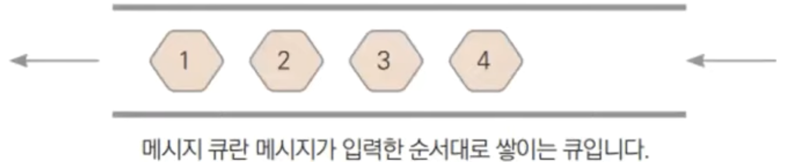

# 25장. 채널과 컨텍스트

## 채널은 고루틴간 메세지큐

---

- 채널은 고루틴끼리 메세지를 전달할 수 있는 메세지 큐
    
    
    
    - Thread-safe Queue라고도 한다.

### 채널 생성

---

- `make()`로 채널 인스턴스 생성 (맵, 슬라이스 처럼)
    
    
    

### 채널에 데이터 넣기

---


### 채널에서 데이터 빼기

---


- ex25.1.go
    
    ```go
    package main
    
    import (
    	"fmt"
    	"sync"
    	"time"
    )
    
    func main() {
    	var wg sync.WaitGroup
    	ch := make(chan int) // 채널 생성
    
    	wg.Add(1)
    	go square(&wg, ch) // Go 루틴 생성
    	ch <- 9            // 채널에 데이터를 넣는다.
    	wg.Wait()          // 작업이 완료되길 기다린다.
    }
    
    func square(wg *sync.WaitGroup, ch chan int) {
    	n := <-ch // 데이터를 빼온다
    
    	time.Sleep(time.Second) // 1초 대기
    	fmt.Printf("Square: %d\n", n*n)
    	wg.Done()
    }
    ```
    
- 실행
    
    ```powershell
    yoonhee@Yoonhee ex25.1 % ./ex25.1
    Square: 81
    ```
    
    - 예를들면 `s := []int{}` 설정했으면 아래와 같이 Lock, Unlock 걸어줘야 한다.
        
        ```go
        	s := []int{}
        
        	wg.Add(1)
        	s[0] = 9
        	go square(&wg, s) // Go 루틴 생성
        	wg.Wait()          // 작업이 완료되길 기다린다.
        }
        
        func square(wg *sync.WaitGroup, s []int) {
        	mutex.Lock()
        	n := s[0]
        	fmt.Printf("Square: %d\n", n*n)
        	mutex.Unlock()
        	wg.Done()
        }
        ```
        
    - 하지만 채널을 쓰면 그러지 않아도 된다.

### 채널 크기

---

- 기본 크기는 0
    
    
    
    - 기본 크기이면 항상 기다려야만 한다.

- ex25.2.go
    
    ```go
    package main
    
    import "fmt"
    
    func main() {
    	ch := make(chan int) // 크기 0인 채널 생성
    
    	ch <- 9                    // main() 함수가 여기서 멈춘다
    	fmt.Println("Never print") // 실행되지 않는다
    }
    ```
    
- 실행
    
    ```powershell
    yoonhee@Yoonhee ex25.2 % ./ex25.2
    fatal error: all goroutines are asleep - deadlock!
    
    goroutine 1 [chan send]:
    main.main()
            /Users/yoonhee/kyh1126/goprojects/ex25.2/ex25.2.go:8 +0x34
    ```
    
    - `ch <- 9`: 채널에 데이터를 집어넣었는데 가져가는 놈이 없어서 영원히 대기한다.

- ex25.2.go - 개선 버전
    
    ```go
    package main
    
    import "fmt"
    
    func main() {
    	ch := make(chan int, 2)
    
    	ch <- 9
    	fmt.Println("Never print") // 실행됨
    }
    ```
    
- 실행
    
    ```powershell
    yoonhee@Yoonhee ex25.2 % ./ex25.2
    Never print
    ```
    
    - 그 다음이 실행된다

### 버퍼를 가진 채널

---

- 2개의 보관함을 가진 채널
    
    
    

### 채널에서 데이터 대기

---

- 데이터를 계속 읽어온다.
    
    
    

- ex25.3.go
    
    ```go
    package main
    
    import (
    	"fmt"
    	"sync"
    	"time"
    )
    
    func square(wg *sync.WaitGroup, ch chan int) {
    	for n := range ch { // 데이터를 계속 기다린다.
    		fmt.Printf("Square: %d\n", n*n)
    		time.Sleep(time.Second)
    	}
    	wg.Done() // 실행되지 않는다.
    }
    
    func main() {
    	var wg sync.WaitGroup
    	ch := make(chan int)
    
    	wg.Add(1)
    	go square(&wg, ch)
    
    	for i := 0; i < 10; i++ {
    		ch <- i * 2 // 데이터를 넣는다.
    	}
    	wg.Wait() // 작업 완료를 기다린다.
    }
    ```
    
- 실행
    
    ```powershell
    yoonhee@Yoonhee ex25.3 % ./ex25.3
    Square: 0
    Square: 4
    Square: 16
    Square: 36
    Square: 64
    Square: 100
    Square: 144
    Square: 196
    Square: 256
    Square: 324
    fatal error: all goroutines are asleep - deadlock!
    
    goroutine 1 [semacquire]:
    sync.runtime_Semacquire(0x14000002101?)
            /opt/homebrew/Cellar/go/1.22.3/libexec/src/runtime/sema.go:62 +0x2c
    sync.(*WaitGroup).Wait(0x1400000e0b0)
            /opt/homebrew/Cellar/go/1.22.3/libexec/src/sync/waitgroup.go:116 +0x74
    main.main()
            /Users/yoonhee/kyh1126/goprojects/ex25.3/ex25.3.go:27 +0xd0
    
    goroutine 4 [chan receive]:
    main.square(0x1400000e0b0, 0x14000074060)
            /Users/yoonhee/kyh1126/goprojects/ex25.3/ex25.3.go:10 +0x94
    created by main.main in goroutine 1
            /Users/yoonhee/kyh1126/goprojects/ex25.3/ex25.3.go:22 +0x98
    ```
    
    - `for n := range ch {`: 계속 대기하기 때문에 `wg.Done()` 실행되지 않는다.

### `close()`로 채널을 닫아준다

---

- 좀비 고루틴: 채널을 닫아주지 않아서 무한 대기를 하는 고루틴을 좀비 고루틴 또는 고루틴 릭(Leak)이라고 한다.

- ex25.3.go - 개선 버전
    
    ```go
    package main
    
    import (
    	"fmt"
    	"sync"
    	"time"
    )
    
    func square(wg *sync.WaitGroup, ch chan int) {
    	for n := range ch { // 데이터를 계속 기다린다.
    		fmt.Printf("Square: %d\n", n*n)
    		time.Sleep(time.Second)
    	}
    	close(ch)
    	wg.Done() // 실행됨
    }
    
    func main() {
    	var wg sync.WaitGroup
    	ch := make(chan int)
    
    	wg.Add(1)
    	go square(&wg, ch)
    
    	for i := 0; i < 10; i++ {
    		ch <- i * 2 // 데이터를 넣는다.
    	}
    	wg.Wait() // 작업 완료를 기다린다.
    }
    
    ```
    
- 실행
    
    ```powershell
    yoonhee@Yoonhee ex25.3 % ./ex25.3
    Square: 0
    Square: 4
    Square: 16
    Square: 36
    Square: 64
    Square: 100
    Square: 144
    Square: 196
    Square: 256
    Square: 324
    ```
    
    - `for n := range ch {`: 계속 대기하기 때문에 `wg.Done()` 실행되지 않는다.

## select 문

---

- 여러 채널에서 동시에 데이터를 기다릴 때 사용
    
    
    

- 일정 간격으로 실행
    - `time` 패키지의
        - `Tick()`은 일정 간격으로 신호를 주는 채널을 반환
        - `After()`는 일정 시간 대기 후 한 번만 신호를 주는 채널 반환

- ex25.6.go
    
    ```go
    package main
    
    import (
    	"fmt"
    	"sync"
    	"time"
    )
    
    func square(wg *sync.WaitGroup, ch chan int) {
    	tick := time.Tick(time.Second)            // 1초 간격 시그널
    	terminate := time.After(10 * time.Second) // 10초 이후 시그널
    
    	for {
    		select { // tick, terminate, ch 순서로 처리
    		case <-tick:
    			fmt.Println("Tick")
    		case <-terminate:
    			fmt.Println("Terminated!")
    			wg.Done()
    			return
    		case n := <-ch:
    			fmt.Printf("Square: %d\n", n*n)
    			time.Sleep(time.Second)
    		}
    	}
    }
    
    func main() {
    	var wg sync.WaitGroup
    	ch := make(chan int)
    
    	wg.Add(1)
    	go square(&wg, ch)
    
    	for i := 0; i < 10; i++ {
    		ch <- i * 2
    	}
    	wg.Wait()
    }
    ```
    
- 실행
    
    ```powershell
    yoonhee@Yoonhee ex25.6 % ./ex25.6
    Square: 0
    Tick
    Square: 4
    Square: 16
    Tick
    Square: 36
    Tick
    Square: 64
    Tick
    Square: 100
    Square: 144
    Tick
    Square: 196
    Tick
    Square: 256
    Square: 324
    Terminated!
    ```
    
    - `select` 문은 동시에 여러개가 오면 어떻게 실행될지는 머신마다 다르다.

## 채널로 생산자/소비자 패턴 구현

---

- 생산자(Producer) / 소비자(Consumer) 패턴 구현
    
    
    

- ex25.7.go
    
    ```go
    package main
    
    import (
    	"fmt"
    	"sync"
    	"time"
    )
    
    type Car struct {
    	Body  string
    	Tire  string
    	Color string
    }
    
    var wg sync.WaitGroup
    var startTime = time.Now()
    
    func main() {
    	tireCh := make(chan *Car)
    	paintCh := make(chan *Car)
    
    	fmt.Printf("Start Factory\n")
    
    	wg.Add(3)
    	go MakeBody(tireCh) // Go 루틴 생성
    	go InstallTire(tireCh, paintCh)
    	go PaintCar(paintCh)
    
    	wg.Wait()
    	fmt.Println("Close the factory")
    }
    
    func MakeBody(tireCh chan *Car) { // 차체 생산
    	tick := time.Tick(time.Second)
    	after := time.After(10 * time.Second)
    	for {
    		select {
    		case <-tick:
    			car := &Car{}
    			car.Body = "Sports car"
    			tireCh <- car
    		case <-after: // 10초 뒤 종료
    			close(tireCh)
    			wg.Done()
    			return
    		}
    	}
    }
    
    func InstallTire(tireCh, paintCh chan *Car) { // 바퀴 설치
    	for car := range tireCh {
    		time.Sleep(time.Second)
    		car.Tire = "Winter tire"
    		paintCh <- car
    	}
    	wg.Done()
    	close(paintCh)
    }
    
    func PaintCar(paintCh chan *Car) { // 도색
    	for car := range paintCh {
    		time.Sleep(time.Second)
    		car.Color = "Red"
    		duration := time.Now().Sub(startTime) // 경과 시간 출력
    		fmt.Printf("%.2f Complete Car: %s %s %s\n", duration.Seconds(), car.Body, car.Tire, car.Color)
    	}
    	wg.Done()
    }
    ```
    
- 실행
    
    ```powershell
    yoonhee@Yoonhee ex25.7 % ./ex25.7
    Start Factory
    3.00 Complete Car: Sports car Winter tire Red
    4.00 Complete Car: Sports car Winter tire Red
    5.00 Complete Car: Sports car Winter tire Red
    6.00 Complete Car: Sports car Winter tire Red
    7.00 Complete Car: Sports car Winter tire Red
    8.00 Complete Car: Sports car Winter tire Red
    9.00 Complete Car: Sports car Winter tire Red
    10.00 Complete Car: Sports car Winter tire Red
    11.00 Complete Car: Sports car Winter tire Red
    12.00 Complete Car: Sports car Winter tire Red
    Close the factory
    ```
    

## 컨텍스트(Context)

---

- 작업을 지시할 때 작업 가능 시간, 작업 취소 등의 조건을 지시할 수 있는 작업 명세서 역할

### 작업 취소가 가능한 컨텍스트

---

- ex25.8.go
    
    ```go
    package main
    
    import (
    	"context"
    	"fmt"
    	"sync"
    	"time"
    )
    
    var wg sync.WaitGroup
    
    func main() {
    	wg.Add(1)
    	ctx, cancel := context.WithCancel(context.Background()) // 컨텍스트 생성
    	go PrintEverySecond(ctx)
    	time.Sleep(5 * time.Second)
    	cancel() // 취소
    
    	wg.Wait()
    }
    
    func PrintEverySecond(ctx context.Context) {
    	tick := time.Tick(time.Second)
    	for {
    		select {
    		case <-ctx.Done(): // 취소 확인
    			wg.Done()
    			return
    		case <-tick:
    			fmt.Println("Tick")
    		}
    	}
    }
    ```
    
- 실행
    
    ```powershell
    yoonhee@Yoonhee ex25.8 % ./ex25.8
    Tick
    Tick
    Tick
    Tick
    Tick
    ```
    

### 작업 시간 설정

---

- 3초 뒤에 `ctx.Done()` 채널에 시그널 발생
    
    
    

### 특정 값 설정

---

- ex25.9.go
    
    ```go
    package main
    
    import (
    	"context"
    	"fmt"
    	"sync"
    )
    
    var wg sync.WaitGroup
    
    func main() {
    	wg.Add(1)
    
    	ctx := context.WithValue(context.Background(), "number", 9) // 컨텍스트에 값을 추가한다
    	go square(ctx)
    
    	wg.Wait()
    }
    
    func square(ctx context.Context) {
    	if v := ctx.Value("number"); v != nil { // 컨텍스트에서 값을 읽어온다.
    		n := v.(int)
    		fmt.Printf("Square:%d", n*n)
    	}
    	wg.Done()
    }
    ```
    
- 실행
    
    ```powershell
    yoonhee@Yoonhee ex25.9 % ./ex25.9
    Square:81
    ```
    
    - `context.WithValue(context.Background(), "number", 9)`: number라는 특정 데이터에 9를 집어넣겠다.

### 컨텍스트 랩핑

---


- 덮어씌워서 기능을 더해갈 수 있다.

## 채널로 발행/구독 패턴 구현

---

- 발행(Publisher) / 구독자(Subscriber) 패턴 구현
- 옵져버 패턴과 거의 유사 (같다고 봐도 무방)

### 옵저버 패턴

---


- 옵저버 패턴은 동기식이다.
    - 그래서 이 문제를 해결하기 위한 Pub/sub 패턴이 나오게 된다.

### Pub/sub 패턴

---


- 채널이 있어서 기본적으로 비동기 방식이다.

### 예제

---

- pubsub 디렉토리 만들고 그 안에
    - main.go
        
        ```go
        package main
        
        import (
        	"context"
        	"fmt"
        	"sync"
        	"time"
        )
        
        var wg sync.WaitGroup
        
        func main() {
        	ctx, cancel := context.WithCancel(context.Background())
        
        	wg.Add(4)
        	publisher := NewPublisher(ctx)
        	subscriber1 := NewSubscriber("AAA", ctx)
        	subscriber2 := NewSubscriber("BBB", ctx)
        
        	go publisher.Update()
        
        	subscriber1.Subscribe(publisher)
        	subscriber2.Subscribe(publisher)
        
        	go subscriber1.Update()
        	go subscriber2.Update()
        
        	go func() {
        		tick := time.Tick(time.Second * 2)
        		for {
        			select {
        			case <-tick:
        				publisher.Publish("Hello Message")
        			case <-ctx.Done():
        				wg.Done()
        				return
        			}
        		}
        	}()
        
        	fmt.Scanln()
        	cancel()
        
        	wg.Wait()
        }
        ```
        
    - publisher.go
        
        ```go
        package main
        
        import "context"
        
        type Publisher struct {
        	ctx         context.Context
        	subscribeCh chan chan<- string
        	publishCh   chan string
        	subscribers []chan<- string
        }
        
        func NewPublisher(ctx context.Context) *Publisher {
        	return &Publisher{
        		ctx:         ctx,
        		subscribeCh: make(chan chan<- string),
        		publishCh:   make(chan string),
        		subscribers: make([]chan<- string, 0),
        	}
        }
        
        func (p *Publisher) Subscribe(sub chan<- string) {
        	p.subscribeCh <- sub
        }
        
        func (p *Publisher) Publish(msg string) {
        	p.publishCh <- msg
        }
        
        func (p *Publisher) Update() {
        	for {
        		select {
        		case sub := <-p.subscribeCh:
        			p.subscribers = append(p.subscribers, sub)
        		case msg := <-p.publishCh:
        			for _, subscriber := range p.subscribers {
        				subscriber <- msg
        			}
        		case <-p.ctx.Done():
        			wg.Done()
        			return
        		}
        	}
        }
        ```
        
        - `subscribeCh chan chan<- string`: 데이터 넣기만 되는 채널(write only)
    - subscriber.go
        
        ```go
        package main
        
        import (
        	"context"
        	"fmt"
        )
        
        type Subscriber struct {
        	ctx   context.Context
        	name  string
        	msgCh chan string
        }
        
        func NewSubscriber(name string, ctx context.Context) *Subscriber {
        	return &Subscriber{
        		ctx:   ctx,
        		name:  name,
        		msgCh: make(chan string),
        	}
        }
        
        func (s *Subscriber) Subscribe(pub *Publisher) {
        	pub.Subscribe(s.msgCh)
        }
        
        func (s *Subscriber) Update() {
        	for {
        		select {
        		case msg := <-s.msgCh:
        			fmt.Printf("%s got Message:%s\n", s.name, msg)
        		case <-s.ctx.Done():
        			wg.Done()
        			return
        		}
        	}
        }
        ```
        
- 실행
    
    ```go
    yoonhee@Yoonhee pubsub % ./pubsub
    AAA got Message:Hello Message
    BBB got Message:Hello Message
    BBB got Message:Hello Message
    AAA got Message:Hello Message
    BBB got Message:Hello Message
    AAA got Message:Hello Message
    BBB got Message:Hello Message
    Hi
    ```