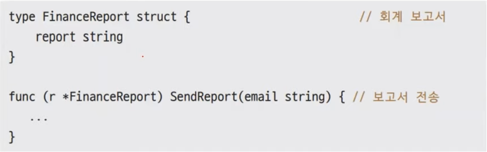

# 27장. SOLID

## SOLID 란?

---

- 객체지향 설계 5가지 원칙의 약자
    - 단일 책임 원칙(SRP)
    - 개방-폐쇄 원칙(OCP)
    - 리스코프 치환 원칙(LSP)
    - 인터페이스 분리 원칙(ISP)
    - 의존 관계 역전 원칙(DIP)

### 나쁜 설계란?

---

- 경직성(rigidity)
    - 모듈 간의 결합도(coupling)가 너무 높아서 코드를 변경하기 매우 어려운 구조를 말합니다. 때론 모듈 간 의존 관계가 거미줄처럼 얽혀 있어서 어디부터 손대야 할지 모를 정도로 복잡한 구조를 갖기도 합니다.
- 부서지기 쉬움(fragility)
    - 한 부분을 건드렸더니 다른 부분까지 망가지는 경우입니다. 언제 어떤 부분이 망가질지 모르기 때문에 프로그램을 변경하기가 매우 힘듭니다.
- 부동성(immobility)
    - 코드 일부분을 현재 어플리케이션에서 분리해서 다른 프로젝트에도 쓰고 싶지만 모듈 간 결합도가 너무 높아서 옮길 수 없는 경우입니다. 그렇게 되면 코드 재사용률이 급격히 감소하므로 (같거나) 비슷한 기능을 매번 새로 구현해야 합니다.

## 단일 책임 원칙(SRP)

---

- 정의: 모든 객체는 책임을 하나만 져야 한다.
- 이점: 코드 재사용성을 높여줍니다.

### SRP 위반 사례

---



- report라는 역할과 SendReport 전송 역할인, 2가지 역할이 있다.

### 어떻게 해야 하는가?

---


- 보고서 역할만, 전송 역할만 하도록 만들어야 한다.
    
    
    
    - `ReportSender`: 전송 객체

## 개방-폐쇄 원칙(OCP)

---

- 정의: 확장에는 열려 있고, 변경에는 닫혀 있다.
    - 기존 코드 변경 없이 새로운 기능 추가가 가능하다.
- 이점: 상호 결합도를 줄여 새 기능을 추가할 때 기존 구현을 변경하지 않아도 됩니다.

### OCP 위반 사례

---


- 기능이 추가되면 이 function 자체가 바껴야 한다. → 부서지기 쉽다.
    - 이메일 전송은 이메일 전송만, 팩스 전송은 팩스 전송만 하도록 해야 한다.

### 어떻게 해야 할까?

---


- Switch case 하나는 있어야 한다. MakeSender 같은 함수
    - Type에 따라 EmailSender, FaxSender..를 만들어주는 함수다.

- Factory Method: 객체를 만들어 주는 것
    - send `Type`에 따라 Sender를 만들어준다.

## 리스코프 치환 원칙(LSP)

---

- 정의: q(x)를 타입 T의 객체 x에 대해 증명할 수 있는 속성이라 하자. 그렇다면 S가 T의 하위 타입이라면 q(y)는 타입 S의 객체 y에 대해 증명할 수 있어야 한다.
    - 상위 타입에서 동작하면 하위 타입에서도 동작해야 한다.
- 이점: 예상치 못한 작동을 예방할 수 있습니다.

### LSP 위반 사례

---


- 이 function 입장에서는 Square인지 Rectangle인지 알 수가 없다.
    - 같은 함수를 탔지만, 동작이 달라질 수 있다.
    - Go는 상속을 지원하지 않는다.

### LSP 또 다른 위반 사례

---


- LSP가 안 지켜지면 Function 호출 결과를 예측하기가 너무 힘들어진다.

## 인터페이스 분리 원칙(ISP)

---

- 정의: 클라이언트는 자신이 이용하지 않는 메서드에 의존하지 않아야 한다.
- 이점: 인터페이스를 분리하면 불필요한 메서드들과 의존 관계가 끊어져 더 가볍게 인터페이스를 이용할 수 있습니다.

### ISP 위반 사례

---


- 자신이 이용하지 않는 메서드에 의존하는 중
    - 안쓰는 메소드도 있는데 Report interface를 무조건 다 구현해야 상황

### 어떻게 해야 하는가?

---


- 이렇게 분리하면 이 구현 객체는 필요없는 메소드를 만들 필요가 없다.

## 의존 관계 역전 원칙(DIP)

---

- 정의: 상위 계층이 하위 계층에 의존하는 전통적인 의존 관계를 반전(역전) 시킴으로써 상위 계층이 하위 계층의 구현으로부터 독립되게 할 수 있다.
- 원칙
    - 원칙1: 상위 모듈은 하위 모듈에 의존해서는 안 된다. 둘 다 추상 모듈에 의존해야 한다.
    - 원칙2: 추상 모듈은 구체화된 모듈에 의존해서는 안 된다. 구체화된 모듈은 추상 모듈에 의존해야 한다.

### 원칙1 뜯어보기

---


- 이렇게 셋 다 구체 클래스인 상황에서, 전송은 키보드에서 입력을 받아서 네트워크로 전송한다.

👉

- 추상 관계로 역전
    
    
    
    - 이렇게 되면 전송은 입력의 방식에 얽매이지 않게 된다. 그래서 입력 장치가 늘어나도 상관없다.
        - 출력도 마찬가지다.
        
        → 확장이 쉬워진다.
        

### 원칙2 뜯어보기

---


- 위의 상황은 메일과 알람 구체 모델끼리 강하게 커플링 되어 있다.
    - Go는 덕타이핑 지원하기 때문에 이렇게 써도 상관없다.

👉

- 추상 관계로 역전
    
    
    

## 예제

---

- eventalarm 디렉토리 만들고
    
    ```go
    package main
    
    import "fmt"
    
    type Event interface {
    	Register(EventListener)
    }
    
    type EventListener interface {
    	OnFire()
    }
    
    type Mail struct {
    	listener EventListener
    }
    
    func (m *Mail) Register(listener EventListener) {
    	m.listener = listener
    }
    
    func (m *Mail) OnRecv() {
    	m.listener.OnFire()
    }
    
    type Alarm struct {
    }
    
    func (a *Alarm) OnFire() {
    	fmt.Println("메일이 왔습니다")
    }
    
    func main() {
    	var mail = &Mail{}
    	var listener EventListener
    
    	listener = &Alarm{}
    
    	mail.Register(listener)
    	mail.OnRecv()
    }
    ```
    
- 실행
    
    ```powershell
    yoonhee@Yoonhee eventalarm % ./eventalarm
    메일이 왔습니다
    ```
    

## 개발은 어떻게 해야하는가?

---

- 우리는 학자도 아니고, 이론가도 아니고, 기술자들이다.
    - 현실에 항상 맞춰져야 한다. 조율해야 한다.
    - 시간과 돈이 정해져있다.
- 프로그래밍의 길: 학습 + 연습
- 금칠(Gold Painting): 황금색으로 칠해야 하는데 황금으로 칠하면 돈이 너무 많이 든다.