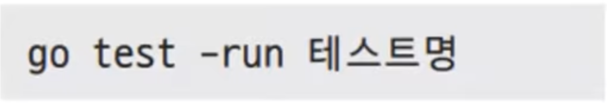

# 28장. 테스트와 벤치마크

## 테스트 코드 작성법

---

1. 파일명이 `_test.go`로 끝나야 합니다.
2. testing 패키지를 임포트해야 합니다.
3. 테스트 코드는 `func TextXxx(t *testing.T)` 형태이어야 합니다.

- ex28.1.go
    
    ```go
    package main
    
    import "fmt"
    
    func square(x int) int {
    	return 81
    }
    
    func main() {
    	fmt.Printf("9 * 9 = %d\n", square(9))
    }
    ```
    
- ex28.1_test.go
    
    ```go
    package main
    
    import "testing"
    
    func TestSquare1(t *testing.T) {
    	rst := square(9)
    	if rst != 81 {
    		t.Errorf("square(9) sholud be 81 but retruns %d", rst)
    	}
    }
    
    func TestSquare2(t *testing.T) {
    	rst := square(3)
    	if rst != 9 {
    		t.Errorf("square(9) sholud be 9 but retruns %d", rst)
    
    	}
    }
    ```
    
- 실행 - 성공버전(위 메소드만 있을 때)
    
    ```powershell
    yoonhee@Yoonhee ex28.1 % go mod init goprojects/ex28.1
    go: creating new go.mod: module goprojects/ex28.1
    yoonhee@Yoonhee ex28.1 % go test
    PASS
    ok      goprojects/ex28.1       0.099s
    ```
    
- 실행 - 실패버전(메소드 2개있을 때)
    
    ```powershell
    yoonhee@Yoonhee ex28.1 % go test
    --- FAIL: TestSquare2 (0.00s)
        ex28.1_test.go:15: square(9) sholud be 9 but retruns 81
    FAIL
    exit status 1
    FAIL    goprojects/ex28.1       0.244s
    ```
    

- `go build` 후 실행파일 실행할 경우엔 테스트 파일은 실행되지 않는다.

### 일부만 테스트하기

---



- ex28.1_test.go 일부 실행
    
    ```powershell
    yoonhee@Yoonhee ex28.1 % go test -run TestSquare1
    PASS
    ok      goprojects/ex28.1       0.154s
    ```
    

### 테스트를 돕는 외부 패키지

---


## 테스트 주도 개발(TDD)

---

- 기존 문제: 테스트가 정말 중요한데 테스트 케이스가 절대적으로 부족하거나 형식적인 경우가 많았다.
    
    
    
    → 코드 작성 이후 테스트를 하다보니 생긴 문제
    

### 테스트 먼저 하자

---


### TDD의 장점

---

- 테스트 케이스가 자연스럽게 늘어난다.
- 테스트가 촘촘해진다.
- 자연스러운 회기 테스트가 가능하다.
- 리팩토링이 쉬워진다.
- 개발이 즐겁다.
- 코드 커버리지가 자연히 증가된다.

### TDD의 단점

---

- 모듈간 의존성이 높은 경우 테스트 케이스를 만들기 힘들다.
    1. 의존성 끊기 - 하지만 의존성 끊기가 더 힘들다.
    2. Mock up을 만든다. - 배보다 배꼽이 커지는 경우가 많아서 쉽지 않다.
- 동시성 테스트에 취약하다.
- 진정한 TDD가 아닌 형식적인 테스트로 전락할 수 있다.
- 지속적인 모니터링과 관리가 필요하다.

## 벤치마크

---

- 성능 검사시 사용
- 다음과 같은 표현 규약
    1. 파일명이 `_test.go`로 끝나야 한다.
    2. `testing` 패키지를 임포트해야 한다.
    3. 벤치마크 코드는 `func BenchmarkXxx(b *testing.B)` 형태이어야 한다.

- ex28.2.go
    
    ```go
    package main
    
    import "fmt"
    
    func fibonacci1(n int) int {
    	if n < 0 {
    		return 0
    	}
    	if n < 2 {
    		return n
    	}
    	return fibonacci1(n-1) + fibonacci1(n-2) // 재귀 호출
    }
    
    func fibonacci2(n int) int {
    	if n < 0 {
    		return 0
    	}
    	if n < 2 {
    		return n
    	}
    	one := 1
    	two := 0
    	rst := 0
    	for i := 2; i <= n; i++ { // 반복문
    		rst = one + two
    		two = one
    		one = rst
    	}
    	return rst
    }
    
    func main() {
    	fmt.Println(fibonacci1(13))
    	fmt.Println(fibonacci2(13))
    }
    ```
    
- ex28.2_test.go
    
    ```go
    package main
    
    import (
    	"testing"
    
    	"github.com/stretchr/testify/assert"
    )
    
    func TestFibonacci1(t *testing.T) {
    	assert := assert.New(t)
    
    	assert.Equal(0, fibonacci1(-1), "fibonacci1(-1) should be 0")
    	assert.Equal(0, fibonacci1(0), "fibonacci1(0) should be 0")
    	assert.Equal(1, fibonacci1(1), "fibonacci1(1) should be 1")
    	assert.Equal(2, fibonacci1(3), "fibonacci1(2) should be 2")
    	assert.Equal(233, fibonacci1(13), "fibonacci1(13) should be 233")
    }
    
    func TestFibonacci2(t *testing.T) {
    	assert := assert.New(t)
    
    	assert.Equal(0, fibonacci2(-1), "fibonacci2(-1) should be 0")
    	assert.Equal(0, fibonacci2(0), "fibonacci2(0) should be 0")
    	assert.Equal(1, fibonacci2(1), "fibonacci2(1) should be 1")
    	assert.Equal(2, fibonacci2(3), "fibonacci2(2) should be 2")
    	assert.Equal(233, fibonacci2(13), "fibonacci2(13) should be 233")
    }
    
    func BenchmarkFibonacci1(b *testing.B) {
    	for i := 0; i < b.N; i++ { // b.N만큼 반복
    		fibonacci1(20)
    	}
    }
    
    func BenchmarkFibonacci2(b *testing.B) {
    	for i := 0; i < b.N; i++ {
    		fibonacci2(20)
    	}
    }
    ```
    
- 실행
    
    ```powershell
    yoonhee@Yoonhee ex28.2 % go mod init goprojects/ex28.2
    go: creating new go.mod: module goprojects/ex28.2
    go: to add module requirements and sums:
            go mod tidy
    yoonhee@Yoonhee ex28.2 % go mod tidy
    go: finding module for package github.com/stretchr/testify/assert
    go: downloading github.com/stretchr/testify v1.9.0
    go: found github.com/stretchr/testify/assert in github.com/stretchr/testify v1.9.0
    go: downloading gopkg.in/yaml.v3 v3.0.1
    go: downloading gopkg.in/check.v1 v0.0.0-20161208181325-20d25e280405
    yoonhee@Yoonhee ex28.2 % go test
    PASS
    ok      goprojects/ex28.2       0.375s
    yoonhee@Yoonhee ex28.2 % go test -bench .
    goos: darwin
    goarch: arm64
    pkg: goprojects/ex28.2
    BenchmarkFibonacci1-12             55869             19905 ns/op
    BenchmarkFibonacci2-12          197724438                5.714 ns/op
    PASS
    ok      goprojects/ex28.2       3.499s
    ```
    
    - `go test -bench .`: 일정한 시간동안 몇번 반복했냐, 한 번당 얼마나 시간이 걸렸냐 찍어준다.