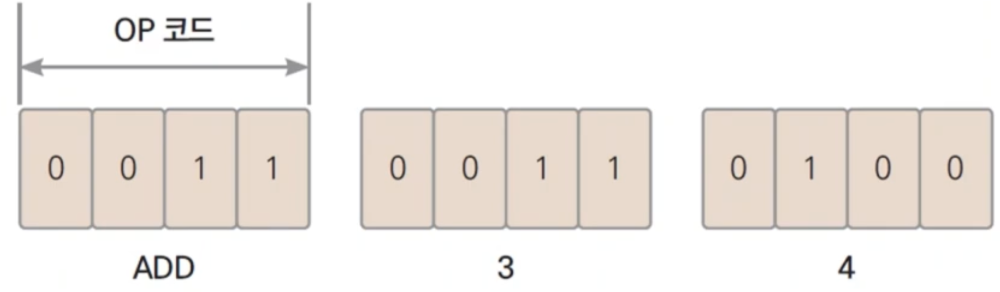

# 2장. 프로그래밍 언어

## 프로그램이란?

---

- 원하는 명령을 원하는 순서대로 실행될 수 있도록 적어 놓은 문서

## 초기 프로그램

---



- OP 코드: Operation 코드

## 기계어 프로그래밍

---

- 천공카드: 구멍뚫어서 컴퓨터에 입력해야 했다.
    - 구멍 잘못 뚫으면 결과가 이상해진다.

## 어셈블리어 등장

---


- 컴파일: 어셈블리어 → 기계어 로 변환
    - OP 코드(2진수)로 변환한다.
    - 어셈블리어는 OP 코드로 1대1로 변환된다.

## 고수준 언어

---


## 코드가 실행되려면

---


## 정적 컴파일 언어 vs 동적 컴파일 언어

---

- 정적 컴파일 언어: 실행하기 전에 코드를 미리 기계어로 바꿔놓는 것
    - 장점: 컴파일(변환)하는 시간이 필요없어서 속도가 빠르다.
    - ex> C, C++, Go
- 동적 컴파일 언어
    - 장점: 플랫폼을 분석해서 기계어로 변환한다.
    - ex> Java, Python

- AMD, Intel, ARM 별로 OP 코드가 다르다. → 기계어가 달라져야 한다.
    - 정적 컴파일 언어의 단점: 실행파일이 컴퓨터, OS, 64비트/32비트 별로 달라져야 한다.

- Go: 정적 컴파일 언어 채택
    - 속도가 빠르다.
    - 플랫폼 규격이 단순해졌다.
    - 플랫폼(모바일, 웹)별로 어차피 코드를 다르게 짜야 한다고 생각했다.
        - ex1> `$Env:GOOS = "linux"`로 셋팅해서 리눅스용 실행파일 만들면 hello.exe 대신 hello가 만들어진다.
        - ex2> windows 용으로 빌드해보기: `GOOS="windows" go build`
            
            ```powershell
            yoonhee@Yoonhee hello % GOOS="windows" go build
            yoonhee@Yoonhee hello % ls
            go.mod          hello           hello.exe       hello.go
            ```
            

## 약타입 언어 vs 강타입 언어

---

- "12" + 12 = ?
    - 1212
    - 24
    - Error → 강타입
- Go: 최강타입 언어
    - 타입을 계속 맞춰줘야 한다.
        - ex> int32 + int 64 = 에러

## 가비지 컬렉터 유무

---

- 가비지 컬렉터 없는 언어: C, C++
- 가비지 컬렉터 있는 언어: Java, C#, Javascript, Python, Go

- GC도 성능을 잡아먹어서 속도가 느려진다.
    - Go는 1ms 이하의 강력한 GC를 지원한다.

## Go 언어는?

---

- 정적 컴파일 언어
- 강타입 언어
- 가비지 컬렉터를 가지고 있다.