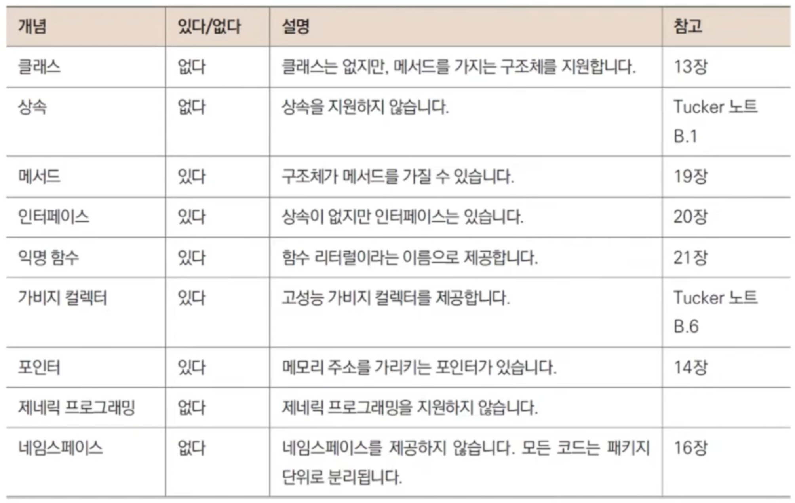

# 3장. Hello Go World

## Go의 역사

---

- Go 언어는 2009년에 발표된 언어로 로버트 그리스머, 롭파이크, 켄톰슨 주축하에 구글에서 만든 오픈 소스 프로그래밍 언어입니다.
    - (영상 기준)현재 버전은 1.16.2 입니다.

- ANSI: 문자 코드. 1byte 값으로 영어만 표현했다.
    - 8비트여서 0~255개 문자를 표현할 수 있다.
- Unicode-8, Unicode-16: 한 문자열을 1, 2byte로 표현
    - 2바이트: 65535개 문자를 나타낼 수 있다. 전세계 모든 문자 표현 가능
- UTF-8: 한 문자열을 1~3byte로 표현 → Go에서 기본 문자 인코딩으로 쓰고 있다.
    - 모든 문자를 표현 가능 (한글, 한자 등)

## Go의 특징

---



## 첫 번째 프로그램 작성

---

- hello2 폴더 만들어서 main.go 작성
    
    ```go
    package main
    
    import "fmt"
    
    func main() {
    	// 이것은 주석입니다
    	fmt.Println("Hello Go World")
    }
    ```
    
- Terminal - New Terminal 후 실행
    
    ```powershell
    yoonhee@Yoonhee goprojects % cd hello2
    yoonhee@Yoonhee hello2 % ls
    main.go
    yoonhee@Yoonhee hello2 % go mod init goprojects/hello2
    go: creating new go.mod: module goprojects/hello2
    go: to add module requirements and sums:
            go mod tidy
    yoonhee@Yoonhee hello2 % go build
    yoonhee@Yoonhee hello2 % ls
    go.mod  hello2  main.go
    yoonhee@Yoonhee hello2 % ./hello2
    Hello Go World
    yoonhee@Yoonhee hello2 % go run main.go
    Hello Go World
    ```
    

### `package main`

---

- Go의 모든 코드는 `package`로 시작해야 한다.
    - 이 코드가 속해있는 패키지 지정한다.

- `main`: 특별한 의미로 사용된다. 1개밖에 없다.
    - 프로그램 시작점을 포함하는 패키지
    - `main`이 아닌 여러 다른 패키지들을 가질 수 있다.

### `import "fmt"`

---

- fmt 패키지 기능을 가져와서 쓰는 것
- `main`이 아닌 다른 패키지들을 가져올 수 있다.

### `func main() {`

---

- `func`: 함수 선언
    - 영문자로 시작하는 함수명 지정
- `main`: 특별한 의미로 사용된다.
    - 프로그램 시작점

### `// 이것은 주석입니다`

---

- 가능한 주석 포맷
    - `// 주석`: 한줄 주석
    - `/* 주석 */`: 블록 단위 주석
- 주석은 아무곳이나 달 수 있다.

### `fmt.Println("Hello Go World")`

---

- `fmt`: 앞에서 `import` 한 패키지.
    - 그 안의 `Println` 함수명의 기능(함수)을 사용(호출)하겠다.