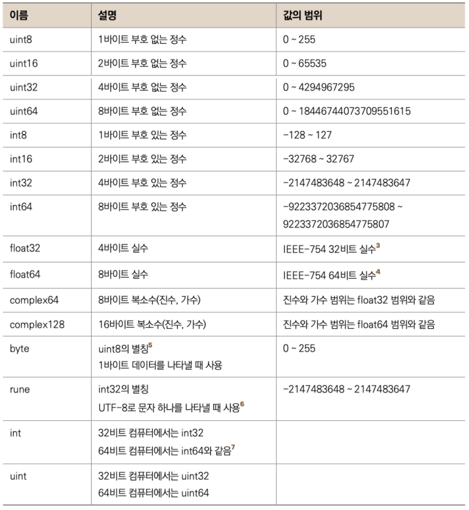

# 4장. 변수

## 변수란?

---

- (프로그램 실행 도중에) 값을 저장하는 메모리 공간을 가리키는 이름

## 변수가 왜 중요한가?

---

- 프로그램이란 결국 (메모리에 있는) 데이터를 연산/조작 하는 일
    - 코드에서 메모리에 접근하는건 변수를 통해서 한다.
    - 컴퓨터에서 데이터는 다 숫자다.

## ex4.1.go

---

- ex4.1 폴더 만들어서 ex4.1.go 작성
    
    ```go
    package main
    
    import "fmt"
    
    func main() {
    	var a int = 10
    	var msg string = "Hello Variable"
    	
    	a = 20
    	msg = "Good Morning"
    	fmt.Println(msg, a)
    }
    ```
    
- 실행
    
    ```powershell
    yoonhee@Yoonhee goprojects % cd ex4.1 
    yoonhee@Yoonhee ex4.1 % go mod init goprojects/ex4.1
    go: creating new go.mod: module goprojects/ex4.1
    go: to add module requirements and sums:
            go mod tidy
    yoonhee@Yoonhee ex4.1 % go build
    yoonhee@Yoonhee ex4.1 % ls
    ex4.1           ex4.1.go        go.mod
    yoonhee@Yoonhee ex4.1 % ./ex4.1 
    Good Morning 20
    ```
    

## 변수 선언

---

- `var a int = 10`
    - 변수명은 영문자, 숫자 가능한데 첫 글자는 영문자여야 한다.
- `int`: 타입. integer의 약자로, 정수를 뜻한다.
- `=`: 대입 연산자. 데이터(숫자)를 변수(메모리 공간)에 넣어라.

## 변수 값 변경

---

- `a = 20`

## 변수 값 출력

---

- `fmt`: [https://pkg.go.dev/fmt](https://pkg.go.dev/fmt)
- `fmt.Println(msg, a)`
    - 변수값 다 출력한다.

## 변수의 4가지 속성

---

- 이름: 변수를 사용할 수 있는 메모리 공간 이름
- 값: 메모리 공간에 넣는 데이터
- 주소: 메모리 시작 주소. 16진수 숫자값
    - 컴파일러가 이름에서 주소로 바꿔준다.
- 타입: 변수가 가리키는 데이터 형태
    - 타입을 알면 사이즈를 알 수 있다.

## 타입

---

### 숫자 타입

---

- 정수, 실수(소숫점이 있음)
    - `uint8`, `uint16`, `uint32`, `uint64`: 부호없는 정수
    - `int8`, `int16`, `int32`, `int64`: 부호있는 정수
    - `float32`, `float64`: 실수
- `byte`: `uint8`과 같다. 별칭타입이다.
    - 1바이트짜리 부호없는 정수
- `rune`: 문자 1개를 나타낸다. `int32`의 별칭타입이다.
    - 기본 문자 인코딩이 UTF-8(1~3바이트), 3바이트보다 큰 2의 배수인 4바이트이다.
- `int`, `uint`: 사이즈가 플랫폼에 따라 달라진다.
    - 32bit 컴퓨터면 `int32`, 64bit 컴퓨터면 `int64`
    - 요샌 보통 64쓴다.

### 그 외 타입

---

- `bool`: `true`, `false`
- `string`
- 배열: 같은 타입의 요소들로 이루어진 연속된 메모리 공간을 나타내는 자료구조
- 슬라이스: Go 언어에서 제공하는 가변 길이 배열
- 구조체: 필드(변수)의 집합 자료구조
    - 보통 상관관계가 있는 데이터를 묶어놓을 때 사용
- 포인터: 메모리 주소를 값으로 갖는 타입
- 함수타입: 함수를 가리키는 타입. 다른 말로 함수 포인터
- 맵
- 인터페이스
- 채널: 멀티스레드9 환경에 특화된 큐 형태 자료구조

### 별칭 타입

---

- `type myInt int`: int 타입을 myInt 타입으로 주겠다.

## 여러가지 변수 선언법

---

- `var a int = 10`
- `var a int`: 초기값을 생략하면 디폴트 값인 0으로 들어간다.
- `var a = 10`: 타입을 생략하면 초기값을 줘야한다.
- `a := 10`: `var`, 타입을 생략하려면 선언 대입문(`:=`)으로 써줘야 한다.

- 기본 변수 타입 디폴트 값
    - `int`: 0
    - `float64`: 0.0
    - `string`: “”
    - `bool`: `false`
    - `byte`: 0
    - `rune`: 0
    - `int8`, `int16`, `int32`, `int64`: 0
    - `uint8`, `uint16`, `uint32`, `uint64`: 0
    - `uintptr`: 0
    - 그 외: `nil`

### ex4.3.go

---

- ex4.3.go
    
    ```go
    package main
    
    import "fmt"
    
    func main() {
    	var a int = 3
    	var b int
    	var c = 4
    	d := 5
    	var e = "Hello"
    	f := 3.14
    
    	fmt.Println(a, b, c, d, e, f)
    }
    ```
    
- 실행
    
    ```powershell
    yoonhee@Yoonhee goprojects % mkdir ex4.3
    yoonhee@Yoonhee goprojects % cd ex4.3 
    yoonhee@Yoonhee ex4.3 % go mod init goprojects/ex4.3
    go: creating new go.mod: module goprojects/ex4.3
    go: to add module requirements and sums:
            go mod tidy
    yoonhee@Yoonhee ex4.3 % go build
    yoonhee@Yoonhee ex4.3 % ls
    ex4.3           ex4.3.go        go.mod
    yoonhee@Yoonhee ex4.3 % ./ex4.3
    3 0 4 5 Hello 3.14
    ```
    

## 타입 변환

---

- 연산의 각 항목의 타입은 반드시 같아야 한다.

### ex4.4.go

---

- ex4.4.go - bug 버전
    
    ```go
    package main
    
    import "fmt"
    
    func main() {
    	a := 3
    	var b float64 = 3.5
    
    	var c int = b // cannot use b (variable of type float64) as int value in variable declaration compiler-IncompatibleAssign
    	d := a * b // invalid operation: a * b (mismatched types int and float64) compiler-MismatchedTypes
    
    	var e int64 = 7
    	f := a * e // invalid operation: a * e (mismatched types int and int64) compiler-MismatchedTypes
    }
    ```
    
- ex4.4.go - 개선 버전
    
    ```go
    package main
    
    import "fmt"
    
    func main() {
    	a := 3
    	var b float64 = 3.5
    
    	var c int = int(b)
    	d := float64(a) * b
    
    	var e int64 = 7
    	f := a * int(e)
    
    	fmt.Println(a, b, c, d, e, f)
    }
    ```
    
- 실행
    
    ```powershell
    yoonhee@Yoonhee goprojects % cd ex4.4
    yoonhee@Yoonhee ex4.4 % go mod init goprojects/ex4.4 
    go: creating new go.mod: module goprojects/ex4.4
    go: to add module requirements and sums:
            go mod tidy
    yoonhee@Yoonhee ex4.4 % go build
    yoonhee@Yoonhee ex4.4 % ./ex4.4
    3 3.5 3 10.5 7 21
    ```
    
    - `c`: 실수를 정수로 바꾸면 소숫점이 날라간다.
        - 큰 범위를 갖는 타입에서 작은 범위를 갖는 타입으로 변환하면 값이 달라질 수 있다.
    - `int`를 `float`으로 자동으로 바꿔준다.

- 타입별 값의 범위
    
    
    

## 타입변환 주의사항 - ex4.5.go

---

- ex4.5.go
    
    ```go
    package main
    
    import "fmt"
    
    func main() {
    	var a int16 = 3456   // a는 int16타입 - 2바이트 정수
    	var b int8 = int8(a) // int17 -> int8
    
    	fmt.Println(a, b)
    }
    ```
    
- 실행
    
    ```powershell
    yoonhee@Yoonhee goprojects % cd ex4.5
    yoonhee@Yoonhee ex4.5 % go mod init goprojects/ex4.5
    go: creating new go.mod: module goprojects/ex4.5
    go: to add module requirements and sums:
            go mod tidy
    yoonhee@Yoonhee ex4.5 % go build 
    yoonhee@Yoonhee ex4.5 % ./ex4.5
    3456 -128
    ```
    

## 변수 범위 - ex4.6.go

---


- ex4.6.go - bug 버전
    
    ```go
    package main
    
    import "fmt"
    
    var g int = 10
    
    func main() {
    	var m int = 20
    
    	{
    		var s int = 50
    		fmt.Println(m, s, g)
    	}
    
    	m = s + 20 // undefined: s compiler-UndeclaredName
    }
    ```
    
    - 변수는 속한 중괄호를 벗어나면 사라진다.
    - `g`: 패키지 전역 변수
        - 패키지 안에서 다 쓸 수 있다.

## 2진수 정수 표현

---


## 2진수 실수 표현

---


- 152.345 = 0.152345 * 10^3(지수표현)
- 실수에서는 제일 왼쪽 1비트가 부호 비트
    - 1이면 음수, 0이면 양수

### 실수 정밀도

---


- ex4.7.go
    
    ```go
    package main
    
    import "fmt"
    
    func main() {
    	var a float32 = 1234.523
    	var b float32 = 3456.123
    	var c float32 = a * b // 1234.523 × 3456.123의 정확한 결과는 4266663.334329지만 float32의 7자리 제한에 걸려서 실제 c값은 4266663이 된다.
    	var d float32 = c * 3
    
    	fmt.Println(a)
    	fmt.Println(b)
    	fmt.Println(c)
    	fmt.Println(d)
    }
    ```
    
- 실행
    
    ```go
    yoonhee@Yoonhee goprojects % cd ex4.7
    yoonhee@Yoonhee ex4.7 % go mod init goprojects/ex4.7
    go: creating new go.mod: module goprojects/ex4.7
    go: to add module requirements and sums:
            go mod tidy
    yoonhee@Yoonhee ex4.7 % go build
    yoonhee@Yoonhee ex4.7 % ./ex4.7 
    1234.523
    3456.123
    4.266663e+06
    1.2799989e+07
    ```
    
    - 연산이 누적될수록 오차가 점점 커짐
        - d의 올바른 값은 12799990.002987이지만 127999890이 출력됨