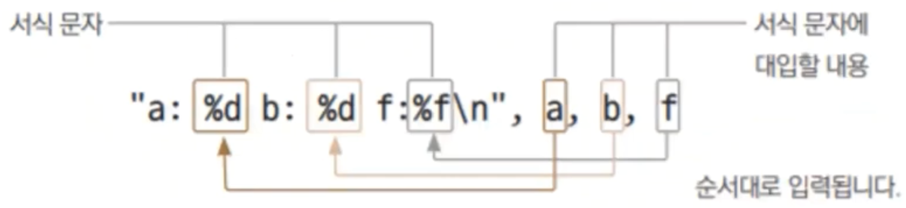

# 5장. fmt패키지를 이용한 표준입출력

## 표준 입출력

---

- 초기 컴퓨터는 천공 방식. 빛을 쏴서 빛이 통과되나 안되나로 입력시켰다.
    - 1개의 입력장치(카드리더), 1개의 출력장치(프린터)로 구성되어 있었다.
- 나중엔 입출력이 키보드, 마우스, 모니터로 진화했다.
- BitStream / ByteStream: 0과 1의 흐름

## 표준 출력 함수

---

- `Print()`: 함수 입력값들을 출력합니다.
- `Println()`: 함수 입력값들을 출력하고 개행합니다.
- `Printf()`: 서식(format)에 맞도록 입력값들을 출력합니다.

- ex5.1.go
    
    ```go
    package main
    
    import "fmt"
    
    func main() {
    	var a int = 10
    	var b int = 20
    	var f float64 = 32799438743.8297
    
    	fmt.Println("a:", a, "b:", b)
    	fmt.Println("a:", a, "b:", b, "f:", f)
    	fmt.Printf("a: %d b: %d f: %f\n", a, b, f)
    }
    ```
    
- 실행
    
    ```powershell
    yoonhee@Yoonhee goprojects % cd ex5.1
    yoonhee@Yoonhee ex5.1 % go mod init goprojects/ex5.1
    go: creating new go.mod: module goprojects/ex5.1
    go: to add module requirements and sums:
            go mod tidy
    yoonhee@Yoonhee ex5.1 % go build
    yoonhee@Yoonhee ex5.1 % ./ex5.1
    a: 10 b: 20
    a: 10 b: 20 f: 3.27994387438297e+10
    a: 10 b: 20 f: 32799438743.829700
    ```
    
    - `%d`: 정수타입 출력, `%f`: 실수타입 출력

### 출력 서식

---




- ex5.2.go
    
    ```go
    package main
    
    import "fmt"
    
    func main() {
    	var a = 123
    	var b = 456
    	var c = 123456789
    
    	fmt.Printf("%5d, %5d\n", a, b)
    	fmt.Printf("%05d, %05d\n", a, b)
    	fmt.Printf("%-5d, %-05d\n", a, b)
    
    	fmt.Printf("%5d, %5d\n", c, c)
    	fmt.Printf("%05d, %05d\n", c, c)
    	fmt.Printf("%-5d, %-05d\n", c, c)
    }
    ```
    
- 실행
    
    ```powershell
    yoonhee@Yoonhee goprojects % cd ex5.2
    yoonhee@Yoonhee ex5.2 % go mod init goprojects/ex5.2
    go: creating new go.mod: module goprojects/ex5.2
    go: to add module requirements and sums:
            go mod tidy
    yoonhee@Yoonhee ex5.2 % go build                    
    yoonhee@Yoonhee ex5.2 % ./ex5.2
      123,   456
    00123, 00456
    123  , 456  
    123456789, 123456789
    123456789, 123456789
    123456789, 123456789
    ```
    

### 실수 출력

---

- `%f`: 소수점 6자리까지 표현
- `%g`: 길이에 따라서 지수 표현 또는 실수 표현으로 출력

- `Println`: `%v` 형태로 동작한다. 실수 타입의 경우, `%g`로 출력된다.

### 특수 문자

---

- `\n`: 줄바꿈합니다.
- `\t`: 탭을 삽입합니다.
- `\\`: `\` 자체를 출력합니다.
- `\"`: `"`를 출력합니다. 큰따옴표로 묶인 문자열 내부에 따옴표를 넣을 때 사용합니다.

## 표준 입력

---

- `Scan()`: 표준 입력에서 값을 입력받습니다.
- `Scanf()`: 표준 입력에서 서식 형태로 값을 입력받습니다.
- `Scanln()`: 표준 입력에서 한 줄을 읽어서 값을 입력받습니다.

### `Scanln()`

---

- `func Scanln(a ...interface{}) (n int, err error)`
- 메모리 주소값을 알아야 값을 넣어줄 수 있기 때문에 `&`를 써줘야 한다.
- 함수의 인자로 쓰이면 Rvalue(값) 형태로 동작한다.
    - `&` 붙여줘야 Lvalue(메모리공간) 형태로 동작한다.

- ex5.3.go
    
    ```go
    package main
    
    import "fmt"
    
    func main() {
    	var a int
    	var b int
    
    	n, err := fmt.Scanln(&a, &b)
    	if err != nil {
    		fmt.Println(err)
    	} else {
    		fmt.Println(n, a, b)
    	}
    }
    ```
    
- 실행
    
    ```powershell
    yoonhee@Yoonhee goprojects % cd ex5.3
    yoonhee@Yoonhee ex5.3 % go mod init goprojects/ex5.3
    go: creating new go.mod: module goprojects/ex5.3
    go: to add module requirements and sums:
            go mod tidy
    yoonhee@Yoonhee ex5.3 % go build
    yoonhee@Yoonhee ex5.3 % ./ex5.3
    100
    unexpected newline
    yoonhee@Yoonhee ex5.3 % ./ex5.3
    100 200
    2 100 200
    ```
    

### 입력 버퍼

---


- 입력 버퍼: 입력한 정보를 보관한다.
    - 메모리 공간(임시 저장소)을 확보하고, 프로그램에서 읽어간다.
    - 실패했을 때 입력 버퍼를 비워줘야 한다.

- ex5.8.go
    
    ```go
    package main
    
    import (
    	"bufio"
    	"fmt"
    	"os"
    )
    
    func main() {
    	stdin := bufio.NewReader(os.Stdin)
    
    	var a int
    	var b int
    
    	n, err := fmt.Scanln(&a, &b)
    	if err != nil {
    		fmt.Println(err)
    		stdin.ReadString('\n')
    	} else {
    		fmt.Println(n, a, b)
    	}
    	
    	// n, err := fmt.Scanln(&a, &b) // 앞에서 선언된 거니까 대입만 하면 된다.
    	n, err = fmt.Scanln(&a, &b)
    	if err != nil {
    		fmt.Println(err)
    		stdin.ReadString('\n')
    	} else {
    		fmt.Println(n, a, b)
    	}
    }
    ```
    
- 실행
    
    ```powershell
    yoonhee@Yoonhee goprojects % cd ex5.8
    yoonhee@Yoonhee ex5.8 % go mod init goprojects/ex5.8
    go: creating new go.mod: module goprojects/ex5.8
    go: to add module requirements and sums:
            go mod tidy
    yoonhee@Yoonhee ex5.8 % go build
    yoonhee@Yoonhee ex5.8 % ./ex5.8 
    hello 4
    expected integer
    10 4
    2 10 4
    ```
    
    - 여러 패키지 `import` 할 땐 소괄호로 묶어서 해주는 방법도 있다.
    - `stdin.ReadString('\n')`: `\n` 문자가 나올 때까지 읽어와라.
        - 안할 경우 - 실행
            - 입력 버퍼에 남아있어서 이어서 값(4, \n)을 읽어오게 된다.
            
            ```powershell
            yoonhee@Yoonhee ex5.8 % ./ex5.8 
            hello 4
            expected integer
            expected integer
            ```
            
    - Go에서는 선언된 변수는 무조건 써줘야 한다.