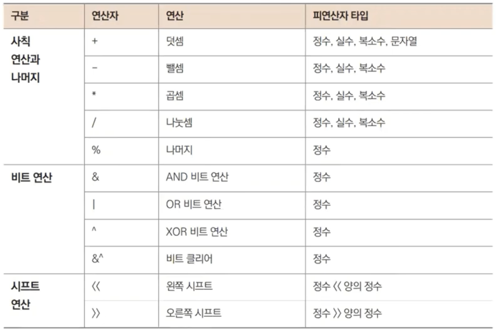

# 6장. 연산자

## 변수와 연산

---

- 데이터(숫자)를 계산/조작(연산자)한다.

## 산술 연산자

---



### 비트 연산자 - `&`(AND)

---


### 비트 연산자 - `|`(OR)

---


### 비트 연산자 - `^`(XOR)

---


### 비트 연산자 - `&^`(비트 클리어)

---


- `^2`: 비트 반전한다.
- 비트 클리어: 10 기준에서 2가 해당하는(1) 부분만 0으로 바뀐다.
    - 열거값 Bit flag 비트조작할 때 쓰인다.

### 왼쪽 쉬프트 `<<`

---


- `10 << 2`: 0000 1010 → 0010 1000 (2^2 == 4배)
    - 왼쪽으로 밀어서 생긴 빈 칸은 0으로 채운다.

- ex6.3.go
    
    ```go
    package main
    
    import (
    	"fmt"
    )
    
    func main() {
    	var x int8 = 4
    	var y int8 = 64
    
    	fmt.Printf("x:%08b x<<2:%08b x<<2: %d\n", x, x<<2, x<<2)
    	fmt.Printf("y:%08b y<<2:%08b y<<2: %d\n", y, y<<2, y<<2)
    }
    ```
    
- 실행
    
    ```powershell
    yoonhee@Yoonhee ex6.3 % ./ex6.3
    x:00000100 x<<2:00010000 x<<2: 16
    y:01000000 y<<2:00000000 y<<2: 0
    ```
    

### 오른쪽 쉬프트 `>>`

---


- ex6.4.go - before
    
    ```go
    package main
    
    import (
    	"fmt"
    )
    
    func main() {
    	var x int8 = 4
    	var y int8 = 64
    
    	fmt.Printf("x:%08b x<<2:%08b x<<2: %d\n", x, x<<2, x<<2)
    	fmt.Printf("y:%08b y<<2:%08b y<<2: %d\n", y, y<<2, y<<2)
    }
    ```
    
- 실행
    
    ```powershell
    yoonhee@Yoonhee ex6.4 % go build
    yoonhee@Yoonhee ex6.4 % ./ex6.4
    x:00010000 x>>2:00000100 x>>2: 4
    y:-10000000 y>>2:-0100000 y>>2: -32
    z:-0000001 z>>2:-0000001 z>>2: -1
    w:10000000 w>>2:00100000 w>>2: 32
    ```
    
- ex6.4.go - after
    
    ```go
    package main
    
    import (
    	"fmt"
    )
    
    func main() {
    	var x int8 = 16
    	var y int8 = -128
    	var z int8 = -1
    	var w uint8 = 128
    
    	fmt.Printf("x:%08b x>>2:%08b x>>2: %d\n", x, x>>2, x>>2)
    	fmt.Printf("y:%08b y>>2:%08b y>>2: %d\n", uint8(y), uint8(y>>2), y>>2)
    	fmt.Printf("z:%08b z>>2:%08b z>>2: %d\n", uint8(z), uint8(z>>2), z>>2)
    	fmt.Printf("w:%08b w>>2:%08b w>>2: %d\n", w, w>>2, w>>2)
    }
    ```
    
- 실행
    
    ```powershell
    yoonhee@Yoonhee ex6.4 % go build
    yoonhee@Yoonhee ex6.4 % ./ex6.4
    x:00010000 x>>2:00000100 x>>2: 4
    y:10000000 y>>2:11100000 y>>2: -32
    z:11111111 z>>2:11111111 z>>2: -1
    w:10000000 w>>2:00100000 w>>2: 32
    ```
    
    - `int8`로 타입변환되서 부호가 붙어버리므로, after처럼 `uint8`로 bit 뽑아보면 된다.

## 비교 연산자

---


### 정수 오버플로 - ex6.5

---

- ex6.5.go
    
    ```go
    package main
    
    import (
    	"fmt"
    )
    
    func main() {
    	var x int8 = 127
    
    	fmt.Printf("%d < %d+1: %v\n", x, x, x < x+1)
    	fmt.Printf("x\t= %4d, %08b\n", x, x)
    	fmt.Printf("x+1\t= %4d, %08b\n", x+1, uint8(x+1))
    }
    ```
    
- 실행
    
    ```powershell
    yoonhee@Yoonhee ex6.5 % ./ex6.5
    127 < 127+1: false
    x       =  127, 01111111
    x+1     = -128, 10000000
    ```
    

### 실수 오차 - ex6.6

---

- ex6.6.go
    
    ```go
    package main
    
    import "fmt"
    
    func main() {
    	var a float64 = 0.1
    	var b float64 = 0.2
    	var c float64 = 0.3
    
    	fmt.Printf("%f + %f == %f : %v\n", a, b, c, a+b == c)
    	fmt.Println(a + b)
    }
    ```
    
- 실행
    
    ```powershell
    yoonhee@Yoonhee ex6.6 % ./ex6.6 
    0.100000 + 0.200000 == 0.300000 : false
    0.30000000000000004
    ```
    
    - 0.00000000000000004 값이 붙어버린다. 그래서 `false`

- 왜 그럴까?
    
    
    
    - 2진수 형태로는 정확하게 0.3을 표현할 방법이 없다.

### `Nextafter()` 사용 - ex6.8

---

- ex6.8.go
    
    ```go
    package main
    
    import (
    	"fmt"
    	"math"
    )
    
    func equal(a, b float64) bool {
    	return math.Nextafter(a, b) == b
    }
    
    func main() {
    	var a float64 = 0.1
    	var b float64 = 0.2
    	var c float64 = 0.3
    
    	fmt.Printf("%0.18f == %0.18f : %v\n", c, a+b, equal(a+b, c))
    	fmt.Println(a + b)
    }
    ```
    
- 실행
    
    ```powershell
    yoonhee@Yoonhee ex6.8 % ./ex6.8 
    0.299999999999999989 == 0.300000000000000044 : true
    0.30000000000000004
    ```
    
    - `math.Nextafter(a, b)`: a → b를 향해 가는데 1비트씩 간다.

## 논리 연산자

---


## 대입 연산자

---

- 값을 반환하지 않는다.
- `a = 30`
- `a, b = 3, 4`

### 값 교환

---


- 우변(r-value): 값으로 바꾸고, 좌변(l-value): 메모리 공간으로 바꾼다.

### 복합 대입 연산자

---

- `+=`, `-=`, `*=`, `/=`, `%=`, `&=`, `|=`, `^=`, `<<=`, `>>=`

### 증감 연산자

---

- `++`, `-—`

## 그 외 연산자

---


## 연산자 우선순위

---


- `3 * 4 ^ 7 << 2 + 3 * 5 == 7`(25 == 7): `false`

### 그냥 괄호로 묶어주자

---

- `(((3 * 4) ^ (7 << 2)) + (3 * 5)) == 7`