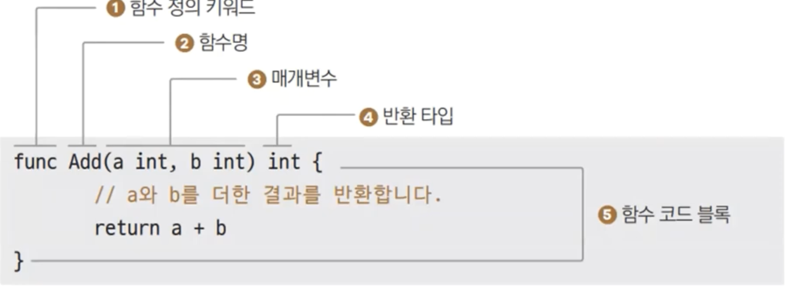

# 7장. 함수

## 수학에서 함수

---

- Input → 함수(계산) → Output

## 함수 정의

---



- C, C++같은 경우는 사용하는 곳 보다 앞서 정의되어 있어야 하는데, Go는 같은 패키지 아무데서나 정의하면 된다.

### ex7.1.go

---

- ex7.1.go
    
    ```go
    package main
    
    import (
    	"fmt"
    )
    
    func Add(a int, b int) int {
    	return a + b
    }
    
    func main() {
    	c := Add(3, 6)
    	fmt.Println(c)
    }
    ```
    
- 실행
    
    ```powershell
    yoonhee@Yoonhee ex7.1 % ./ex7.1 
    9
    ```
    

### 함수 왜 쓰나?

---

- 반복 작업이 싫다…
- 줄 별로 명령어 실행 시, `JMP`로 IP를 바꾸고 다시 돌아오면 어떨까?
    - IP(Instruction Point), PC(Program Count)

### 함수 콜 깊이 보기

---

- 함수: 반복이 싫어서 만들어짐. 프로그램에서는 코드 블럭이다.
    - 묶어서 call 할 수 있게 만들어 놓은 것

## 멀티 반환 함수 - ex7.4

---


- ex7.4.go
    
    ```go
    package main
    
    import "fmt"
    
    func Divide(a, b int) (int, bool) {
    	if b == 0 {
    		return 0, false
    	}
    	return a / b, true
    }
    
    func main() {
    	c, success := Divide(9, 3)
    	fmt.Println(c, success)
    	d, success := Divide(9, 0)
    	fmt.Println(d, success)
    }
    ```
    
- 실행
    
    ```powershell
    yoonhee@Yoonhee ex7.4 % ./ex7.4
    3 true
    0 false
    ```
    
    - 함수명이 대문자로 시작하는건 의미가 있는데 나중에 설명할 예정.
    - `func Divide(a, b int) (int, bool) {`
        - a, b 처럼 같은 타입이 연속될 때 타입을 하나만 써줘도 된다.
        - 반환타입이 여러개면 소괄호로 묶어줘야 한다.
    - `d, success := Divide(9, 0)`: 여러개에 선언 대입문을 쓸 땐, 하나라도 아직 선언이 안되었으면 선언대입문 쓸 수 있다.

## 출력 값에 이름 지정 - ex7.5

---

- ex7.5.go
    
    ```go
    package main
    
    import "fmt"
    
    func Divide(a, b int) (result int, success bool) {
    	if b == 0 {
    		result = 0
    		success = false
    		return
    	}
    	result = a / b
    	success = true
    	return
    }
    
    func main() {
    	c, success := Divide(9, 3)
    	fmt.Println(c, success)
    	d, success := Divide(9, 0)
    	fmt.Println(d, success)
    }
    ```
    
- 실행
    
    ```powershell
    yoonhee@Yoonhee ex7.5 % ./ex7.5
    3 true
    0 false
    ```
    
    - 출력값에 이름을 적으면 `return`만으로 그 이름의 값을 반환한다.

## 재귀 호출 - ex7.6

---

- ex.7.6.go
    
    ```go
    package main
    
    import "fmt"
    
    func printNo(n int) {
    	if n == 0 { // 재귀 호출 탈출 조건
    		return
    	}
    	fmt.Println(n)
    	printNo(n - 1) // 재귀 호출
    	fmt.Println("After", n) // 재귀 호출 이후 출력
    }
    
    func main() {
    	printNo(3) // 함수 호출
    }
    ```
    
- 실행
    
    ```powershell
    yoonhee@Yoonhee ex7.6 % ./ex7.6
    3
    2
    1
    After 1
    After 2
    After 3
    ```
    
    - 재귀 호출 시 탈출 조건을 명확히 해줘야 한다.
    - 재귀 호출할 때마다 스택이 하나씩 쌓인다. 프로그램이 강제 종료 되기도 한다.

- Go는 자동 증가되는 스택을 쓴다.(고정길이 x)
    - 메모리가 고갈나지 않는 한 계속 실행된다.