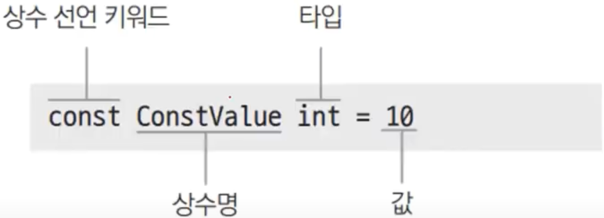

# 8장. 상수

## 상수

---

- 변하지 않는 수

### 상수 선언

---



- 초기값이 정해지면 값을 바꿀 수 없다.

- ex8.2.go
    
    ```go
    package main
    
    import "fmt"
    
    func main() {
    	const pi1 float64 = 3.141592653589793228 // 상수
    	var pi2 float64 = 3.141592653589793228   // 변수
    
    	// pi1 = 3 // cannot assign to pi1 (neither addressable nor a map index expression) compiler-UnassignableOperand
    	pi2 = 4
    
    	fmt.Printf("원주율: %f\n", pi1)
    	fmt.Printf("원주율: %f\n", pi2)
    }
    ```
    
- 실행
    
    ```powershell
    yoonhee@Yoonhee ex8.2 % ./ex8.2 
    원주율: 3.141593
    원주율: 4.000000
    ```
    

### 코드값으로 사용

---

- 코드란 숫자에 의미를 부여하는 것이다.
    - ASCII: 65를 'A'로 하자.

- ex8.3.go
    
    ```go
    package main
    
    import "fmt"
    
    const Pig int = 0
    const Cow int = 1
    const Chicken int = 2
    
    func PrintAnimal(animal int) {
    	if animal == Pig {
    		fmt.Println("꿀꿀")
    	} else if animal == Cow {
    		fmt.Println("음메")
    	} else if animal == Chicken {
    		fmt.Println("꼬끼오")
    	} else {
    		fmt.Println("...")
    	}
    }
    
    func main() {
    	PrintAnimal(Cow)
    	PrintAnimal(Pig)
    	PrintAnimal(7)
    	PrintAnimal(0)
    }
    ```
    
- 실행
    
    ```powershell
    yoonhee@Yoonhee ex8.3 % ./ex8.3
    음메
    꿀꿀
    ...
    꿀꿀
    ```
    
    - Pig로 쓰면 같은 0이어도 의미있게 쓸 수 있다.

## iota로 열거값 사용

---


- 상수를 여러개 한꺼번에 선언할 수 있다.
- iota로 쓰면 자동으로 1씩 증가된다.
- 밑에 상수의 타입, 초기값과 똑같이 반복되는거는 안써줘도 된다.

## 비트플래그

---


- 깃발처럼 각 비트자리마다 의미를 부여하는 것이다.

- 예제
    
    
    
- 실행
    
    ```powershell
    Turn on MasterRoom Light
    Turn on LivingRoom Light
    ```
    

## 타입 없는 상수

---

- ex8.4.go
    
    ```go
    package main
    
    import "fmt"
    
    const PI = 3.14
    const FloatPI float64 = 3.14
    
    func main() {
    	var a int = PI * 100
    	// var b int = FloatPI * 100 // cannot use FloatPI * 100 (constant 314 of type float64) as int value in variable declaration compiler-IncompatibleAssign
    
    	fmt.Println(a)
    	// fmt.Println(b)
    }
    ```
    
- 실행
    
    ```go
    yoonhee@Yoonhee ex8.4 % ./ex8.4 
    314
    ```
    
    - Go에서는 모든 연산자의 피연산자 타입이 같아야 한다.
        - PI는 타입 없는 상수라 값을 넣을 때 타입이 정해져서 오류가 안난다.

### 상수 깊이 보기

---

- 상수는 좌변(l-value)으로 사용할 수 없다.
    - 항상 값으로만 쓰여야 한다.
    - 상수는 동적 메모리 공간이 없다. 코드에 그냥 박아버린다.