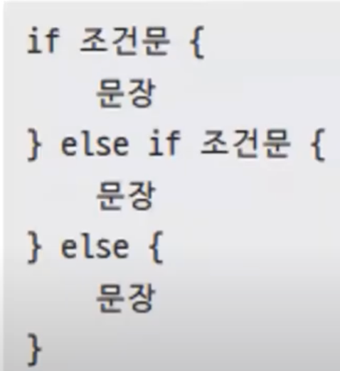

# 9장. if문

## if문 기본 사용법

---



- `if`문의 컨디션: `bool` 타입

- ex9.2.go
    
    ```go
    package main
    
    import "fmt"
    
    func main() {
    	temp := 33
    
    	if temp > 28 {
    		fmt.Println("에어컨을 켠다")
    	} else if temp <= 3 {
    		fmt.Println("히터를 켠다")
    	} else if temp <= 18 {
    		fmt.Println("나가자!")
    	} else {
    		fmt.Println("덥다")
    	}
    }
    ```
    
- 실행
    
    ```powershell
    yoonhee@Yoonhee ex9.2 % ./ex9.2 
    에어컨을 켠다
    ```
    

- ex9.3.go
    
    ```go
    package main
    
    import "fmt"
    
    func main() {
    	var age = 22
    
    	if age >= 10 && age <= 15 {
    		fmt.Println("You are young")
    	} else if age > 30 || age < 20 {
    		fmt.Println("You are not 20s")
    	} else {
    		fmt.Println("Best age")
    	}
    }
    ```
    
- 실행
    
    ```powershell
    yoonhee@Yoonhee ex9.3 % ./ex9.3 
    Best age
    ```
    

### Go의 제어문, 조건문, 반복문

---

- 제어문: `control`
- 조건문: `if`/`switch`
- 반복문: `for`

## 쇼트 서킷

---


- ex9.4.go
    
    ```go
    package main
    
    import "fmt"
    
    var cnt int = 0
    
    func IncreaseAndReturn() int {
    	fmt.Println("IncreaseAndReturn()", cnt)
    	cnt++
    	return cnt
    }
    
    func main() {
    	if false && IncreaseAndReturn() < 5 {
    		fmt.Println("1 증가")
    	}
    }
    ```
    
- 실행
    
    ```powershell
    yoonhee@Yoonhee ex9.4 % ./ex9.4
    ```
    
    - `cnt`: 패키지 전역변수
        - 지역변수는 중괄호 나가는 순간 없어진다.
    - `IncreaseAndReturn()`가 호출이 안됫다.
- 실행 - 앞에가 `true`일 때
    
    ```powershell
    yoonhee@Yoonhee ex9.4 % ./ex9.4 
    IncreaseAndReturn() 0
    1 증가
    ```
    

## 소괄호 활용

---

- 조건문이 복잡할 때 소괄호로 보기 좋게 해줄 필요가 있다.

## 중첩 `if`

---


- ex9.5.go
    
    ```go
    package main
    
    import "fmt"
    
    func HasRichFriend() bool {
    	return true
    }
    
    func GetFriendsCount() int {
    	return 3
    }
    
    func main() {
    	price := 35000
    	if price >= 50000 {
    		if HasRichFriend() {
    			fmt.Println("앗 신발끈이 풀렸네")
    		} else {
    			fmt.Println("나눠내자")
    		}
    	} else if price >= 30000 {
    		if GetFriendsCount() > 3 {
    			fmt.Println("어이쿠 신발끈이...")
    		} else {
    			fmt.Println("사람도 얼마 없는데 나눠내자.")
    		}
    	} else {
    		fmt.Println("오늘은 내가 쏜다")
    	}
    }
    ```
    
- 실행
    
    ```powershell
    yoonhee@Yoonhee ex9.5 % ./ex9.5 
    사람도 얼마 없는데 나눠내자.
    ```
    

## `if 초기문; 조건문`

---


- Go는 한 줄에 여러 구문이 쓰일 때만 `;`를 쓴다.