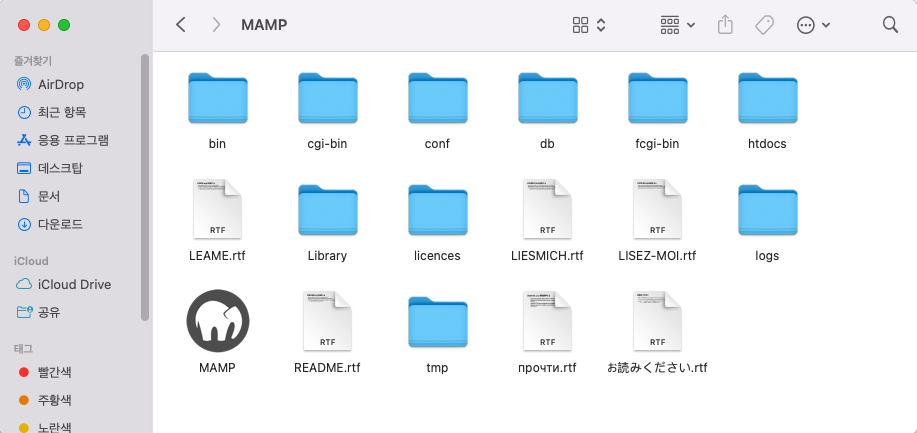

# Chapter 1. PHP 기초

## 1. PHP의 설치

---

- WAMP를 설치했다면 PHP가 설치되었겠지만 아니라면 없을 것이다.
- [https://www.mamp.info/en/downloads/](https://www.mamp.info/en/downloads/) 에서 MAMP를 설치한다.
    
    
    
    
    
    
    
    - [http://localhost:8888/MAMP/?language=English](http://localhost:8888/MAMP/?language=English) 가 열린다.

### htdocs 에서 작업할 예정

---

```php
<?php
phpinfo();
?>
```


### 학습&개발을 위한 환경설정

---

- MAMP > bin > php > php8.2.0 > conf 의 php.ini 파일: PHP의 기본적인 동작 방식을 바꿀 수 있다.
    1. `display_errors = On` 으로 바꾼다. 에러를 화면으로 표시해주는 것 (기본적으론 꺼져있다)
        
        
        
    2. `opcache.enable=0`으로 바꾼다. PHP의 성능을 올리는 일. 컴퓨팅 파워를 덜 쓰고 작업할 수 있다.
        
        
        
    
    → 그 후 restart
    
- MAMP > bin > apache2 > logs 의 error_log 참고하면 도움이 된다.

## 2. PHP의 원리

---

- php 요청이 오면 웹서버가 처리할 수 없음을 인지하고 PHP 서버로 요청을 위임하고 응답을 받아 넘긴다.
- [http://127.0.0.1:8888/index.html](http://127.0.0.1:8888/index.html)
    
    ```html
    <!doctype html>
    <html>
      <body>
        2018-01-20 18:36:01
      </body>
    </html>
    ```
    
    
    
- [http://127.0.0.1:8888/index.php](http://127.0.0.1:8888/index.php)
    
    ```php
    <!doctype html>
    <html>
      <body>
        <?php
          echo date('Y-m-d H:i:s');
        ?>
      </body>
    </html>
    ```
    
    
    
    
    
    - 코드보기 하면 평범한 html 코드로 나온다.

## 3. PHP의 데이터 타입 (숫자와 문자)

---

- 컴퓨터 언어를 배우는 중요한 흐름은 그 언어가 지원하는 데이터의 형식들을 익히고, 형식별로 데이터를 처리하는 방법을 알아가는 과정이다. 여기서는 가장 많이 사용되는 형식인 숫자와 문자열을 살펴봄으로서 데이터 타입이 무엇인가에 대한 감을 잡아보는 시간이다.
- php data types 로 구글 검색해보자.
    - 강의에서는 5.1 버전이라 다른듯
        
        
        
- [https://www.php.net/manual/en/language.types.intro.php](https://www.php.net/manual/en/language.types.intro.php)
    - `bool`
    - `int`
    - `float` (floating-point number)
    - `string`
    - `array`
    - `object`
    - `callable`
    - `resource`
    - `null`
    
    ```php
    <?php
    $a_bool = true;   // a bool
    $a_str  = "foo";  // a string
    $a_str2 = 'foo';  // a string
    $an_int = 12;     // an int
    
    echo get_debug_type($a_bool), "\n";
    echo get_debug_type($a_str), "\n";
    
    // If this is an integer, increment it by four
    if (is_int($an_int)) {
        $an_int += 4;
    }
    var_dump($an_int);
    
    // If $a_bool is a string, print it out
    if (is_string($a_bool)) {
        echo "String: $a_bool";
    }
    ?>
    ```
    
    ```php
    # PHP8
    bool
    string
    int(16)
    ```
    

### ****숫자와 산술연산자****

---

- `int`
    - PHP는 반드시 하나의 구문/명령이 끝나면 세미콜론(`;`)을 찍어야 한다.
    
    ```php
    <?php
      echo 1;
    ?>
    ```
    
    
    
- `float`
    
    ```php
    <?php
      echo 1.1;
    ?>
    ```
    
    
    
    - `operator`: 연산자. `+`, `-`, `*`, `/`
        
        ```php
        <!doctype html>
        <html>
        <body>
         <h1>Number & Arithmetic Operator</h1>
         <h2>1+1</h2>
         <?php
         echo 1+1;
         ?>
         <h2>2-1</h2>
         <?php
         echo 2-1;
         ?>
         <h2>2*2</h2>
         <?php
         echo 2*2;
         ?>
         <h2>4/2</h2>
         <?php
         echo 4/2;
         ?>
        </body>
        </html>
        ```
        
        
        

### ****문자열과 문자열의 처리****

---

- `string`: single/double 따옴표
    
    ```php
    <!doctype html>
    <html>
    <body>
     <h1>String & String Operator</h1>
    <?php
    echo "Hello \"w\"ord";
    ?>
     <h2>concatenation operator</h2><!-- 많이쓴다 -->
     <?php
     echo "Hello "."world";
     ?>
     <h2>String length function</h2>
     <?php
     echo strlen("Hello world");
     ?>
    </body>
    </html>
    ```
    
    - 큰 따옴표, 작은 따옴표 조합으로 표현하거나, escape 해서 큰 따옴표와 작은 따옴표를 써줄 수 있다.
        - ex> `"Hello 'w'orld"` / `"Hello \"w\"orld"`
    - `strlen`: 몇 개의 문자로 이뤄져 있나?
        
        ```php
        <?php
        $str = 'abcdef';
        echo strlen($str); // 6
        
        $str = ' ab cd ';
        echo strlen($str); // 7
        ?>
        ```
        

## 4. PHP의 변수

---

- 변할 수 있는 값, 혹은 값에 대한 이름으로서 변수를 살펴봅니다. 또 변수를 통해서 해결할 수 있는 현실의 문제도 살펴보는 시간이다.
- `$`: 변수이름 앞에 붙여서 변수로 만든다.
    
    ```php
    <!doctype html>
    <html>
    <body>
     <h1>Variable</h1>
    <?php
    $a = 10;
    echo $a+1;
    ?>
    </body>
    </html>
    ```
    
    
    
    ```php
    <!DOCTYPE html>
    <html>
     <body>
     <h1>Variable</h1>
     <?php
     $name = "leezche";
     echo "Lorem ipsum dolor sit amet, consectetur ".$name." adipisicing elit, sed do eiusmod tempor incididunt ut labore et dolore magna aliqua. Ut enim ad minim veniam, quis nostrud exercitation ullamco ".$name." laboris nisi ut aliquip ex ea commodo consequat. Duis aute irure dolor in reprehenderit in voluptate velit esse cillum dolore egoing eu fugiat nulla pariatur. Excepteur sint occaecat cupidatat non proident, sunt in culpa qui officia deserunt mollit anim id est laborum. by ".$name;
     ?>
     </body>
    </html>
    ```
    
    
    

## 5. **PHP의 URL 파라미터**

---

- 여기서는 php 에플리케이션의 입력으로서 URL parameter 를 사용하는 방법을 알아본다.
- `$_GET`
    
    ```php
    <!DOCTYPE html>
    <html>
      <head>
        <meta charset="utf-8">
      </head>
      <body>
        안녕하세요. <?php echo $_GET['address']; ?>에 사시는 <?php echo $_GET['name']; ?>님
      </body>
    </html>
    ```
    
    
    
    ```php
    <!DOCTYPE html>
    <html>
      <head>
        <meta charset="utf-8">
        <title></title>
      </head>
      <body>
        <h1>WEB</h1>
        <ol>
          <li><a href="index.php?id=HTML">HTML</a></li>
          <li><a href="index.php?id=CSS">CSS</a></li>
          <li><a href="index.php?id=JavaScrit">JavaScript</a></li>
        </ol>
        <h2>
          <?php
            echo $_GET['id'];
          ?>
        </h2>
        Lorem ipsum dolor sit amet, consectetur adipisicing elit, sed do eiusmod tempor incididunt ut labore et dolore magna aliqua. Ut enim ad minim veniam, quis nostrud exercitation ullamco laboris nisi ut aliquip ex ea commodo consequat. Duis aute irure dolor in reprehenderit in voluptate velit esse cillum dolore eu fugiat nulla pariatur. Excepteur sint occaecat cupidatat non proident, sunt in culpa qui officia deserunt mollit anim id est laborum.
      </body>
    </html>
    ```
    
    
    
    
    

## 6. PHP 함수의 사용

---

- 함수의 사용자로서 함수가 무엇인가? 함수를 어떻게 사용하는가? 필요한 함수를 어떻게 찾을 수 있는가를 살펴보는 시간이다.
- `nl2br`: `string`의 줄바꿈을 HTML 줄바꿈으로 바꿔주는 함수
    
    ```php
    <!DOCTYPE html>
    <html>
      <head>
        <meta charset="utf-8">
        <title>function</title>
      </head>
      <body>
        <h1>function</h1>
        <?php
        $str = "Lorem ipsum dolor sit amet, consectetur adipisicing elit.
     
     
        sed do eiusmod tempor incididunt ut labore et dolore magna aliqua.";
        echo $str;
         ?>
         <h2>strlen()</h2>
         <?php
         echo strlen($str);
          ?>
          <h2>nl2br</h2>
          <?php
         echo nl2br($str);
           ?>
      </body>
    </html>
    ```
    
    
    
    ```php
    <!DOCTYPE html>
    <html>
      <head>
        <meta charset="utf-8">
        <title></title>
      </head>
      <body>
        <h1>WEB</h1>
        <ol>
          <li><a href="index.php?id=HTML">HTML</a></li>
          <li><a href="index.php?id=CSS">CSS</a></li>
          <li><a href="index.php?id=JavaScript">JavaScript</a></li>
        </ol>
        <h2>
          <?php
            echo $_GET['id'];
          ?>
        </h2>
        <?php
        echo file_get_contents("data/".$_GET['id']);
         ?>
      </body>
    </html>
    ```
    
    ```html
    **HTML** Lorem ipsum dolor sit amet, consectetur adipisicing elit. sed do eiusmod tempor incididunt ut labore et dolore magna aliqua.
    ```
    
    
    
    → `file_get_contents`: 파일을 가져온다.
    

## 7. PHP와 제어문 예고

---

- 앞으로 배우게 될 조건문, 반복문이 무엇인가에 대한 예고편이다.
- 제어문: 시간의 흐름을 제어한다.
    - 조건문
    - 반복문