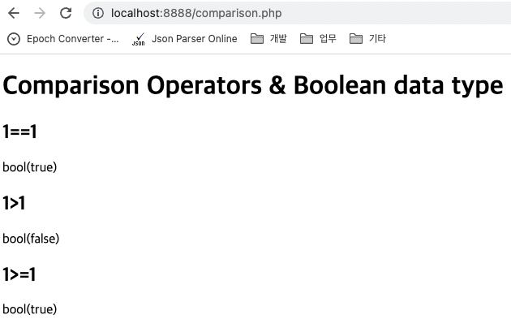

# Chapter 2. 조건문

## 1. PHP의 조건문 예고

---

- 조건문은 왜 필요한지에 대한 예고편이다.

## 2. Boolean과 비교연산자

---

- 조건문을 배우기에 앞서서 `Boolean`과 비교연산자에 대해서 알아보는 시간이다.
    
    ```php
    <!DOCTYPE html>
    <html>
      <head>
        <meta charset="utf-8">
      </head>
      <body>
        <h1>Comparison Operators &amp; Boolean data type </h1>
        <h2>1==1</h2>
        <?php
        var_dump(1==1);
        ?>
        <h2>1>1</h2>
        <?php
        var_dump(1>1);
        ?>
        <h2>1>=1</h2>
        <?php
        var_dump(1>=1);
        ?>
      </body>
    </html>
    ```
    
    
    
    - `var_dump`: 변수의 정보를 출력하는 함수

## 3. 조건문의 형식

---

- PHP의 조건문의 기본형식을 알아보는 시간이다.
    
    ```php
    <!DOCTYPE html>
    <html>
      <head>
        <meta charset="utf-8">
      </head>
      <body>
        <h1>Conditional</h1>
        <h2>if</h2>
        <?php
        echo '1<br>';
        if(false) {
          echo '2-1<br>';
        } else {
          echo '2-2<br>';
        }
        echo '3<br>';
        ?>
      </body>
    </html>
    ```
    
    
    

- `elseif`/`else if`: statement
    
    ```php
    <?php
    if ($a > $b) {
        echo "a is bigger than b";
    } elseif ($a == $b) {
        echo "a is equal to b";
    } else {
        echo "a is smaller than b";
    }
    ?>
    ```
    
    ```php
    <?php
    
    /* Incorrect Method: */
    if ($a > $b):
        echo $a." is greater than ".$b;
    else if ($a == $b): // Will not compile.
        echo "The above line causes a parse error.";
    endif;
    
    /* Correct Method: */
    if ($a > $b):
        echo $a." is greater than ".$b;
    elseif ($a == $b): // Note the combination of the words.
        echo $a." equals ".$b;
    else:
        echo $a." is neither greater than or equal to ".$b;
    endif;
    
    ?>
    ```
    

## 4. 조건문 활용

---

- PHP의 조건문을 활용해서 웹 애플리케이션의 기능을 개선하는 모습을 살펴본다.
    
    ```php
    <!DOCTYPE html>
    <html>
      <head>
        <meta charset="utf-8">
        <title></title>
      </head>
      <body>
        <h1><a href="index.php">WEB</a></h1>
        <ol>
          <li><a href="index.php?id=HTML">HTML</a></li>
          <li><a href="index.php?id=CSS">CSS</a></li>
          <li><a href="index.php?id=JavaScript">JavaScript</a></li>
        </ol>
        <h2>
          <?php
          if(isset($_GET['id'])){
            echo $_GET['id'];
          } else {
            echo "Welcome";
          }
          ?>
        </h2>
        <?php
        if(isset($_GET['id'])){
          echo file_get_contents("data/".$_GET['id']);
        } else {
          echo "Hello, PHP";
        }
         ?>
      </body>
    </html>
    ```
    
    
    
    
    
    - `isset`: 값이 있냐 없냐에 따라 `bool` 리턴
        
        ```php
        <?php
        
        $var = '';
        
        // TRUE so the text will be printed.
        if (isset($var)) {
            echo "This var is set so I will print.";
        }
        
        // In the next examples we'll use var_dump to output
        // the return value of isset().
        
        $a = "test";
        $b = "anothertest";
        
        var_dump(isset($a));     // TRUE
        var_dump(isset($a, $b)); // TRUE
        
        unset ($a);
        
        var_dump(isset($a));     // FALSE
        var_dump(isset($a, $b)); // FALSE
        
        $foo = NULL;
        var_dump(isset($foo));   // FALSE
        
        ?>
        ```