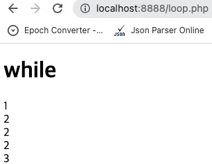

# Chapter 3. 반복문

## 1. 반복문 예고

---

- 대규모의 반복적인 작업을 처리할 수 있는 반복문이 왜 필요한지에 대한 예고편이다.

## 2. 반복문 형식

---

- PHP 반복문의 기본적인 형식을 살펴보는 시간이다.
    
    ```php
    <!DOCTYPE html>
    <html>
      <head>
        <meta charset="utf-8">
        <title>Loop</title>
      </head>
      <body>
        <h1>while</h1>
        <?php
        echo '1<br>';
        $i = 0;
        while($i < 3){
          echo '2<br>';
          $i = $i + 1;
        }
        echo '3<br>';
         ?>
      </body>
    </html>
    ```
    
    
    
    - `while`: statement
        
        ```php
        <?php
        /* example 1 */
        
        $i = 1;
        while ($i <= 10) {
            echo $i++;  /* the printed value would be
                           $i before the increment
                           (post-increment) */
        }
        
        /* example 2 */
        
        $i = 1;
        while ($i <= 10):
            echo $i;
            $i++;
        endwhile;
        ?>
        ```
        

## 3. 배열의 형식

---

- 배열이 무엇인지 살펴보고, 그 형식을 배우는 시간이다.
    
    ```php
    <!DOCTYPE html>
    <html>
      <head>
        <meta charset="utf-8">
        <title>Array</title>
      </head>
      <body>
        <h1>Array</h1>
        <?php
        $coworkers = array('egoing', 'leezche', 'duru', 'taeho');
        echo $coworkers[1].'<br>';
        echo $coworkers[3].'<br>';
        var_dump(count($coworkers));
        
        echo '<br>';
        
        array_push($coworkers, 'graphittie');
        var_dump($coworkers);
        ?>
      </body>
    </html>
    ```
    
    
    
    - `array`
        
        ```php
        <?php
        $fruits = array (
            "fruits"  => array("a" => "orange", "b" => "banana", "c" => "apple"),
            "numbers" => array(1, 2, 3, 4, 5, 6),
            "holes"   => array("first", 5 => "second", "third")
        );
        ?>
        ```
        
        ```php
        <?php
        $array = array(1, 1, 1, 1, 1, 8 => 1,  4 => 1, 19, 3 => 13);
        print_r($array);
        ?>
        #
        Array
        (
            [0] => 1
            [1] => 1
            [2] => 1
            [3] => 13
            [4] => 1
            [8] => 1
            [9] => 19
        )
        ```
        
        ```php
        <?php
        $firstquarter = array(1 => 'January', 'February', 'March');
        print_r($firstquarter);
        ?>
        #
        Array
        (
            [1] => January
            [2] => February
            [3] => March
        )
        ```
        
        ```php
        <?php
        
        $foo = array('bar' => 'baz');
        echo "Hello {$foo['bar']}!"; // Hello baz!
        
        ?>
        ```
        

## 4. 반복문과 배열의 활용

---

- 반복문, 배열, 조건문을 망라해서 웹애플리케이션을 제작해보는 수업이다.
    
    ```php
    <!DOCTYPE html>
    <html>
      <head>
        <meta charset="utf-8">
        <title></title>
      </head>
      <body>
        <h1><a href="index.php">WEB</a></h1>
        <ol>
          <?php
            $list = scandir('./data');
            $i = 0;
            while($i < count($list)){
              if($list[$i] != '.') {
                if($list[$i] != '..') {
                  echo "<li><a href=\"index.php?id=$list[$i]\">$list[$i]</a></li>\n";
                }
              }
              $i = $i + 1;
            }
          ?>
        </ol>
        <h2>
          <?php
          if(isset($_GET['id'])){
            echo $_GET['id'];
          } else {
            echo "Welcome";
          }
          ?>
        </h2>
        <?php
        if(isset($_GET['id'])){
          echo file_get_contents("data/".$_GET['id']);
        } else {
          echo "Hello, PHP";
        }
         ?>
      </body>
    </html>
    ```
    
    
    
    
    
    - `scandir`: 특정 디렉토리의 파일을 배열로 받아볼 수 있다.