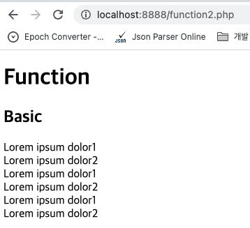

# Chapter 4. 함수

## 1. 함수 만들기 예고

---

- 함수를 직접 만들면 무엇이 좋아지는지 스포일러를 담고 있다.

## 2. 함수의 형식

---

- PHP에서 함수를 만드는 방법에 대한 수업이다.
    
    ```php
    <!DOCTYPE html>
    <html>
      <head>
        <meta charset="utf-8">
        <title>function</title>
      </head>
      <body>
        <h1>Function</h1>
        <h2>Basic</h2>
          <?php
    				function basic(){
    				    print("Lorem ipsum dolor1<br>");
    				    print("Lorem ipsum dolor2<br>");
    				}
    
    				basic();
    				basic();
    				basic();
    			?>
      </body>
    </html>
    ```
    
    
    
    ```php
    <!DOCTYPE html>
    <html>
      <head>
        <meta charset="utf-8">
        <title>function</title>
      </head>
      <body>
        <h1>Function</h1>
        <h2>Basic</h2>
          <?php
            function basic(){
                print("Lorem ipsum dolor1<br>");
                print("Lorem ipsum dolor2<br>");
            }
    
            basic();
            basic();
            basic();
          ?>
        <h2>parameter &amp; argument</h2>
          <?php
            function sum($left, $right){
                print($left+$right);
                print("<br>");
              }
              sum(2,4);
              sum(4,6);
          ?>
      </body>
    </html>
    ```
    
    
    
    ```php
    function sum2($left, $right){
      return $left+$right;
    }
    print(sum2(2,4));
    file_put_contents('result.txt', sum2(2,4));
    // email('egoing@egoing.net', sum2(2,4));
    // upload('egoing.net', sum2(2,4));
    ```
    
    
    
    
    

## 3. 함수의 활용

---

- 함수를 직접 만들어서 애플리케이션의 복잡도를 높이고, 재활용성을 높이는 모습을 보여준다.
    
    ```php
    <?php
    function print_title(){
      if(isset($_GET['id'])){
        echo $_GET['id'];
      } else {
        echo "Welcome";
      }
    }
    function print_description(){
      if(isset($_GET['id'])){
        echo file_get_contents("data/".$_GET['id']);
      } else {
        echo "Hello, PHP";
      }
    }
    function print_list(){
      $list = scandir('./data');
      $i = 0;
      while($i < count($list)){
        if($list[$i] != '.') {
          if($list[$i] != '..') {
            echo "<li><a href=\"index.php?id=$list[$i]\">$list[$i]</a></li>\n";
          }
        }
        $i = $i + 1;
      }
    }
    ?>
    <!DOCTYPE html>
    <html>
      <head>
        <meta charset="utf-8">
        <title>
          <?php
          print_title();
          ?>
        </title>
      </head>
      <body>
        <h1><a href="index.php">WEB</a></h1>
        <ol>
          <?php
          print_list();
          ?>
        </ol>
        <h2>
          <?php
          print_title();
          ?>
        </h2>
        <?php
        print_description();
         ?>
      </body>
    </html>
    ```
    
    
    
    