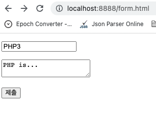

# Chapter 5. 웹 애플리케이션

## 1. 웹 애플리케이션 완성 예고

---

- 이제부터 읽기, 쓰기, 수정, 삭제 기능을 모두 갖춘 완벽한 웹앱을 만들 것입니다. 우리가 만들 웹앱이 어떤 기능을 가지게 될 것인지를 스포일러 한다.

## 2. `FORM`과 `POST`

---

- 서버로 데이터를 전송할 때 사용하는 HTML의 기능인 `form`을 살펴봅니다. 또, URL을 통하지 않고 은밀하게 데이터를 전송하는 방법인 `POST` 방식도 알아본다.
    
    ```html
    <!doctype html>
    <html>
      <body>
        <form action="form.php" method="post">
          <p><input type="text" name="title" placeholder="Title"></p>
          <p><textarea name="description"></textarea></p>
          <p><input type="submit"></p>
        </form>
      </body>
    </html>
    ```
    
    ```php
    <?php
    file_put_contents('data/'.$_POST['title'], $_POST['description']);
    ?>
    ```
    
    
    
    
    

## 3. 글 생성 기능 구현하기

---

- PHP를 이용해서 불특정 다수가 웹을 통해서 글을 제출하는 방법을 살펴본다.
    
    ```php
    <?php
    function print_title(){
      if(isset($_GET['id'])){
        echo $_GET['id'];
      } else {
        echo "Welcome";
      }
    }
    function print_description(){
      if(isset($_GET['id'])){
        echo file_get_contents("data/".$_GET['id']);
      } else {
        echo "Hello, PHP";
      }
    }
    function print_list(){
      $list = scandir('./data');
      $i = 0;
      while($i < count($list)){
        if($list[$i] != '.') {
          if($list[$i] != '..') {
            echo "<li><a href=\"index.php?id=$list[$i]\">$list[$i]</a></li>\n";
          }
        }
        $i = $i + 1;
      }
    }
    ?>
    <!DOCTYPE html>
    <html>
      <head>
        <meta charset="utf-8">
        <title>
          <?php
          print_title();
          ?>
        </title>
      </head>
      <body>
        <h1><a href="index.php">WEB</a></h1>
        <ol>
          <?php
          print_list();
          ?>
        </ol>
        <a href="create.php">create</a>
        <h2>
          <?php
          print_title();
          ?>
        </h2>
        <?php
        print_description();
        ?>
      </body>
    </html>
    ```
    
    ```php
    <?php
    function print_title(){
      if(isset($_GET['id'])){
        echo $_GET['id'];
      } else {
        echo "Welcome";
      }
    }
    function print_description(){
      if(isset($_GET['id'])){
        echo file_get_contents("data/".$_GET['id']);
      } else {
        echo "Hello, PHP";
      }
    }
    function print_list(){
      $list = scandir('./data');
      $i = 0;
      while($i < count($list)){
        if($list[$i] != '.') {
          if($list[$i] != '..') {
            echo "<li><a href=\"index.php?id=$list[$i]\">$list[$i]</a></li>\n";
          }
        }
        $i = $i + 1;
      }
    }
    ?>
    <!DOCTYPE html>
    <html>
      <head>
        <meta charset="utf-8">
        <title>
          <?php
          print_title();
          ?>
        </title>
      </head>
      <body>
        <h1><a href="index.php">WEB</a></h1>
        <ol>
          <?php
          print_list();
          ?>
        </ol>
        <a href="create.php">create</a>
        <form action="create_process.php" method="post">
          <p>
            <input type="text" name="title" placeholder="Title">
          </p>
          <p>
            <textarea name="description" placeholder="Description"></textarea>
          </p>
          <p>
            <input type="submit">
          </p>
        </form>
      </body>
    </html>
    ```
    
    ```php
    <?php
    file_put_contents('data/'.$_POST['title'], $_POST['description']);
    header('Location: /index.php?id='.$_POST['title']);
    ?>
    ```
    
    - `header`: 해당 위치로 이동한다.
    
    
    
    
    
    
    

## 4. 글 수정 기능 구현하기

---

- PHP를 이용해서 기존의 글을 수정하는 방법을 알려준다.
    
    ```php
    <?php
    function print_title(){
      if(isset($_GET['id'])){
        echo $_GET['id'];
      } else {
        echo "Welcome";
      }
    }
    function print_description(){
      if(isset($_GET['id'])){
        echo file_get_contents("data/".$_GET['id']);
      } else {
        echo "Hello, PHP";
      }
    }
    function print_list(){
      $list = scandir('./data');
      $i = 0;
      while($i < count($list)){
        if($list[$i] != '.') {
          if($list[$i] != '..') {
            echo "<li><a href=\"index.php?id=$list[$i]\">$list[$i]</a></li>\n";
          }
        }
        $i = $i + 1;
      }
    }
    ?>
    <!DOCTYPE html>
    <html>
      <head>
        <meta charset="utf-8">
        <title>
          <?php
          print_title();
          ?>
        </title>
      </head>
      <body>
        <h1><a href="index.php">WEB</a></h1>
        <ol>
          <?php
          print_list();
          ?>
        </ol>
        <a href="create.php">create</a>
        <?php if(isset($_GET['id'])) { ?>
          <a href="update.php?id=<?=$_GET['id']?>">update</a>
        <?php } ?>
        <h2>
          <?php
          print_title();
          ?>
        </h2>
        <?php
        print_description();
         ?>
      </body>
    </html>
    ```
    
    ```php
    <?php
    function print_title(){
      if(isset($_GET['id'])){
        echo $_GET['id'];
      } else {
        echo "Welcome";
      }
    }
    function print_description(){
      if(isset($_GET['id'])){
        echo file_get_contents("data/".$_GET['id']);
      } else {
        echo "Hello, PHP";
      }
    }
    function print_list(){
      $list = scandir('./data');
      $i = 0;
      while($i < count($list)){
        if($list[$i] != '.') {
          if($list[$i] != '..') {
            echo "<li><a href=\"index.php?id=$list[$i]\">$list[$i]</a></li>\n";
          }
        }
        $i = $i + 1;
      }
    }
    ?>
    <!DOCTYPE html>
    <html>
      <head>
        <meta charset="utf-8">
        <title>
          <?php
          print_title();
          ?>
        </title>
      </head>
      <body>
        <h1><a href="index.php">WEB</a></h1>
        <ol>
          <?php
          print_list();
          ?>
        </ol>
        <a href="create.php">create</a>
        <?php if(isset($_GET['id'])) { ?>
          <a href="update.php?id=<?=$_GET['id']?>">update</a>
        <?php } ?>
        <h2>
         <form action="update_process.php" method="post">
           <input type="hidden" name="old_title" value="<?=$_GET['id']?>">
           <p>
             <input type="text" name="title" placeholder="Title" value="<?php print_title(); ?>">
           </p>
           <p>
             <textarea name="description" placeholder="Description"><?php print_description(); ?></textarea>
           </p>
           <p>
             <input type="submit">
           </p>
         </form>
      </body>
    </html>
    ```
    
    ```php
    <?php
    rename('data/'.$_POST['old_title'], 'data/'.$_POST['title']);
    file_put_contents('data/'.$_POST['title'], $_POST['description']);
    header('Location: /index.php?id='.$_POST['title']);
    ?>
    ```
    
    
    
    
    
    
    
    
    

## 5. 글 삭제 기능 구현하기

---

- 글 삭제
    
    ```php
    <?php
    function print_title(){
      if(isset($_GET['id'])){
        echo $_GET['id'];
      } else {
        echo "Welcome";
      }
    }
    function print_description(){
      if(isset($_GET['id'])){
        echo file_get_contents("data/".$_GET['id']);
      } else {
        echo "Hello, PHP";
      }
    }
    function print_list(){
      $list = scandir('./data');
      $i = 0;
      while($i < count($list)){
        if($list[$i] != '.') {
          if($list[$i] != '..') {
            echo "<li><a href=\"index.php?id=$list[$i]\">$list[$i]</a></li>\n";
          }
        }
        $i = $i + 1;
      }
    }
    ?>
    <!DOCTYPE html>
    <html>
      <head>
        <meta charset="utf-8">
        <title>
          <?php
          print_title();
          ?>
        </title>
      </head>
      <body>
        <h1><a href="index.php">WEB</a></h1>
        <ol>
          <?php
          print_list();
          ?>
        </ol>
        <a href="create.php">create</a>
        <?php if(isset($_GET['id'])) { ?>
          <a href="update.php?id=<?=$_GET['id']?>">update</a>
          <form action="delete_process.php" method="post">
            <input type="hidden" name="id" value="<?=$_GET['id']?>">
            <input type="submit" value="delete">
          </form>
        <?php } ?>
        <h2>
          <?php
          print_title();
          ?>
        </h2>
        <?php
        print_description();
         ?>
      </body>
    </html>
    ```
    
    ```php
    <?php
    unlink('data/'.$_POST['id']);
    header('Location: /index.php');
    ?>
    ```
    
    - `unlink`: 파일 삭제한다.
    
    
    
    