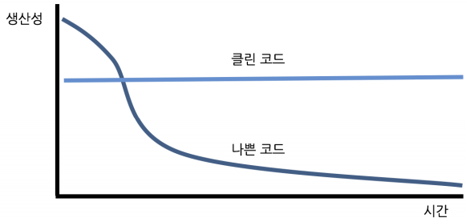

# 1. 과정소개, 기타자료

## 1. 객체 지향 생활 체조 원칙

1. 한 메서드에 오직 한 단계의 들여쓰기만 한다.
2. else 예약어를 쓰지 않는다.
3. 모든 원시 값과 문자열을 포장한다.
4. 한 줄에 점을 하나만 찍는다.
5. 줄여 쓰지 않는다(축약 금지).
6. 모든 엔티티를 작게 유지한다.
7. 3개 이상의 인스턴스 변수를 가진 클래스를 쓰지 않는다.
8. 일급 컬렉션을 쓴다.
9. getter/setter/프로퍼티를 쓰지 않는다.

## 2. 클린코드는 왜 중요한가?

- 나쁜 코드가 쌓일수록 팀 생산성은 떨어진다.

    

- 우리 모두는 쓰레기 코드를 보며 나중에 손보겠다고 생각한다.

    → 나중은 결코 오지 않는다. - 르블랑의 법칙

- 기한을 맞추는, 빨리 가는 유일한 방법 → 언제나 코드를 최대한 깨끗하게 유지하는 습관

## 3. 미션을 슬기롭게 소화하는 방법

- 변화를 위해 의지력보다는 환경(상황)이 더 중요

### 연습할 시간 확보하기 위해 환경을 바꿔라.

---

- 야근을 하지 않고 싶다.
    - 교육에 집중하기 위해 배려해 달라고 요청한다.
    - 그럼에도 불구하고 야근에 대한 압박이 있다면 그냥 회사를 그만둔다.
- 애인 또는 친구들과의 관계를 끊고 싶다.
    - 퇴근 후 카페로 출근한다.
- TV를 보지 않고 싶다.
    - 집중 학습 기간 동안 TV를 창고에 처박아 둔다. 리모콘을 버린 후 학습 기간이 끝난 후 다시 산다.
- 스마트폰 보는 시간을 줄이고 싶다.
    - 집에 도착하면 스마트폰을 꺼놓는다. 리뷰 요청을 보낸 후 켠다.

→ 여러분의 의지력을 믿지 마라. 절대로 **환경을 바꿔라.**

### 매일 미션 진행하기

---

- 한번에 모두 구현하기 보다 **매일 일정한 시간 투자하는 것이 정말 중요**함.
- **최소 하루에 2시간 이상 투자**할 것을 추천

### 가진 것을 비우기

---

- 요구사항 규모에 비해 극단적인 리팩토링을 요구하는 경우가 많다.
- 거부감이 들 수 있지만 일단 적용해 보고, 적용하기 전과 후의 코드를 분석해 본다.
- **자신이 가진 것을 비울 때 가장 많은 것을 배울 수 있다.**

### 정답을 찾기 위해 집착하지 마라

---

- 미션을 진행하는데 정답은 없다.
- 정답을 찾으려는 노력이 오히려 학습을 방해한다.
- 현재 상황에서 최선의 답을 끊임없이 찾으려고 노력한다.

- [Notion link](https://www.notion.so/1-f441106c903c4e159870e9f4e9fd6e7e)
