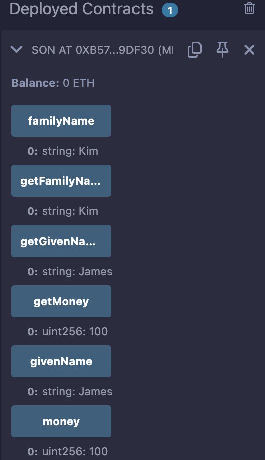

# 10강. 상속 1 - 정의

## 상속 이란?

---

```solidity
상속받을 컨트랙트 is 상속주는 스마트 컨트랙트 {
    //....
}
```

- 스마트 컨트랙트 사이의 상속은 변수와 함수들을 상속해준다.

## 예제

---

- lec10.sol
    
    ```solidity
    // SPDX-License-Identifier: GPL-3.0
    pragma solidity >= 0.7.0 < 0.9.0;
    
    contract Father{
        string public familyName = "Kim";
        string public givenName = "Jung";
        uint256 public money = 100; 
        
        constructor(string memory _givenName) public {
            givenName = _givenName;
        }
        
        function getFamilyName() view public  returns(string memory){
            return familyName;
        } 
        
        function getGivenName() view public  returns(string memory){
            return givenName;
        } 
        
        function getMoney() view public returns(uint256){
            return money;
        }
    }
    
    contract Son is Father("James"){
        
    }
    ```
    
- 실행
    - Son 컨트랙트 배포
        
        
