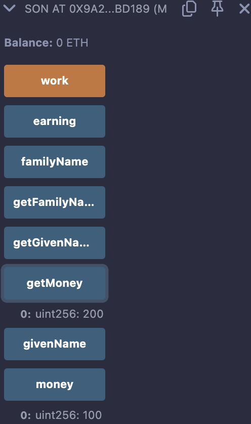

# 11강. 상속 2 - overriding 오버라이딩

## 오버라이딩: 상속받은 함수 덮어쓰기

---

- 오버라이딩 할 함수에 `virtual`을 명시해줘야 한다.
    
    ```solidity
    function getMoney() view public virtual returns(uint256){
        return money;
    }
    ```
    
    - 아버지 컨트랙트에 `virtual`을 써줌으로써, 자식 컨트랙트에서 오버라이딩을 할 것이다 알려줘야 한다.
    
    ```solidity
     function getMoney() view public override returns(uint256){
        return money+earning;
    }
    ```
    
    - 자식 컨트랙트에서 이렇게 오버라이드 한다.

## 예제

---

- lec11.sol
    
    ```solidity
    // SPDX-License-Identifier: GPL-3.0
    pragma solidity >= 0.7.0 < 0.9.0;
    
    contract Father{
        string public familyName = "Kim";
        string public givenName = "Jung";
        uint256 public money = 100; 
        
        constructor(string memory _givenName) public {
            givenName = _givenName;
        }
        
        function getFamilyName() view public  returns(string memory){
            return familyName;
        } 
        
        function getGivenName() view public  returns(string memory){
            return givenName;
        } 
        
        function getMoney() view public virtual returns(uint256){
            return money;
        }
    }
    
    contract Son is Father("James"){
        uint256 public earning = 0;
    
        function work() public {
            earning += 100;
        }
        
         function getMoney() view public override returns(uint256){
            return money+earning;
        }
    }
    ```
    
- 실행
    - work 클릭 후 getMoney 클릭하면 200, money 클릭하면 100 나온다.
        
        
