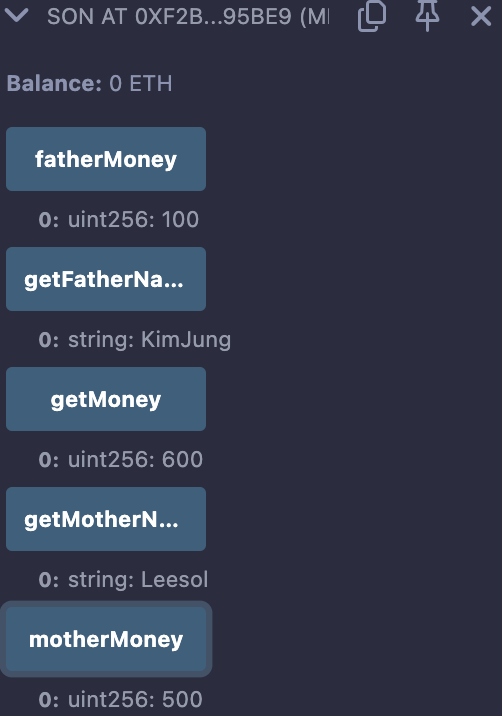

# 12강. 상속 3 - 두개 이상 상속하기

## 상속 받기

---

- `is`를 써주면 된다.
    
    ```solidity
    contract Father{
    }
    
    contract Mother{
    }
    
    contract Son is Father,Mother{
    }
    ```
    
- 같은 이름의 함수가 있다면, `virtual` 명시해줘야 한다. 오버라이드는 `override (중복이름의 함수를 가진 스마트 컨트랙트 명시)` 해줘야 한다.
    
    ```solidity
    contract Father{
        .....
        
        function getMoney() public view virtual returns(uint256){
            return fatherMoney;
        }
    }
    
    contract Mother{
        ....
       
        function getMoney() public view virtual returns(uint256){
            return motherMoney;
        }
    }
    
    contract Son is Father, Mother {
        function getMoney() public view override(Father,Mother) returns(uint256){
            return fatherMoney+motherMoney;
        }
    }
    ```
    

## 예제

---

- lec12.sol
    
    ```solidity
    // SPDX-License-Identifier:GPL-30
    pragma solidity >= 0.7.0 < 0.9.0;
    
    contract Father{
        uint256 public fatherMoney = 100;
        function getFatherName() public pure returns(string memory){
            return "KimJung";
        }
        
        function getMoney() public view virtual returns(uint256){
            return fatherMoney;
        }
        
    }
    
    contract Mother{
        uint256 public motherMoney = 500;
        function getMotherName() public  pure returns(string memory){
            return "Leesol";
        }
        function getMoney() public view virtual returns(uint256){
            return motherMoney;
        }
    }
    
    contract Son is Father, Mother {
        function getMoney() public view override(Father,Mother) returns(uint256){
            return fatherMoney+motherMoney;
        }
    }
    ```
    
- 실행
    - Son 컨트랙트 배포
        
        
