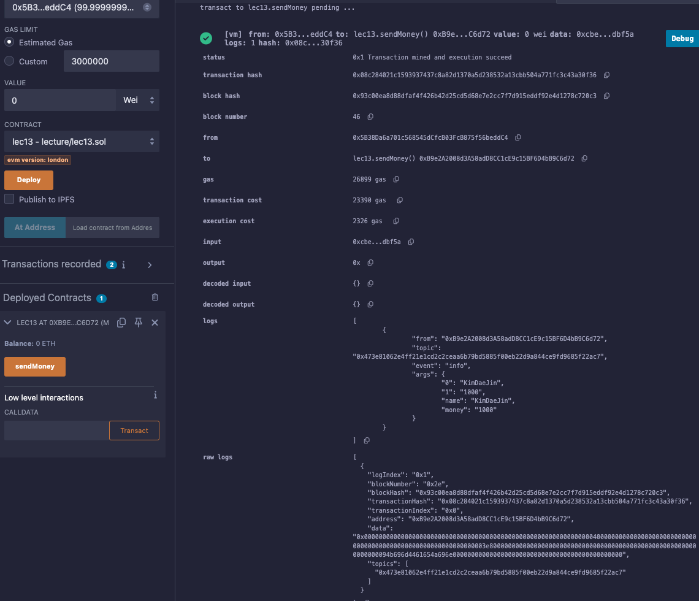

# 13강. event 1 - 정의

## 정의

---

- `event`: 블록체인 네트워크의 블록에 특정값을 기록하는 것
    - ex> 송금하기 함수: 송금하기 버튼을 누르면, 누른 사람의 계좌와 금액이 이벤트로 출력이 되어서 블록체인 네트워크 안에 기록이 된다.
    - 로그를 사용하여 블록에 각인시키는 것은, 일반적으로 `string`이나 다른 값들을 스마트 컨트랙트(`storage`)에 저장하는것보다 효율적이다.
        - `storage`에 데이터를 저장할 때는 상태 트리를 변경해야 하므로, 많은 가스 비용이 발생한다.
    - 로그는 블록 헤더에는 포함되지 않지만 트랜잭션 receipt에 포함되어 영구적으로 블록에 기록된다.
        - 저장 공간이 별도이며 블록체인 상태(state)에 영향을 주지 않음
        - 오직 오프체인 클라이언트(Web3, The Graph 등)가 이벤트를 조회하는 용도로 사용
        
        | 항목 | emit 로그 (이벤트) | storage (상태 변수 저장) |
        | --- | --- | --- |
        | 가스 비용 (Gas) | 매우 저렴 (2000 gas + 375/event topic 등) | 매우 비쌈 (최대 20,000 gas 이상) |
        | 블록체인 상태(State) | 변화 없음 (로그는 상태에 저장되지 않음) | 상태에 저장됨 (state size 증가) |
        | 데이터 접근성 | 스마트 컨트랙트에서는 읽기 불가, 오프체인에서만 사용 | 스마트 컨트랙트에서 직접 읽기 가능 |
        | 영구성 / 목적 | 영구적 기록, 오프체인 분석/인덱싱 용도 | 상태 유지, 스마트 컨트랙트 로직 처리용 |
        | 예시 용도 | 로그 기록, 거래 내역, 알림 | 토큰 잔액, 권한 정보 등 로직 기반 데이터 |
    
    ```solidity
    contract lec13 {
        event info(string name, uint256 money);
    
        function sendMoney() public {
            emit info("KimDaeJin", 1000);
        }
    }
    ```
    
- `emit`: 이벤트를 트랜잭션 로그에 기록한다.
    - `emit`을 통해서 이벤트를 출력한다.

## 예제

---

- lec13.sol
    
    ```solidity
    // SPDX-License-Identifier:GPL-30
    pragma solidity >= 0.7.0 < 0.9.0;
    
    contract lec13{
        event info(string name, uint256 money);
        
        function sendMoney() public {
            emit info("KimDaeJin", 1000);
        }
    }
    ```
    
- 실행
    - 트랜잭션 로그에 이벤트 형태로 기록된다.
        
        
