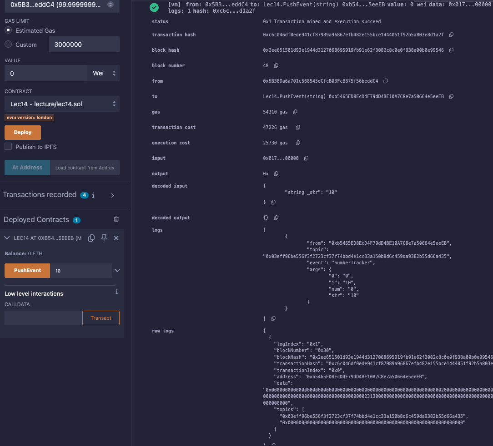

# 14강. event 2 - indexed

- 사실상 이벤트를 `emit` 하여 블록에 넣는다고 해도, 블록은 계속 생성되고 여러 이벤트에 겹쳐지게 될 것임

## 정의

---

- `indexed`: 블록들안에 출력된 이벤트들을 필터하여 원하는 이벤트만을 가지고 올 수 있다.
    - 아래의 경우, num은 `indexed` 필드가 되어, 블록에 저장될 때 이벤트 topic으로 저장된다.
    - 이벤트 파라미터 중 최대 3개까지 `indexed`로 지정할 수 있다.
    
    ```solidity
    contract Lec14 {
        event numberTracker(uint256 indexed num, string str);
    
        uint256 num =0;
        function PushEvent(string memory _str) public {
            emit numberTracker(num,_str);
            num ++;
        }
    }
    ```
    

## 예제

---

- lec14.sol
    
    ```solidity
    // SPDX-License-Identifier:GPL-30
    pragma solidity >= 0.7.0 < 0.9.0;
    
    contract Lec14 {
        event numberTracker(uint256 indexed num, string str);
    
        uint256 num =0;
        function PushEvent(string memory _str) public {
            emit numberTracker(num,_str);
            num ++;
        }
    }
    ```
    
- 실행
    
    
    

- ex> 오프체인 예시
    
    ```solidity
    event Transfer(address indexed from, address indexed to, uint256 value);
    ```
    
    - 이 경우, `from`, `to`는 indexed 필드가 되어, 블록에 저장될 때 이벤트 topic으로 저장된다.
    - 이후 오프체인(Web3.js, Ethers.js 등)에서 이렇게 필터링할 수 있다.
        - 해당 주소에서 발생한 Transfer 이벤트만 조회
            
            ```jsx
            contractInstance.getPastEvents("Transfer", {
              filter: { from: userAddress },
              fromBlock: 0,
              toBlock: 'latest'
            });
            ```
