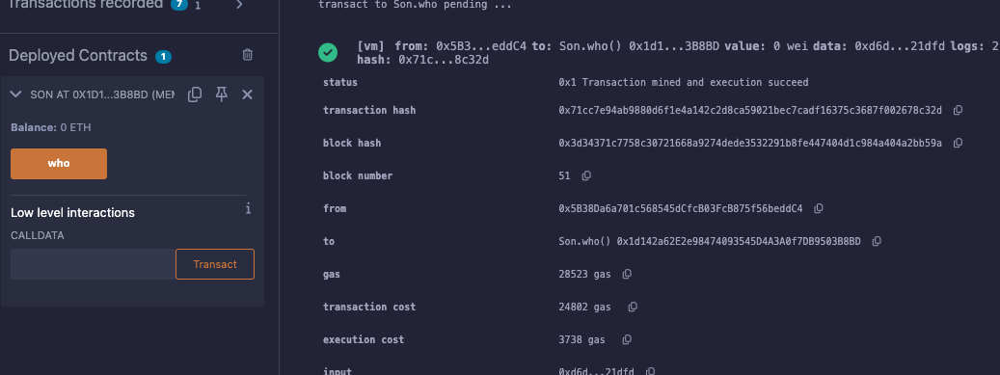

# 15강. 상속 4 - super

- `super`: 상속받은 부모 컨트랙트의 이벤트도 호출할 수 있다.
    
    ```solidity
    contract Father {
        event FatherName(string name);
        function who() public virtual{
            emit FatherName("KimDaeho");
        }
    }
    
    contract Mother {
        event MotherName(string name);
        function who() public virtual{
            emit MotherName("leeSol");
        }
    }
    
    contract Son is Father{
        event sonName(string name);
        function who() public override{
            super.who();
            emit sonName("KimJin");
        }
    }
    ```
    

## 예제

---

- lec15.sol
    
    ```solidity
    // SPDX-License-Identifier:GPL-30
    pragma solidity >= 0.7.0 < 0.9.0;
    
    contract Father {
        event FatherName(string name);
        function who() public virtual{
            emit FatherName("KimDaeho");
        }
    }
    
    contract Mother {
        event MotherName(string name);
        function who() public virtual{
            emit MotherName("leeSol");
        }
    }
    
    contract Son is Father{
        event sonName(string name);
        function who() public override{
            super.who();
            emit sonName("KimJin");
        }
    }
    ```
    
- 실행
    - Son 컨트랙트 배포
    
    
    
    
