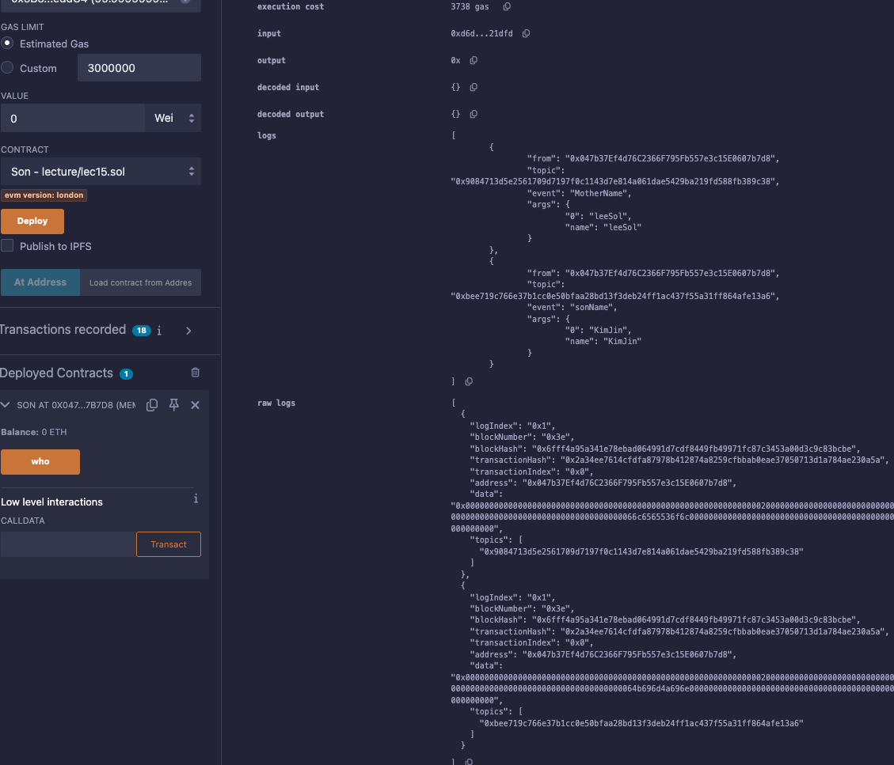

# 16강. 상속 5 - 상속의 순서

## C3 Linearization

---

- 상속 계층 전체를 선형(Linear) 구조로 정렬한 다음, `super`는 그 선형 구조를 따라 다음에 위치한 부모의 메서드를 호출한다.
    - Solidity는 `override` 해석 시 오른쪽 부모에게 우선순위를 준다.
- Solidity는 다중 상속에서 `super`를 호출할 때, 상속 순서에 따라 메서드 호출 우선순위를 정해놓는 MRO(메서드 해석 순서)를 따른다.
    
    ```solidity
    // SPDX-License-Identifier:GPL-30
    pragma solidity >= 0.7.0 < 0.9.0;
    
    contract Father {
        event FatherName(string name);
        function who() public virtual{
            emit FatherName("KimDaeho");
        }
    }
    
    contract Mother {
        event MotherName(string name);
        function who() public virtual{
            emit MotherName("leeSol");
        }
    }
    
    contract Son is Father, Mother {
        function who() public override(Father,Mother){
            super.who();
        }
    }
    ```
    
    - 선언상 상속 순서: Son → Father → Mother
    - 실제 실행 순서: Son → Mother → Father

🤔

- Solidity가 `Son is Father, Mother`처럼 다중 상속을 처리할 때, 하위 클래스의 순서를 보존하면서, 중복 없이 가능한 모든 부모를 먼저 소비하는 구조로 선형화한다.

> 가능한 후보들 중 가장 앞에 있는 항목 중에서, 다른 리스트의 꼬리(후속)에 없는 항목을 고른다.
> 

## 예제

---

- lec15.sol
    
    ```solidity
    // SPDX-License-Identifier:GPL-30
    pragma solidity >= 0.7.0 < 0.9.0;
    
    contract Father {
        event FatherName(string name);
        function who() public virtual{
            emit FatherName("KimDaeho");
        }
    }
    
    contract Mother {
        event MotherName(string name);
        function who() public virtual{
            emit MotherName("leeSol");
        }
    }
    
    contract Son is Father, Mother{
        event sonName(string name);
        function who() public override(Mother, Father) {
            super.who();
            emit sonName("KimJin");
        }
    }
    ```
    
- 실행
    - Son 컨트랙트 배포
    - Mother → Son 순서로 로그가 `emit`된다.
        
        
        
        1. 각 클래스의 Linearization 정의
            
            Father: [Father]
            Mother: [Mother]
            Son: [Son] + merge(L(Mother), L(Father), [Mother, Father])
            
        2. `merge(Father, Mother)`
            - C3는 "가능한 부모들 중에서 첫 번째 후보를 선택하고, 그 후보가 나머지 모든 후보들의 꼬리 부분(뒤쪽)에 없는 경우에만 선택"한다.
            
            → 최종 Linearization: [Son, Mother, Father]
            

- lec16.sol
    
    ```solidity
    // SPDX-License-Identifier:GPL-30
    pragma solidity >= 0.7.0 < 0.9.0;
    
    contract A {
        event Log(string who);
        function who() public virtual {
            emit Log("A");
        }
    }
    
    contract B is A {
        function who() public virtual override {
            emit Log("B");
            super.who();
        }
    }
    
    contract C is A {
        function who() public virtual override {
            emit Log("C");
            super.who();
        }
    }
    
    contract D is B, C {
        function who() public virtual override(B, C) {
            emit Log("D");
            super.who();
        }
    }
    
    contract E is D {
        function who() public override {
            emit Log("E");
            super.who();
        }
    }
    ```
    
- 실행
    - E 컨트랙트 배포
    - 로그 순서 때문에 콘솔엔 E D C B A로 찍힌다.
        
        
        
        
        
        ```solidity
              A
             / \
            B   C
             \ /
              D
               \
                E
        ```
        
        1. 먼저 각 컨트랙트의 Linearization을 정의
            - `A`: [A]
            - `B is A`: [B, A]
            - `C is A`: [C, A]
            - `D is B, C`: [D] + `merge(L(C), L(B), [C, B])`
        2. `merge(L(B), L(C), [C, B])` = `merge([B, A], [C, A], [C, B])`
            - 후보: [B, A], [C, A], [C, B]
                - B는 다른 리스트들([C, A], [C, B])의 꼬리에 있으므로 선택 불가능
                - C는 다른 리스트들([B, A], [C, B])의 꼬리에 없으므로 선택 가능
            - 후보: [B, A], [A], [B]
                - B 선택
            - 후보: [A], [A]
                - 3번째 선택: A
            
            → 최종 Linearization: L(D) = [D, C, B, A]
            
            - L(E) = [E] + L(D) = [E, D, C, B, A]
