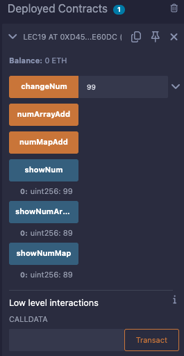

# 19강. Mapping과 Array 주의할 점

## 참조가 아닌 값 복사

---

- Solidity의 `mapping`과 `array`는 변수의 '참조'가 아닌 '값 복사'를 저장한다.
    - 변수 값을 바꿔도, 저장된 값은 자동으로 바뀌지 않으므로 별도로 업데이트를 해줘야 한다.

- ex> 변수 `num = 5`를 `mapping`이나 `array`에 넣는다.
    - 이후 `num = 15`로 변경하더라도, `mapping`이나 `array`는 여전히 5로 유지

## 예제

---

- lec19.sol
    
    ```solidity
    // SPDX-License-Identifier:GPL-30
    pragma solidity >= 0.7.0 < 0.9.0;
    
    contract lec19 {
    
        uint256 num = 89;
        mapping(uint256=>uint256) numMap;
        uint256[] numArray;
    
        function changeNum(uint256 _num) public {
            num = _num;
        }
    
        function showNum() public view returns(uint256) {
            return num;
        }
    
        function numMapAdd() public {
            numMap[0] = num;
        }
    
        function showNumMap() public view returns(uint256) {
            return numMap[0];
        }
    
        function numArrayAdd() public {
            numArray.push(num);
        }
    
        function showNumArray() public view returns(uint256) {
            return numArray[0];
        }
    }
    ```
    
- 실행
    
    
