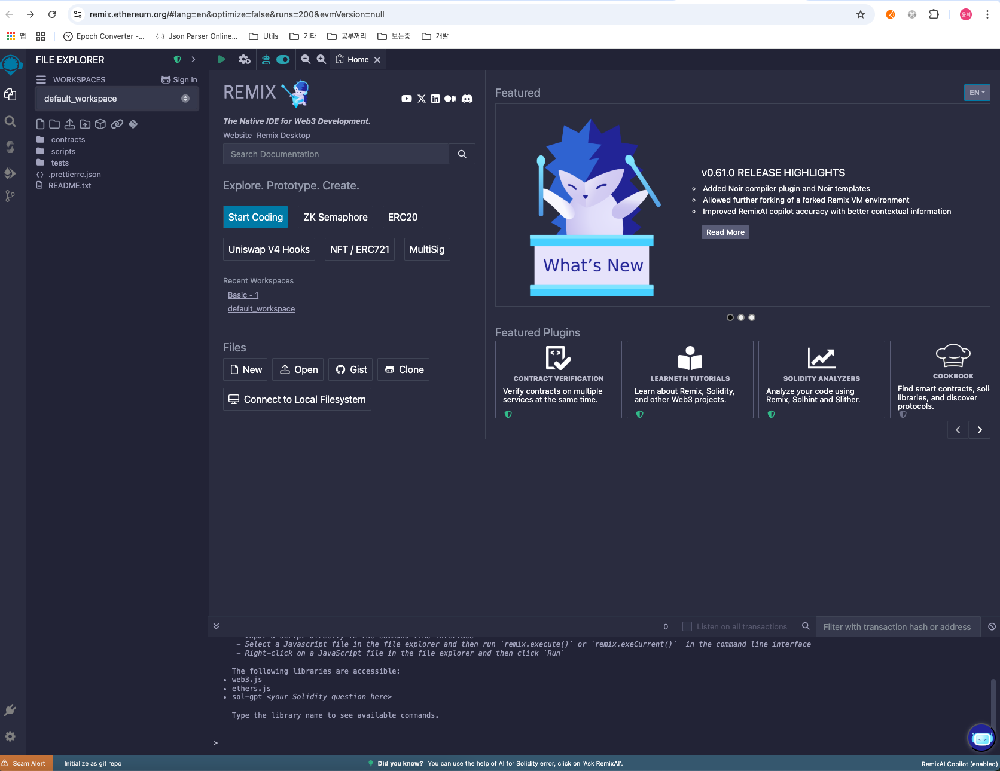

# 1강. Hello Solidity

- Solidity: 스마트 컨트랙트를 개발하기 위한, 이더리움에서 나온 언어
- 스마트 컨트랙트: 조건이 충족되면 블록체인 안에 저장된 프로그램이 작동하는 것

## Remix 세팅

---

- 솔리디티를 이용하기 위해서 여러 IDE가 있지만, 처음에는 Remix로 간단하게 시작하여 익히는게 좋다.
    - [https://remix.ethereum.org/#lang=en&optimize=false&runs=200&evmVersion=null&version=soljson-v0.8.26+commit.8a97fa7a.js](https://remix.ethereum.org/#lang=en&optimize=false&runs=200&evmVersion=null&version=soljson-v0.8.26+commit.8a97fa7a.js)
    
    
    
- default_workspace 안에 있는 폴더를 클릭하여 생성하신후, 폴더 옆에 파일을 생성해보자
    
    
    

## Solidity 시작

---

- 목표: Hello Solidity 출력하기
    - 솔리디티에는 기본 내장함수인 print 함수가 없다.
        
        → event를 통해서 print 함수의 역할을 할 수 있다.
        

- HelloWorld.sol
    
    ```solidity
    // SPDX-License-Identifier : GPL-30
    pragma solidity >= 0.7.0 < 0.9.0;
    
    contract Hello{
        string public hi = "Hello solidity";
    }
    ```
    
- `// SPDX-License-Identifier: GPL-3.0`: 스마트 컨트랙트를 만들기 위해, 라이센스를 무조건 맨 윗줄에 명시해줘야 에러가 나지 않는다.
- `pragma solidity >=0.7.0 <0.9.0;`: 솔리디티의 컴파일 버전 명시 입니다 (0.7~0.9 버전을 사용)
- `contract Hello{`: 스마트 컨트랙트 명시
- `string public hi = "Hello solidity";`: hi 라는 public 함수에 hello solidity 를 넣음

### 컴파일

---

- 컴파일 버튼 클릭
    
    
    

### 배포

---

- Deploy 버튼 클릭
    
    
    
- Deployed Contracts 에 배포한 컨트랙트가 보인다.
    
    
    
    - hi 버튼을 클릭하면 hello solidity가 출력된다.
