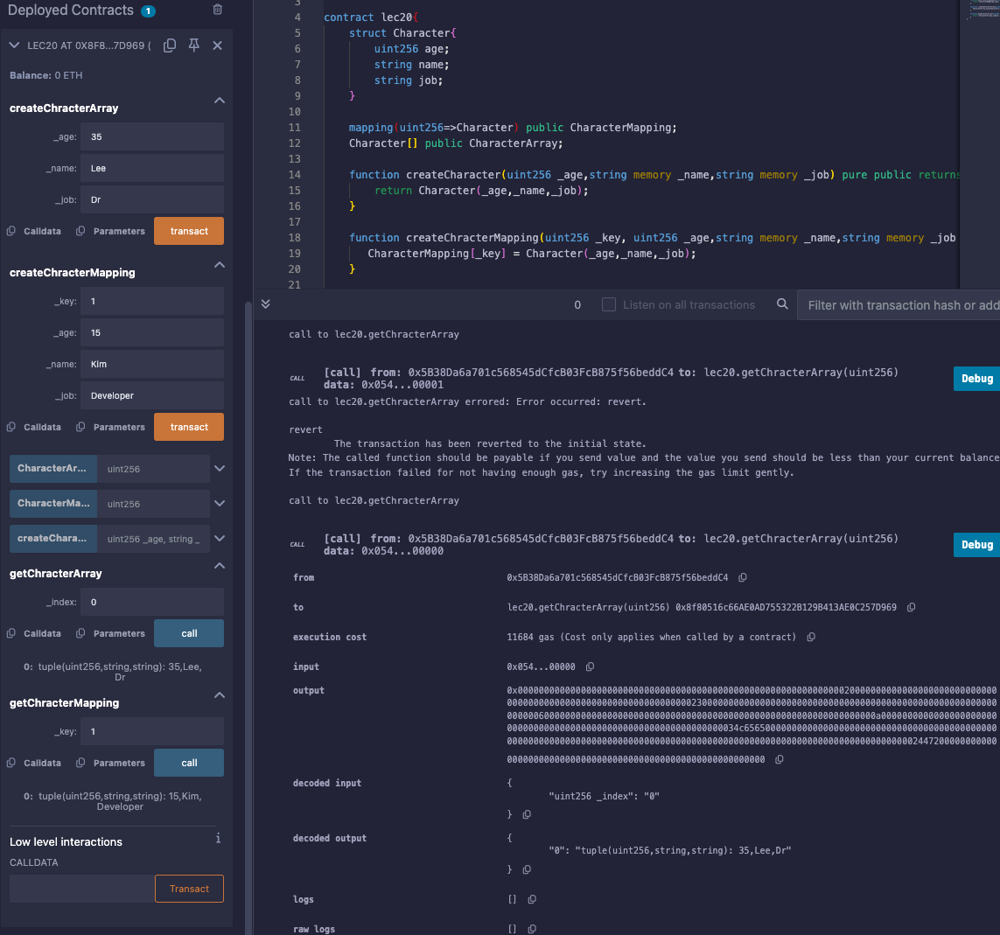

# 20강. struct (구조체)

## 정의

---

- 구조체: 사용자가 정의하는 복합 데이터 타입
    - 서로 다른 타입의 변수들을 하나의 그룹으로 묶어 새로운 데이터 구조를 생성할 수 있다.
    - 이는 객체지향 프로그래밍의 클래스와 유사하며, 스마트 컨트랙트 내에서 복잡한 데이터 구조를 관리하고 조직화하는 데 유용하다.
    
    ```solidity
    struct Character{
        uint256 age;
        string name;
        string job;
    }
    ```
    

## 예제

---

- lec20.sol
    
    ```solidity
    // SPDX-License-Identifier:GPL-30
    pragma solidity >= 0.7.0 < 0.9.0;
    
    contract lec20{
        struct Character{
            uint256 age;
            string name;
            string job;
        }
        
        mapping(uint256=>Character) public CharacterMapping;
        Character[] public CharacterArray;
        
        function createCharacter(uint256 _age,string memory _name,string memory _job) pure public returns(Character memory) {
            return Character(_age,_name,_job);
        }
        
        function createChracterMapping(uint256 _key, uint256 _age,string memory _name,string memory _job )  public {
           CharacterMapping[_key] = Character(_age,_name,_job);
        }
        
        function getChracterMapping(uint256 _key)  public view returns(Character memory){
           return CharacterMapping[_key];
        }
        
        function createChracterArray(uint256 _age,string memory _name,string memory _job )  public {
           CharacterArray.push(Character(_age,_name,_job));
        }
        
        function getChracterArray(uint256 _index)  public view returns(Character memory){
           return CharacterArray[_index];
        }
    }
    ```
    
    - 실행
        
        
