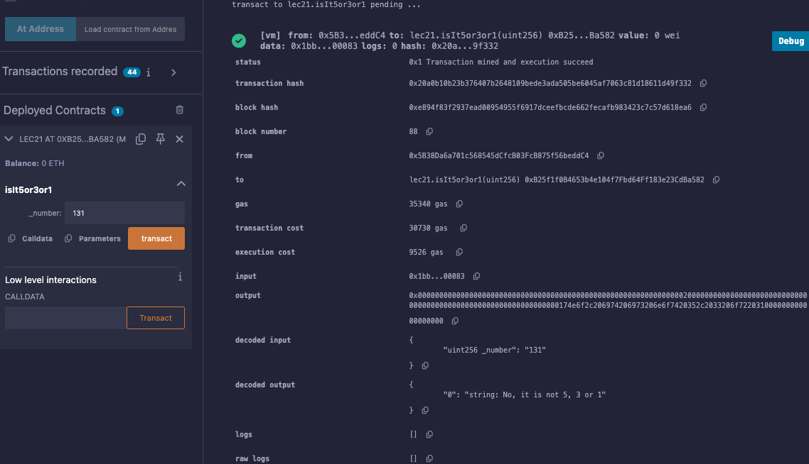

# 21강. if 조건문

## 정의

---

- `if`문: 특정 조건에 따라 코드 블록을 실행하도록 제어하는 기본적인 흐름 제어 구조
    - 기본 형태의 `if` 문
        
        ```solidity
        if (조건) {
            // 조건이 참일 때 실행될 코드
        } else {
            // 조건이 거짓일 때 실행될 코드
        }
        ```
        
    - `else if`를 활용한 다중 조건 처리
        
        ```solidity
        if (조건1) {
            // 조건1이 참일 때 실행될 코드
        } else if (조건2) {
            // 조건2가 참일 때 실행될 코드
        } else {
            // 위의 모든 조건이 거짓일 때 실행될 코드
        }
        ```
        

## 예제

---

- lec21.sol
    
    ```solidity
    // SPDX-License-Identifier:GPL-30
    pragma solidity >= 0.7.0 < 0.9.0;
    
    contract lec21{
        string private outcome = "";
        function isIt5or3or1(uint256 _number) public returns(string memory){
            if(_number == 5){
                outcome = "Yes, it is 5";
                return outcome;
            }
            else if(_number == 3){
                outcome = "Yes, it is 3";
                return outcome;
            }
            else if(_number == 1){
                outcome = "Yes, it is 1";
                return outcome;
            }
            else{
                outcome = "No, it is not 5, 3 or 1";
                return outcome;
            }
        }
    }
    ```
    
    - 실행
        
        
