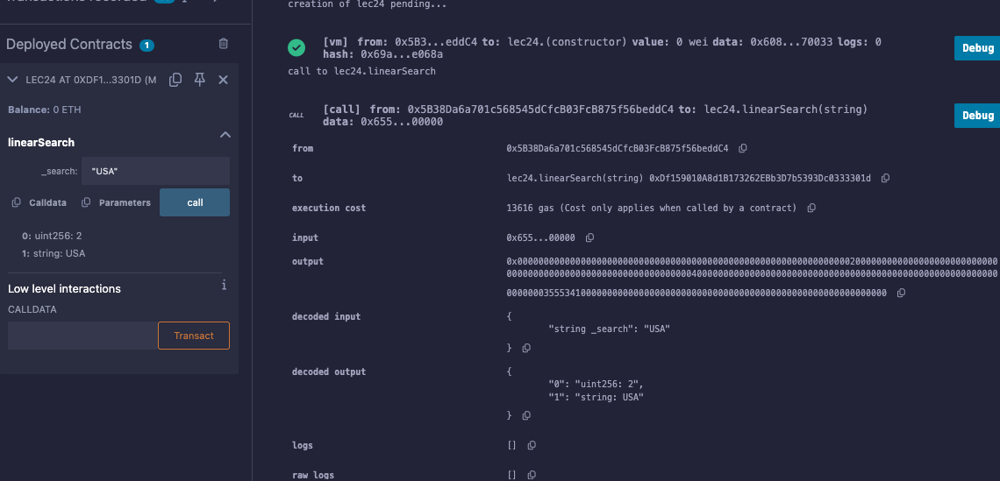

# 24강. 반복문 3 - linear search

## 정의

---

- 선형 탐색: 배열의 각 요소를 처음부터 끝까지 순차적으로 비교하여 원하는 값을 찾는 방법
    
    ```solidity
    // SPDX-License-Identifier: GPL-3.0
    pragma solidity >=0.7.0 <0.9.0;
    
    contract LinearSearchExample {
        string[] private countryList = ["South Korea", "North Korea", "USA", "China", "Japan"];
    
        function linearSearch(string memory _search) public view returns (int256, string memory) {
            for (uint256 i = 0; i < countryList.length; i++) {
                if (keccak256(bytes(countryList[i])) == keccak256(bytes(_search))) {
                    return (int256(i), countryList[i]);
                }
            }
            return (-1, "Not Found");
        }
    }
    ```
    
- 문자열 비교: 솔리디티에서는 문자열을 직접 비교할 수 없으므로, `keccak256` 해시 함수를 사용하여 비교해야 한다.
- 가스 비용: 배열이 클 경우, 선형 탐색은 많은 가스 비용을 소모할 수 있으므로, 배열의 크기에 주의해야 한다.

## 예제

---

- lec24.sol
    
    ```solidity
    // SPDX-License-Identifier: GPL-3.0
    pragma solidity >=0.7.0 <0.9.0;
    
    contract lec24 {
        string[] private countryList = ["South Korea", "North Korea", "USA", "China", "Japan"];
    
        function linearSearch(string memory _search) public view returns (uint256, string memory) {
            for (uint256 i = 0; i < countryList.length; i++) {
                if (keccak256(bytes(countryList[i])) == keccak256(bytes(_search))) {
                    return (i, countryList[i]);
                }
            }
            return(99,"Nothing");
        }
    }
    ```
    
    - 실행
        
        
