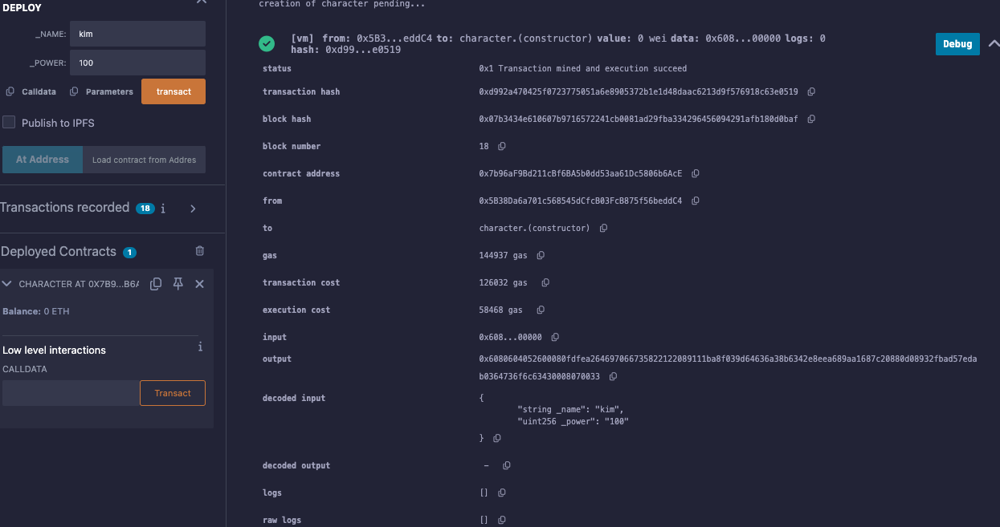

# 28강. 에러 핸들러 4 - try/catch 2

## 2. 외부 스마트 컨트랙트 생성 시 `try/catch` 사용법

---

- 외부 스마트 컨트랙트를 생성할 때, 생성자에서 예외가 발생할 수 있다.

### 예제

---

- lec28.sol
    
    ```solidity
    // SPDX-License-Identifier: GPL-3.0
    pragma solidity >=0.7.0 <0.9.0;
    
    contract Character {
        string private name;
        uint256 private power;
        constructor(string memory _name, uint256 _power) {
            name = _name;
            power = _power;
        }
    }
    
    contract Runner {
        event CatchOnly(string _name, string _err);
        function playTryCatch(string memory _name, uint256 _power) public returns (bool successOrFail) {
            try new Character(_name, _power) {
                return true;
            } catch {
                emit CatchOnly("catch", "Error occurred during contract creation.");
                return false;
            }
        }
    }
    ```
    

## 3. 내부 스마트 컨트랙트 함수 호출 시 `try/catch` 사용법

---

- 동일한 컨트랙트 내에서 함수를 호출할 때도 `try/catch` 문을 사용할 수 있다.
    - 이때 `this` 키워드를 사용하여 현재 컨트랙트를 참조한다.

### 예제

---

- lec28.sol
    
    ```solidity
    // SPDX-License-Identifier: GPL-3.0
    pragma solidity >=0.7.0 <0.9.0;
    
    contract Runner {
        function simple() public pure returns (uint256) {
            return 4;
        }
        event CatchOnly(string _name, string _err);
        function playTryCatch() public returns (uint256, bool) {
            try this.simple() returns (uint256 _value) {
                return (_value, true);
            } catch {
                emit CatchOnly("catch", "Error occurred during function call.");
                return (0, false);
            }
        }
    }
    ```
    
    - 내부 함수 호출 시 `this.simple()`과 같이 `this` 키워드를 사용하여 현재 컨트랙트를 참조합니다.

## 예제

---

- lec28.sol
    
    ```solidity
    // SPDX-License-Identifier: GPL-3.0
    pragma solidity >=0.7.0 <0.9.0;
    
    /*
    try/catch 특징
    1. try/catch문
    안에서, assert/revert/require을 통해 에러가 난다면,
      - catch는 에러를 잡지를 못하고, 개발자가 의도한지 알고 정상적으로 프로그램 끝낸다
    밖에서 assert/revert/require을 통해 에러가 난다면,
      - catch는 에러를 잡고, 에러를 핸들할수 있다
    
    2. 3가지 catch
    catch Error(string memory reason) { ... }: revert 나 require을 통해 생성된 에러용도
    catch Panic(uint errorCode) { ... }:  assert 를 통해 생선된 에러가 날 때 이 catch에 잡혀요. 
    catch(bytesmemorylowLevelData){...}: 이 catch는 로우 레벨에러를 잡습니다. 
    
    3. 어디서 쓰는가?
    외부 스마트 컨트랙트 함수를 부를 때: 다른 스마트 컨트랙트를 인스턴스화 하여서, try/catch문이 있는
                                 스마트 컨트랙트의 함수를 불러와서 사용.
    외부 스마트 컨트랙트를 생성할 때: 다른 스마트 컨트랙트를 인스턴스화 생성할 때 씀
    스마트 컨트랙트 내에서 함수를 부를 때: this를 통해 try/catch를 씀
    */
    
    //외부 스마트 컨트랙트를 생성할 때
    contract character{    
        string private name;
        uint256 private power;
        
        constructor(string memory _name, uint256 _power){
            name = _name;
            power = _power;
        }
    }
    
    contract runner{
        event catchOnly(string _name,string _err);
        
        function playTryCatch(string memory _name, uint256 _power) public returns(bool){
            try new character(_name,_power) {
                revert("errors in the try/catch block");
                return(true);
            }
            catch{
                emit catchOnly("catch","ErrorS!!");
                return(false);
            }
        } 
    }
    
    //스마트 컨트랙트 내에서 함수를 부를 때
    contract runner2{
        event catchOnly(string _name,string _err);
        
        function simple() public returns(uint256){
            return 4;
        }
        
        function playTryCatch() public returns(uint256,bool){
            try this.simple() returns(uint256 _value){
                return(_value,true);
            }
            catch{
                emit catchOnly("catch","ErrorS!!");
                return(0,false);
            }
        } 
    } 
    ```
    
    - 실행
        
        
