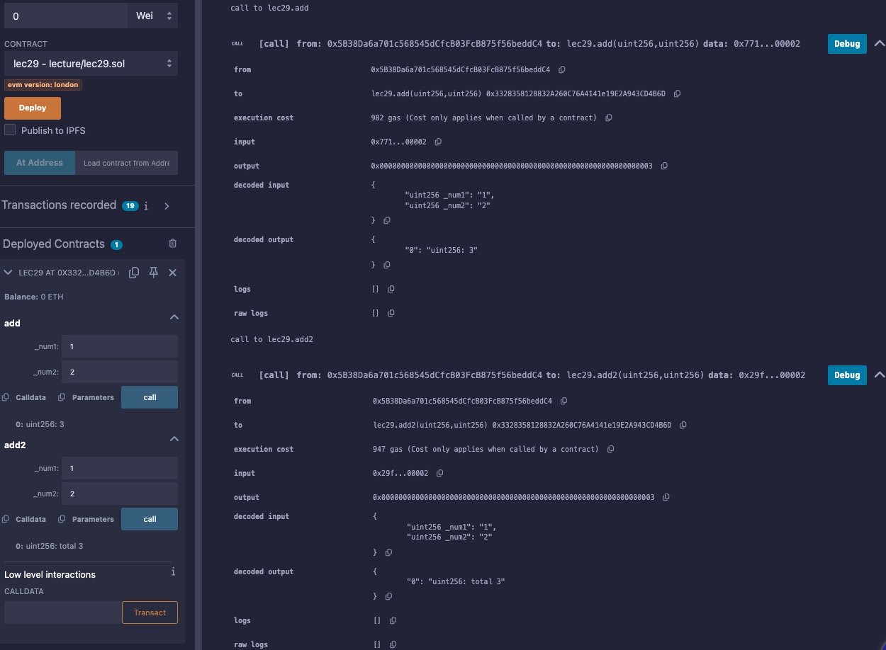

# 29강. function 5 - return값 변수 명시

## return값 변수 명시

---

- 솔리디티(Solidity)에서 함수의 반환값(return value)에 변수명을 명시하면 코드의 가독성과 유지보수성이 향상된다.
- 기존 방식
    
    ```solidity
    function add(uint256 _num1, uint256 _num2) public pure returns (uint256) {
        uint256 total = _num1 + _num2;
        return total;
    }
    ```
    
- 변수명을 명시한 방식
    
    ```solidity
    function add2(uint256 _num1, uint256 _num2) public pure returns (uint256 total) {
        total = _num1 + _num2;
    }
    ```
    
    - `return` 문 없이도 함수가 종료될 때 자동으로 `total` 값이 반환된다.

- 장점
    - 가독성 향상: 반환값의 의미를 명확하게 전달하여 코드를 읽는 사람이 이해하기 쉽다.
    - 코드 간결화: 함수 내부에서 저장할 반환값 변수를 별도로 선언하지 않아도 되므로 코드가 더 간결해진다.
        
        → 특히 반환값이 여러 개인 함수에서 각 반환값의 의미를 명시할 때 유용하다.
        

## 예제

---

- lec29.sol
    
    ```solidity
    // SPDX-License-Identifier: GPL-3.0
    pragma solidity >=0.7.0 <0.9.0;
    
    contract lec29{
        function add(uint256 _num1, uint256 _num2) public pure returns (uint256){
            uint256 total = _num1 + _num2;
            return total;
        }
        
        function add2(uint256 _num1, uint256 _num2) public pure returns (uint256 total){
            total = _num1 + _num2;
            return total;
        }    
    }
    ```
    
    - 실행
        
        
