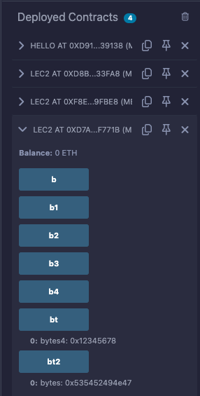

# 2강. data type

- 솔리디티의 타입
    - data type: `boolean`, `bytes`, `Integer`, `address`
    - reference type: `string`, `Arrays`, `struct`
    - mapping type

## boolean

---

- `true`와 `false`가 있다.

- 관련 연산자
    - `!` (Not)
        - ex> `!true => false`
    - `&&` (AND)
        - ex> `true && false => false`
    - `||` (OR)
        - ex> `true && false => false`
    - `==` (equality)
        - ex> `true == true => true`
    - `!=` (inequality)
        - ex> true != true => false

## string

---

- `""`를 붙여서 쓰면 된다.
    - 솔리디티에서는 `string` 쓰는 것을 지양한다 → 가스를 더 소비하기 때문

- 솔리디티는
    - `string`을 받으면, 다시 `byte`화 시켜서 이해한다.
    - 반대로, `byte`를 `string`화 하여 꺼낸다.

❗가스는 스마트 컨트랙트 개념에서 보안적으로 너무 중요한 개념이다.

- 가스: 스마트 컨트랙트를 운영시키는 연료

## bytes

---

- 솔리디티는 `byte1` ~ `byte32`까지 존재한다.
    - 숫자에 따라 `byte`의 크기가 정해진다.

## Integer

---

- `int`: 기호있는 integer
    - `int8`: -2^7 ~ 2^7-1
    - `int16`: -2^15~2^15-1
    - `int32`: -2^31~2^31-1
    - `int64`: -2^63~2^63-1
    - `int128`: -2^127~2^127-1
    - `int256`(=`int`): -2^255~2^255-1
- `uint`: 기호없는 integer
    - `uint8`: 0~2^8-1
    - `uint16`: -0~2^16-1
    - `uint32`: -0~2^32-1
    - `uint64`: -0~2^64-1
    - `uint128`: -0~2^128-1
    - `uint256`(=`uint`): 0~2^256-1

- 관련 연산자
    - `+`: 더하기
        - `2+2 => 4`
    - `-`: 빼기
        - `2-2 => 0`
    - `*`: 곱하기
        - `2*2 => 4`
    - `/`: 나누기 몫
        - `2/2 => 1`
    - `%`: 나누기 나머지
        - `2/2 = 0`
    - `**`: 지수
        - `2**2(=2^2) = 4`

## address

---

- 20bytes의 길이. 주소를 나타낸다.

- 배포된 스마트 컨트랙트는 주소를 얻는다.
    
    
    
    - 디지털 지갑의 계정마다 각자의 주소를 할당받는다.
- 주소: 디지털 코인을 보내기도, 스마트 컨트랙트를 불러오기도 한다.
    - 이더같은 디지털 코인을 주고 받는 은행 계좌번호 정도라고 일단 생각하자.
    - 이더리움을 보내기 위해서는 주소 `payable`이라는걸 붙여야 한다.

## 예제

---

- lec2.sol
    
    ```solidity
    // SPDX-License-Identifier: GPL-3.0
    // SPDX-License-Identifier: MIT
    pragma solidity >= 0.7.0 < 0.9.0;
    
    contract lec2{
    
        // data type
        // boolean, bytes, address, uint
    
        // reference type
        // string, Arrays, struct
    
        // mapping type
    
        //boolean: true | false
        bool public b = false;
    
        // ! || == &&
        bool public b1 = !false; // true
        bool public b2 = false || true; // true
        bool public b3 = false == true; // false
        bool public b4 = false && true; // false
    
        // bytes 1 ~ 32
        bytes4 public bt = 0x12345678;
        bytes public bt2 = "STRING"; // bytes화 되서 변환된다. 0x535452494e47
    
        //address : 
        address public addr = 0xD7ACd2a9FD159E69Bb102A1ca21C9a3e3A5F771B;
    
        // int vs uint
    
        // int8
        // 2^7 ~ 2^7 - 1
        int8 public it = 4;
    
        // uint8
        // 0 ~ 2^8 - 1
        // uint == uint256
        uint256 public uit = 132213;
    
        uint8 public uit2 = 256; // 컴파일 에러. from solidity: TypeError: Type int_const 256 is not implicitly convertible to expected type uint8. Literal is too large to fit in uint8.
    
    }
    ```
