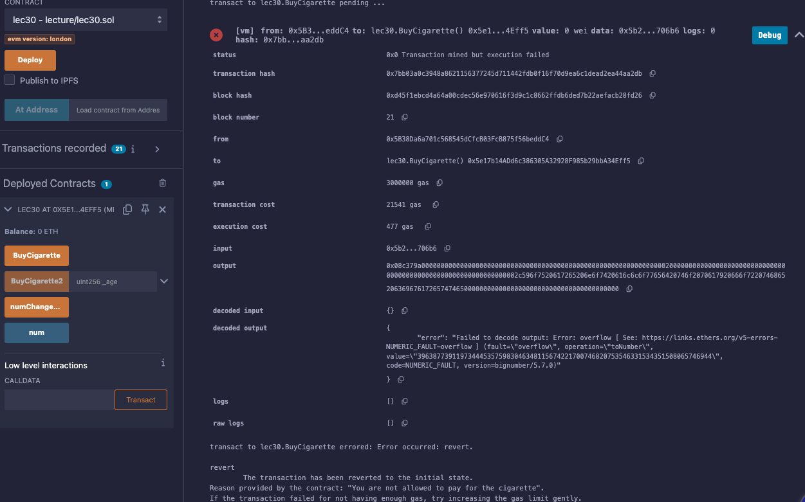

# 30강. modifier 모디파이어

## **modifier**

---

- 함수의 실행 전에 특정 조건이나 로직을 검사하여 코드의 재사용성과 가독성을 높이는 데 사용된다.
    - 이를 통해 중복되는 코드 작성을 줄이고, 함수에 대한 접근 제어를 효율적으로 관리할 수 있다.

### 기본 구조

---

```solidity
modifier 모디파이어명 {
    // 조건 검사 또는 로직
    _;
}
```

- `modifier` 키워드 다음에 모디파이어의 이름을 정의한다.
- 모디파이어 내부에는 조건 검사나 특정 로직을 구현하며, `_;`는 모디파이어가 적용된 함수의 본문이 삽입되는 위치를 나타낸다.

- 사용 예시
    
    ```solidity
    // SPDX-License-Identifier: GPL-3.0
    pragma solidity >=0.7.0 <0.9.0;
    
    contract lec30 {
        modifier onlyAdults {
            revert("You are not allowed to pay for the cigarette");
            _;
        }
    
        function buyCigarette() public onlyAdults returns(string memory) {
            return "Your payment is succeeded";
        }
    }
    ```
    
    - `onlyAdults` 모디파이어는 항상 `revert`를 호출하여 에러를 발생시킨다.
    - `buyCigarette` 함수는 `onlyAdults` 모디파이어를 적용받아, 호출 시 에러가 발생하게 된다.

- 장점
    - 코드 재사용성: 반복되는 조건 검사를 모디파이어로 정의하여 여러 함수에서 재사용할 수 있습니다.
    - 가독성 향상: 함수의 주요 로직과 접근 제어 로직을 분리하여 코드의 가독성을 높입니다.
    - 유지보수 용이: 중앙 집중식으로 조건 검사를 관리하여, 변경 사항이 있을 때 모디파이어만 수정하면 됩니다.

### 파라미터를 받는 모디파이어

---

- 모디파이어는 파라미터를 받을 수도 있다. 이를 통해 보다 유연한 조건 검사가 가능하다.
    
    ```solidity
    // SPDX-License-Identifier: GPL-3.0
    pragma solidity >=0.7.0 <0.9.0;
    
    contract lec30 {
        modifier onlyAdults(uint256 _age) {
            require(_age > 18, "You are not allowed to pay for the cigarette");
            _;
        }
    
        function buyCigarette(uint256 _age) public onlyAdults(_age) returns(string memory) {
            return "Your payment is succeeded";
        }
    }
    ```
    
    - `onlyAdults` 모디파이어는 `_age` 파라미터를 받아, 18세 초과 여부를 검사한다.
    - `buyCigarette` 함수는 `_age`를 입력받아, 해당 값이 모디파이어에 전달된다.

## 예제

---

- lec30.sol
    
    ```solidity
    // SPDX-License-Identifier: GPL-3.0
    pragma solidity >=0.7.0 <0.9.0;
    
    // modifier 
    contract lec30{    
        modifier onlyAdults{
             revert("You are not allowed to pay for the cigarette");
             _;
        } 
        
        function BuyCigarette() public onlyAdults returns(string memory){
            return "Your payment is succeeded";
        }
    
        modifier onlyAdults2(uint256 _age){
            require(_age>18,"You are not allowed to pay for the cigarette");
            _;
        }
        
        function BuyCigarette2(uint256 _age) public onlyAdults2(_age) returns(string memory){
            return "Your payment is succeeded";
        }
    
        uint256 public num = 5;
        modifier numChange{
            num = 10;
            _;
        }
    
        function numChangeFunction() public numChange{
            num = 15;
        }
    }
    ```
    
    - 실행
        - buyCigarette
            
            
