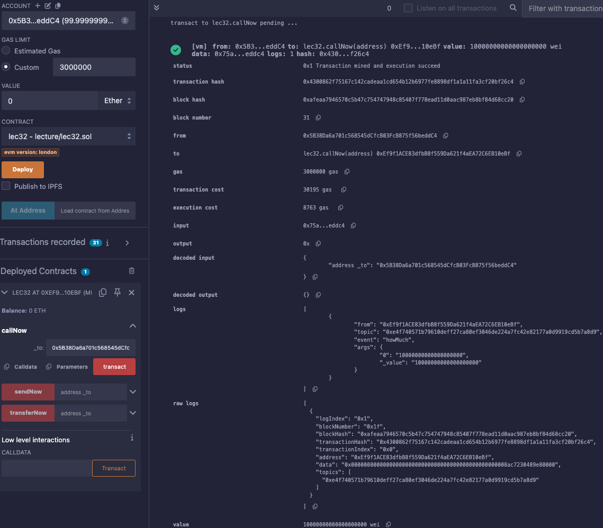

# 32강. payable,msg.value와 이더를 보내는 3가지 함수 (send, transfer, call)

## `payable`

---

- `payable`: 함수, 주소, 생성자에 붙여 사용되며, 해당 요소가 이더를 송수신할 수 있도록 허용한다.
    
    ```solidity
    function deposit() public payable {
        // 이 함수는 이더를 받을 수 있습니다.
    }
    ```
    

## `msg.value`

---

- `msg.value`: 현재 거래에서 전송된 이더의 양을 나타내는 전역 변수
    
    ```solidity
    function deposit() public payable {
        uint256 amount = msg.value;
        // 전송된 이더의 양을 amount에 저장합니다.
    }
    ```
    

## 이더를 전송하는 세 가지 방법

---

### `send`

---

- 가스 제한: 2300 가스를 소비한다.
- 성공 여부 반환: `true` 또는 `false`를 반환한다.
- 특징: 가스 제한으로 인해 복잡한 로직이 있는 컨트랙트에 이더를 전송할 때 실패할 수 있다.

### `transfer`

---

- 가스 제한: 2300 가스를 소비한다.
- 실패 시 동작: 에러를 발생시킨다.
- 특징: `send`와 유사하지만, 실패 시 에러를 발생시켜 거래를 되돌린다.

### `call`

---

- 가스 제한: 가변적이며, 가스 값을 지정할 수 있다.
- 성공 여부 반환: `true` 또는 `false`를 반환한다.
- 특징: 가변적인 가스 소비로 인해 재진입 공격(reentrancy attack)에 취약할 수 있으므로, 사용 시 주의가 필요하다. 그러나 2019년 12월 이후로는 `call` 사용이 추천되고 있다.

## 예제

---

- lec32.sol
    
    ```solidity
    // SPDX-License-Identifier: GPL-3.0
    pragma solidity >=0.5.0 < 0.9.0;
    
    contract lec32 {
        /*
        Payable 
        Payable은 이더/토큰과 상호작용 시 필요한 키워드라고 생각하시면 간단합니다. 
        즉, send, trnafer, call을 이용하여, 이더를 보낼때 Payable이라는 키워드가 필요합니다.
        이 Payable은 주로 함수, 주소, 생성자에 붙여서 사용. 
    
        msg.value
        msg.value는 송금보낸 코인의 값.
    
        이더를 보내는 3가지 
        1.send: 2300 gas를 소비, 성공여부를 true 또는 false로 리턴한다
        2.transfer: 2300 gas를 소비, 실패시 에러를 발생
        3.call: 가변적인 gas 소비 (gas값 지정 가능), 성공여부를 true 또는 false로 리턴
                 재진입(reentrancy) 공격 위험성 있음, 2019년 12월 이후 call 사용을 추천. 
        */
    
        event howMuch(uint256 _value);
        
        function sendNow(address payable _to) public payable{
            bool sent = _to.send(msg.value); // return true or false
            require(sent,"Failed to send either");
            emit howMuch(msg.value);
        }
        
        function transferNow(address payable _to) public payable{
            _to.transfer(msg.value);
            emit howMuch(msg.value);
        }
        
        function callNow(address payable _to) public payable{//스마트 컨트랙트 주소도 가능
            // ~ 0.7
            (bool sent, ) = _to.call.gas(1000).value(msg.value)("");
            require(sent,"Failed to send either");
            
            //0.7 ~
            // (bool sent, ) = _to.call{value: msg.value, gas:1000}("");
            // require(sent, "Failed to send Ether");
            emit howMuch(msg.value);   
        }
    }
    ```
    
    - 실행
        - 배포 후 Account 주소 복사 후 `_to`로 넣고, Custom: 3000000, VALUE: 10 Ether로 설정 후 callNow 실행한다.
            
            
            
            - Account 돈이 줄어든다.
