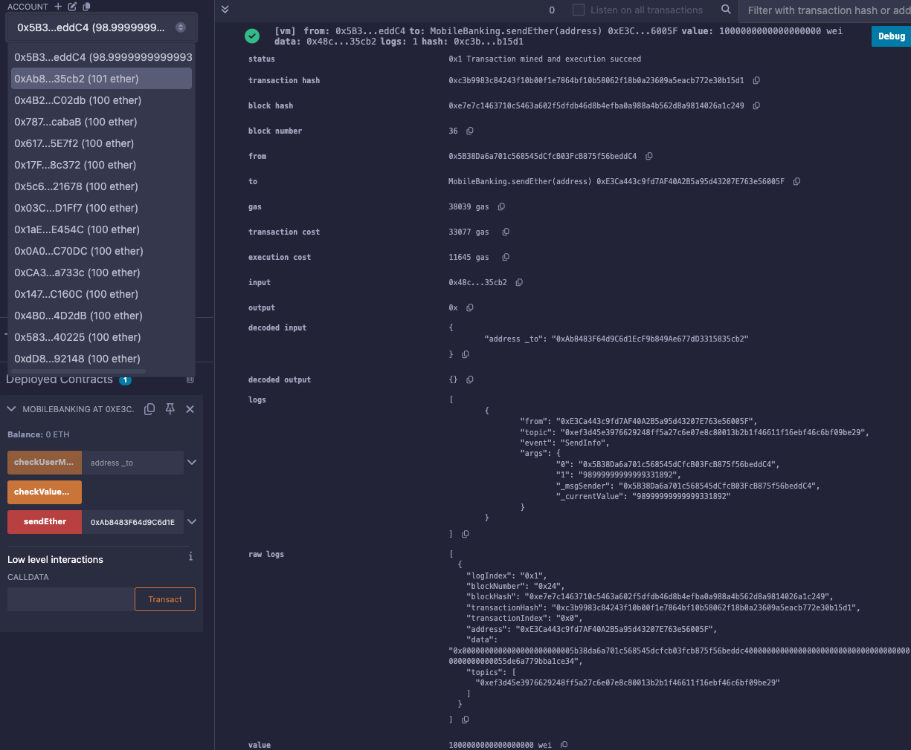

# 33강. balance 와 msg.sender

## `balance`

---

- `balance`: 특정 주소가 보유한 이더(Ether) 잔액을 나타내는 속성
- 사용법: `<주소>.balance` 형태로 사용하며, 해당 주소의 현재 이더 잔액을 반환한다.
- 예제
    
    ```solidity
    address user = 0x123...; // 특정 사용자의 주소
    uint256 userBalance = user.balance; // 해당 사용자의 이더 잔액 조회
    ```
    
    - 위 코드에서 `user.balance`는 `user` 주소의 현재 이더 잔액을 반환합니다.

## `msg.sender`

---

- `msg.sender`: 현재 실행 중인 함수 또는 컨트랙트를 호출한 주체의 주소를 나타낸다.
    - 이는 스마트 컨트랙트와 상호작용하는 외부 계정(EOA) 또는 다른 컨트랙트의 주소가 될 수 있다.
- 사용법: 함수 내에서 `msg.sender`를 사용하여 호출자의 주소를 참조할 수 있다.
- 예제
    
    ```solidity
    function exampleFunction() public {
        address caller = msg.sender; // 함수 호출자의 주소 저장
        // 추가 로직
    }
    ```
    
    - 위 함수에서 `msg.sender`는 `exampleFunction`을 호출한 주체의 주소를 반환합니다.

## 예제

---

- lec33.sol
    
    ```solidity
    // SPDX-License-Identifier: GPL-3.0
    pragma solidity >=0.7.0 <0.9.0;
    
    /*
    주소.balance
    주소.balance는 해당 특정 주소의 현재 갖고있는 이더의 잔액을 나타낸다.(msg.value는 송금액) 
    주소.balance 와 같은 형태로 사용한다. 
    
    msg.sender 
    msg.sender 는 스마트 컨트랙트를 사용하는 하는 주체라고 볼 수 있다.  
    msg.sender는 앞으로 설명해야 할 call vs delegate call에서 주요 내용이니 관심있게 봐주세요
    */
    contract MobileBanking {
        event SendInfo(address _msgSender, uint256 _currentValue);
        event MyCurrentValue(address _msgSender, uint256 _value);
        event CurrentValueOfSomeone(address _msgSender, address _to,uint256 _value);
       
        function sendEther(address payable _to) public payable {
            require(msg.sender.balance>=msg.value, "Your balance is not enough");
            _to.transfer(msg.value);    
            emit SendInfo(msg.sender,(msg.sender).balance);
        }
        
        function checkValueNow() public{
            emit MyCurrentValue(msg.sender, msg.sender.balance);
        }
        
        function checkUserMoney(address _to) public{
            emit CurrentValueOfSomeone(msg.sender,_to ,_to.balance);
        }    
    }
    ```
    
    - 실행
        - 2번째 주소를 _to로 입력하고, 1번째 지갑주소 선택 후 1 Ether 입력 후 sendEther 클릭한다.
            - 2번째 지갑에 1 ether가 더해졌고, 1번째 지갑에서 1 ether가 빠졌다.
            
            
            
    - 설명:
        1. 이벤트 정의:
            - `SendInfo`: 이더 전송 후 호출자의 주소와 현재 잔액을 기록합니다.
            - `MyCurrentValue`: 호출자의 주소와 현재 잔액을 기록합니다.
            - `CurrentValueOfSomeone`: 호출자의 주소, 조회 대상 주소, 해당 주소의 잔액을 기록합니다.
        2. `sendEther` 함수:
            - 호출자의 잔액이 전송하려는 이더보다 많거나 같은지 확인합니다.
            - 조건을 만족하면 `_to` 주소로 이더를 전송하고, `SendInfo` 이벤트를 발생시킵니다.
        3. `checkValueNow` 함수:
            - 호출자의 현재 이더 잔액을 `MyCurrentValue` 이벤트를 통해 기록합니다.
        4. `checkUserMoney` 함수:
            - 지정된 `_to` 주소의 현재 이더 잔액을 `CurrentValueOfSomeone` 이벤트를 통해 기록합니다.
