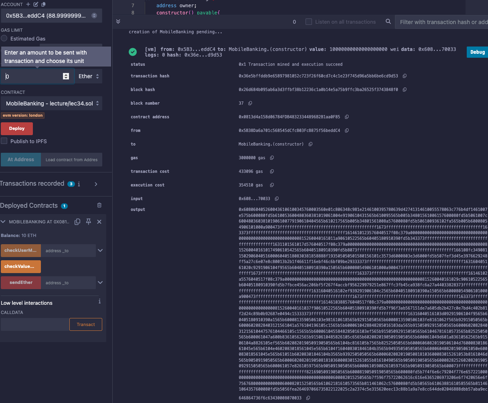

# 34강. payable 생성자 적용, msg.sender로 권한 부여

- 솔리디티(Solidity)에서 `payable` 생성자와 `msg.sender`를 활용한 함수 접근 제한은 스마트 컨트랙트의 보안과 기능성을 향상시키는 중요한 기법이다.

## 생성자에 `payable` 적용하기

---

- 생성자(Constructor)에 `payable` 키워드를 적용하면, 스마트 컨트랙트를 배포할 때 이더(Ether)를 함께 전송하여 컨트랙트에 초기 자금을 할당할 수 있다.
    
    ```solidity
    constructor() payable {
        // 생성자 로직
    }
    ```
    

## `msg.sender`를 활용한 함수 접근 제한

---

- `msg.sender`: 현재 함수를 호출한 주체의 주소를 나타낸다. 이를 활용하여 특정 주소만이 함수에 접근할 수 있도록 제한할 수 있다.
    
    ```solidity
    address owner;
    
    modifier onlyOwner {
        require(msg.sender == owner, "Only Owner!");
        _;
    }
    
    function restrictedFunction() public onlyOwner {
        // 제한된 함수 로직
    }
    ```
    
    - `msg.sender`가 `owner`와 일치하는지 확인하여, 일치하지 않으면 함수를 실행하지 않는다.

## 예제

---

- lec34.sol
    - 생성자에 `payable`을 적용하고, `msg.sender`를 활용하여 함수 접근을 제한하는 예제
    
    ```solidity
    // SPDX-License-Identifier: GPL-3.0
    pragma solidity >=0.7.0 <0.9.0;
    
    contract MobileBanking {
        address owner;
    
        // payable 생성자: 컨트랙트 배포 시 이더를 함께 전송할 수 있음
        constructor() payable {
            owner = msg.sender;
        }
    
        // onlyOwner 모디파이어: 오직 owner만이 접근할 수 있도록 제한
        modifier onlyOwner {
            require(msg.sender == owner, "Only Owner!");
            _;
        }
    
        event SendInfo(address indexed _msgSender, uint256 _currentValue);
        event MyCurrentValue(address indexed _msgSender, uint256 _value);
        event CurrentValueOfSomeone(address indexed _msgSender, address indexed _to, uint256 _value);
    
        // 이더 전송 함수: 오직 owner만 실행 가능
        function sendEther(address payable _to) public onlyOwner payable {
            require(msg.sender.balance >= msg.value, "Your balance is not enough");
            _to.transfer(msg.value);
            emit SendInfo(msg.sender, msg.sender.balance);
        }
    
        // 호출자의 현재 잔액 확인 함수: 오직 owner만 실행 가능
        function checkValueNow() public onlyOwner {
            emit MyCurrentValue(msg.sender, msg.sender.balance);
        }
    
        // 특정 주소의 현재 잔액 확인 함수: 오직 owner만 실행 가능
        function checkUserMoney(address _to) public onlyOwner {
            emit CurrentValueOfSomeone(msg.sender, _to, _to.balance);
        }
    }
    ```
    
    - 실행
        - 1번째 주소를 선택하고 10 Ether 입력 후 Deploy 하면 바로 1번째 주소에서 10 Ether 차감된다.
            - value: 10000000000000000000 wei (10 Ether)
            
            
            
        - 배포된 스마트 컨트랙트의 주소를 입력하고 checkUserMoney 클릭
            
            
            
            - `logs`에 CurrentValueOfSomeone 찍히고, _value 값으로 10 Ether가 찍혔다.
        - 다른 account를 선택하고 sendEther 클릭하면 에러난다.
            
            
            
    - 설명:
        1. 생성자에 `payable` 적용:
            - `constructor() payable`을 통해 컨트랙트 배포 시 이더를 전송할 수 있습니다.
            - 배포 시 전송된 이더는 컨트랙트의 초기 자금으로 활용될 수 있습니다.
        2. `msg.sender`를 활용한 접근 제한:
            - `owner` 변수를 통해 컨트랙트의 소유자를 지정합니다.
            - `onlyOwner` 모디파이어를 사용하여 `msg.sender`가 `owner`와 일치하는지 확인합니다.
            - 일치하지 않으면 해당 함수를 실행하지 않고 에러 메시지를 반환합니다.
