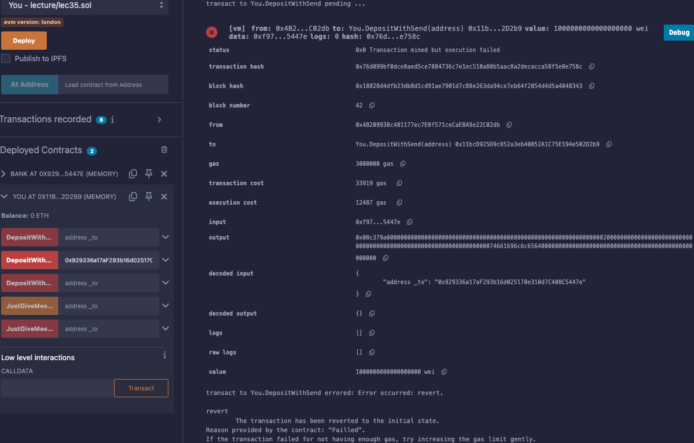

# 35강. fallback / receive 함수

- 솔리디티(Solidity) 0.6 버전 이후, 컨트랙트가 이더를 수신하는 방식을 제어하기 위해 `fallback` 함수와 `receive` 함수가 도입되었다.

## `receive` 함수

---

- 정의: 컨트랙트가 순수하게 이더만 전송받을 때 실행되는 함수
- 특징
    - 이름이 없는 무기명 함수
    - `external`과 `payable` 키워드를 포함해야 한다.
    
    ```solidity
    receive() external payable {
        // 이더를 받았을 때 실행할 코드
    }
    ```
    

## `fallback` 함수

---

- 정의: 호출된 함수가 컨트랙트에 존재하지 않거나, 데이터와 함께 이더가 전송될 때 실행되는 함수
- 특징
    - 이름이 없는 무기명 함수
    - `external` 키워드를 포함해야 한다.
    - 이더를 받을 수 있도록 하려면 `payable` 키워드를 추가해야 한다.
    
    ```solidity
    fallback() external {
        // 존재하지 않는 함수 호출 시 또는 데이터와 함께 이더를 받았을 때 실행할 코드
    }
    
    // 또는 이더를 받을 수 있도록 설정하려면
    fallback() external payable {
        // 이더와 함께 존재하지 않는 함수 호출 시 실행할 코드
    }
    ```
    

## 예제

---

- lec35.sol
    
    ```solidity
    // SPDX-License-Identifier: GPL-3.0
    
    pragma solidity >=0.5.0 < 0.9.0;
    
    /*
    0.6이전의 fallback
    
    fallback 함수는 이름 그대로 대비책 함수다. 
    
    특징 
    1. 먼저 무기명 함수, 이름이 없는 함수입니다.
    2. external 필수 
    3. payable
    
    왜 쓰는가 ?
    1. 스마트 컨트랙이 이더를 받을 수 있게 한다.
    2. 이더 받고난 후 어떠한 행동을 취하게 할 수 있다. 
    3. call함수로 없는 함수가 불려질 때, 어떠한 행동을 취하게 할 수 있다. 
    
    0.6 이전 
    function() external payable {    
    }
    
    0.6 이후 fallback
    fallback은 recevie 와 fallback 으로 두가지 형태로 나뉘게 되었다.
    - receive: 순수하게 이더만 받을 때 작동합니다. 
    - fallback: 함수를 실행하면서 이더를 보낼때, 불려진 함수가 없을 때 작동합니다.
    
    0.6 이후 
    기본형: 불려진 함수가 특정 스마트 컨트랙트에 없을 때 fallback 함수가 발동 합니다. 
    fallback() external {
    }
    
    payable 적용시 : 이더를 받고 나서도 fallaback 함수가 발동합니다. 
    fallback() external payable {
    }
    
    receive() external payable {
    }
    */
    
    contract Bank{
        event JustFallback(address _from,string message);
        event RecevieFallback(address _from,uint256 _value ,string message);
        event JustFallbackWIthFunds(address _from,uint256 _value ,string message);
        //~0.6 
    //   function() external payable {
    //      emit JustFallbackWIthFunds(msg.sender, msg.value,"JustFallback is called");
    //     }
        
        //0.6~
        fallback() external {
            emit JustFallback(msg.sender,"JustFallback is called");
        }
        receive() external payable {
            emit RecevieFallback(msg.sender, msg.value, "RecevieFallback is called");
        }
    
        // fallback() external payable {
        //     emit JustFallbackWIthFunds(msg.sender, msg.value, "JustFallbackWIthFunds is called");
        // }
    }
    
    contract You{
        //receve() 
        function DepositWithSend(address payable _to) public payable{
            bool success = _to.send(msg.value);
            require(success, "Failled" );
        }
        
        function DepositWithTransfer(address payable _to) public payable{
            _to.transfer(msg.value);
        }
        
        function DepositWithCall(address payable _to) public payable{
            // ~ 0.7
            // (bool sent, ) = _to.call.value(msg.value)("");
            // require(sent,"Failed to send either");
            
            // 0.7 ~
            (bool sent, ) = _to.call{value: msg.value}("");
            require(sent, "Failled" );
        }
        
        //fallback()
        function JustGiveMessage(address _to) public{
            // ~ 0.7
            // (bool sent, ) = _to.call("HI");
            // require(sent,"Failed to send either");
            
            // 0.7 ~
            (bool success, ) = _to.call("HI");
            require(success, "Failled" );
        }
        
        //To the fallback() with Funds
        function JustGiveMessageWithFunds(address payable _to) public payable{
            // ~ 0.7
            // (bool sent, ) = _to.call.value(msg.value)("HI");
            // require(sent,"Failed to send either");
            
            //0.7 ~
            (bool success,) = _to.call{value:msg.value}("HI");
            require(success, "Failled" );
        }
    }
    ```
    
    - 실행
        - bank, you 배포, bank로 1이더 DepositWithSend, DepositWithTransfer 클릭하면 에러난다.
            
            
            
        - DepositWithCall 클릭하면 성공한다.
            
            
            
            - `transfer`, `send`는 2300 가스를 써서 이 이벤트를 출력하기 힘들다.
                - RecevieFallback에서 String을 지워주면 가스 소비량이 2300을 넘지 않게되어 `transfer`, `send` 함수가 잘 작동한다.
        - JustGiveMessage 클릭
            
            
            
            - JustFallback is called 문구가 찍힌것을 보아, bank의 HI 메소드가 없어서 fallback 함수가 잘 작동했음을 알 수 있다.
        - fallback 주석 조정 및 재배포 후 1이더 JustGiveMessageWithFunds 클릭
            
            
            
            - _value가 1이더(1000000000000000000)
        - bank 의 1이더 transact 클릭
            
            
            
            - `receive`가 동작하여 bank로 1이더가 전송되었다.
