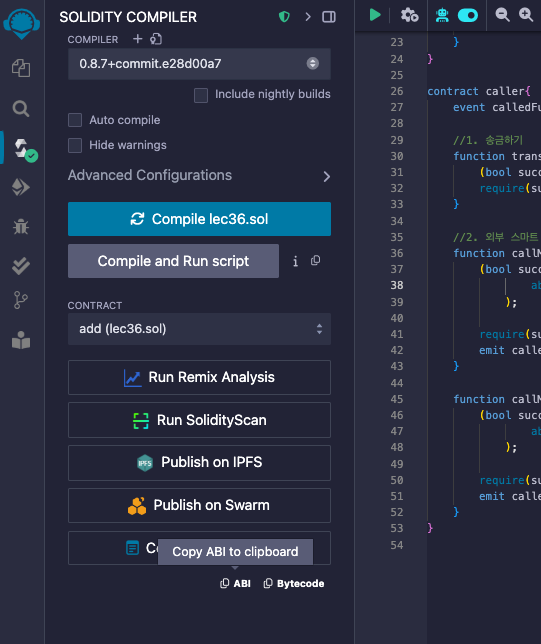

# 36강. call

## `call`

---

- `call`: 단순한 코인 송금 기능 외에도, 스마트 컨트랙트의 주소만 알고 있다면 내부 또는 외부의 다른 컨트랙트의 함수를 호출할 수 있는 강력한 기능을 제공한다.
    - 이러한 호출은 ABI(Application Binary Interface)를 통해 이루어진다.

## ABI(Application Binary Interface)란?

---

- `ABI`: 이더리움 생태계에서 컨트랙트와 상호작용하기 위한 표준 인터페이스
    - 이를 통해 컨트랙트의 함수, 파라미터, 반환값 등의 정보를 정의하고, 외부에서 해당 컨트랙트와 상호작용할 수 있다.
    - 컴파일된 스마트 컨트랙트의 정보를 포함하고 있으며, 이를 활용하여 다른 컨트랙트나 외부 애플리케이션이 해당 컨트랙트의 함수를 호출할 수 있다.

- lec36.sol 의 ABI: 컴파일러 화면에서 볼 수 있다.
    
    
    
    - 내용
        
        ```json
        [
        	{
        		"anonymous": false,
        		"inputs": [
        			{
        				"indexed": false,
        				"internalType": "string",
        				"name": "_str",
        				"type": "string"
        			}
        		],
        		"name": "JustFallback",
        		"type": "event"
        	},
        	{
        		"anonymous": false,
        		"inputs": [
        			{
        				"indexed": false,
        				"internalType": "string",
        				"name": "_str",
        				"type": "string"
        			}
        		],
        		"name": "JustReceive",
        		"type": "event"
        	},
        	{
        		"stateMutability": "payable",
        		"type": "fallback"
        	},
        	{
        		"stateMutability": "payable",
        		"type": "receive"
        	},
        	{
        		"inputs": [
        			{
        				"internalType": "uint256",
        				"name": "_num1",
        				"type": "uint256"
        			},
        			{
        				"internalType": "uint256",
        				"name": "_num2",
        				"type": "uint256"
        			}
        		],
        		"name": "addNumber",
        		"outputs": [
        			{
        				"internalType": "uint256",
        				"name": "",
        				"type": "uint256"
        			}
        		],
        		"stateMutability": "pure",
        		"type": "function"
        	}
        ]
        ```
        

### `encodeWithSignature`

---

- `abi.encodeWithSignature`: 함수 호출을 위한 데이터를 인코딩하는 도구
    - 주어진 함수 시그니처와 해당 인자를 ABI 규격에 맞게 인코딩하여 바이트 배열로 반환한다.
    - 이를 통해 스마트 컨트랙트 내에서 다른 컨트랙트의 함수를 호출할 때 필요한 데이터를 생성할 수 있다.
    
    ❗함수 시그니처 내에서 매개변수 타입 사이에 공백이 없어야 한다.
    

## 예제

---

- lec36.sol
    
    ```solidity
    // SPDX-License-Identifier: GPL-3.0
    pragma solidity >=0.7.0 < 0.9.0;
    
    /*
    call: 로우레벨 함수 
    1. 송금하기
    2. 외부 스마트 컨트랙트 함수 부르기 
    3. 가변적인 gas
    4. 이스탄불 하드포크, 2019년 12월 이후, gas 가격 상승에 따른 call 사용 권장/ send tranfer = 2300gas
    5. re-entrancy(재진입) 공격위험 있기에, Checks_Effects_Interactions_pattern 사용  
    */
    contract add{
        event JustFallback(string _str);
        event JustReceive(string _str);
        function addNumber(uint256 _num1, uint256 _num2) public pure returns(uint256){
            return _num1 + _num2;
        }
        fallback() external payable  {
            emit JustFallback("JustFallback is called");
        }
        receive() external payable {
            emit JustReceive("JustReceive is called");
        }
    }
    
    contract caller{
        event calledFunction(bool _success, bytes _output);
       
        //1. 송금하기 
        function transferEther(address payable _to) public payable{
            (bool success,) = _to.call{value:msg.value}("");
            require(success,"failed to transfer ether");
        }
        
        //2. 외부 스마트 컨트랙트 함수 부르기 
        function callMethod(address _contractAddr,uint256 _num1, uint256 _num2) public{
            (bool success, bytes memory outputFromCalledFunction) = _contractAddr.call(
                    abi.encodeWithSignature("addNumber(uint256,uint256)",_num1,_num2)
                );
                  
            require(success,"failed to transfer ether");
            emit calledFunction(success,outputFromCalledFunction);
        }
        
        function callMethod3(address _contractAddr) public payable{
            (bool success, bytes memory outputFromCalledFunction) = _contractAddr.call{value:msg.value}(
                    abi.encodeWithSignature("Nothing()")
                );
                  
            require(success,"failed to transfer ether");
            emit calledFunction(success,outputFromCalledFunction);
        }
    }
    ```
    
    - 실행
        - add, caller 배포 후 add 주소로 1이더 transferEther 클릭
            
            
            
            - 1 이더가 전송되었다.(account 잔액은 95.999.. 로 줄어들었다)
        - callMethod: 이더 보내지 않고 함수만 호출하므로 `value` 부분이 없다. success는 이 call이 잘 작동했는지 여부, outputFromCalledFunction는 바이트화 된 리턴된 값이다.
            
            
            
            - 3, 2 넣고 호출 시 _output 값이 5임을 알 수 있다.
        -
