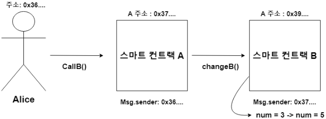

# 37강. call vs delegate call

## Call vs Delegate call

---

- `call`: 한 컨트랙트가 다른 컨트랙트의 함수를 호출할 때, 호출된 컨트랙트의 컨텍스트에서 해당 함수가 실행된다. 이 경우, 호출된 컨트랙트의 상태 변수와 `msg.sender`가 호출 컨트랙트로 설정된다.
    
    
    
    - 스마트 컨트랙트 A의 msg.sender 는 Alice 의 주소
    - 스마트 컨트랙트 B의 msg.sender 는 스마트 컨트랙트 A의 주소
    - 스마트 컨트랙트 B의 num은 5로 변경되고, num=5라는 것은 스마트 컨트랙트 B에 저장된다.
- `delegatecall`: 한 컨트랙트가 다른 컨트랙트의 함수를 자신의 컨텍스트에서 실행하도록 한다.
    - 즉, 호출된 컨트랙트의 코드를 호출하는 컨트랙트의 상태와 `msg.sender`를 유지한 채 실행한다.
    
    
    
    - 스마트 컨트랙트 B의 `msg.sender`는 스마트 컨트랙트 A 주소가 아니라, Alice의 주소다.
    - 스마트 컨트랙트 B의 함수가 불려서, num의 값은 5가 됐지만, 정작 num=5라는 것은 스마트 컨트랙트 A에 저장되어 있고, 스마트 컨트랙트 B의 num의 값은 그대로 3이다.
    
    → 스마트 컨트랙트 B의 함수를 스마트 컨트랙트 A에 옮겨놓은 것처럼 행동한다.
    

### upgradable smart contract framework

---

- 프록시 컨트랙트가 사용자와 상호작용하며, 실제 로직은 별도의 구현 컨트랙트에 위임된다.
- 이러한 구조를 통해 구현 컨트랙트를 교체하여 기능을 업데이트할 수 있으며, 프록시 컨트랙트는 기존의 상태와 주소를 유지하므로 사용자 측에서는 변화가 없다.

- 프록시 패턴의 핵심 요소
    1. 프록시 컨트랙트 (Proxy Contract)
        - 사용자와 직접 상호작용하며, 모든 호출을 구현 컨트랙트로 위임한다.
        - 상태 변수를 유지하며, 구현 컨트랙트의 주소를 저장한다.
        - `fallback` 함수를 통해 `delegatecall`을 사용하여 구현 컨트랙트의 함수를 호출한다.
    2. 구현 컨트랙트 (Implementation Contract)
        - 실제 로직을 포함하며, 프록시 컨트랙트에 의해 호출된다.
        - 상태 변수는 선언하지만, 실제 데이터는 프록시 컨트랙트에 저장된다.
- 프록시 패턴의 작동 방식
    1. 사용자가 프록시 컨트랙트의 함수를 호출한다.
    2. 프록시 컨트랙트의 `fallback` 함수가 호출되며, 이 함수는 `delegatecall`을 사용하여 구현 컨트랙트의 해당 함수를 실행한다.
    3. 구현 컨트랙트의 함수는 프록시 컨트랙트의 컨텍스트에서 실행되므로, 상태 변수의 변경은 프록시 컨트랙트에 반영된다.
- 주의사항
    - 저장소 레이아웃 일치: 프록시 컨트랙트와 구현 컨트랙트의 상태 변수 선언 순서와 타입이 일치해야 한다. 불일치 시 저장소 충돌로 인해 예기치 않은 동작이 발생할 수 있다.
    - 보안 고려사항: `delegatecall`을 사용할 때는 호출 대상 컨트랙트의 신뢰성을 반드시 확인해야 한다. 악의적인 코드가 실행될 경우 프록시 컨트랙트의 상태가 위험에 처할 수 있다.

## 예제

---

- lec37.sol
    
    ```solidity
    // SPDX-License-Identifier: GPL-3.0
    pragma solidity >=0.7.0 < 0.9.0;
    
    /*
    Call vs Delegate call
    Delegate call: 
    1. msg.sender 가 본래의 스마트 컨트랙트 사용자를 나타낸다.
    2. delegate call이 정의된  스마트 컨트랙트(즉 caller)가 외부 컨트랙의 함수들을 마치 자신의 것처럼 사용(실질적인 값도 caller애 저장)
    조건: 외부 스마트 컨트랙트와 caller 스마트 컨트랙트는 같은 변수를 갖고 있어야 한다.   
    
    why? upgradable smart contract 용도 
    */
    contract add {
        uint256 public num = 0;
        event Info(address _addr,uint256 _num);
        
        function plusOne() public {
            num = num + 1;
            emit Info(msg.sender,num);
        }
    }
    
    contract caller {
        uint256 public num = 0;
        function callNow(address _contractAddr) public payable {
            (bool success,) = _contractAddr.call(abi.encodeWithSignature("plusOne()"));
            require(success,"failed to transfer ether");
        }
        function delcateCallNow(address _contractAddr) public payable {
            (bool success,) = _contractAddr.delegatecall(abi.encodeWithSignature("plusOne()"));
            require(success,"failed to transfer ether");
        }
    }
    ```
    
    - 실행
        - add, caller 배포 후 callNow 클릭
            
            
            
            - caller의 num 값은 0, add의 num 값은 1
        - delegateCallNow 클릭 시 add의 num 값이 1 증가한다.
