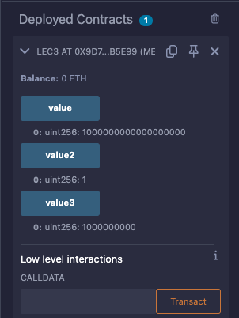

# 3강. gas 와 ether 단위

- 1 ether = 10^9 Gwei = 10^18 wei
- 0.00000000000000001 ehter = 1 wei
- Gwei: 가스를 소비했을 때 사용되는 단위

- 가스비용
    - 사용하고자 하는 스마트 컨트랙트 안에 정의된 코드의길이에 따라 가스 비용이 책정된다.
        - 길이가 짧을수록 소비되는 가스가 적어짐
    - 스마트 컨트랙트 안에 무엇으로 정의 되냐에 따라 가스 소비하는 비용이 달라진다.
        - ex> `string`, `modifer`를 사용하는 경우 가스가 더 들어간다.
    
    → 이더리움에서 제공하는 [옐로우 페이퍼](https://ethereum.github.io/yellowpaper/paper.pdf)를 보면, 사용하는 내장기능에 따라 가스 소비량을 계산할 수 있다.
    

- 가스를 만든 이유: DDoS(Distributed Denial of Service) 공격에서 좀 더 자유로워지기 위해서 만들었다.
    - ex> 해커가 고의적으로 블록체인 네트워크를 다운시키려고 스마트 컨트랙트를 지속적으로 작동하게 반복시켜 과부화를 주고자 할 때, 해커는 반복시킬 때마다 Gas 비용을 지불해야 한다.

## 예제

---

- lec3.sol
    
    ```solidity
    // SPDX-License-Identifier: GPL-3.0
    // SPDX-License-Identifier: MIT
    pragma solidity >= 0.7.0 < 0.9.0;
    
    contract lec3{
    
        //1 ether = 10^9 Gwei = 10^18 wei
        //0.00000000000000001 ehter = 1^-18 = 1wei
        // 0.01 ether = 10^16wei
    
        uint256 public value = 1 ether;
        uint256 public value2 = 1 wei;
        uint256 public value3 = 1 gwei;
    
    }
    ```
    
- 배포 후 클릭
    
    ```solidity
    creation of lec3 pending...
    [vm]from: 0x5B3...eddC4to: lec3.(constructor)value: 0 weidata: 0x608...70033logs: 0hash: 0x375...4cbe8
    status	0x1 Transaction mined and execution succeed
    transaction hash	0x3753cd4d573992e1e97d8fd60e3cdf1c5abf2f082e898276ede2238aef64cbe8
    block hash	0xcbef64fe749831cefd8a64d65708d8509e082510a1d412e798586670a16c6c08
    block number	8
    contract address	0x9D7f74d0C41E726EC95884E0e97Fa6129e3b5E99
    from	0x5B38Da6a701c568545dCfcB03FcB875f56beddC4
    to	lec3.(constructor)
    gas	203471 gas
    transaction cost	176931 gas 
    execution cost	119023 gas 
    input	0x608...70033
    output	0x6080604052348015600f57600080fd5b5060043610603c5760003560e01c80633fa4f2451460415780635d33a27f14605b578063aef52a2c146075575b600080fd5b6047608f565b6040516052919060ae565b60405180910390f35b60616095565b604051606c919060ae565b60405180910390f35b607b609b565b6040516086919060ae565b60405180910390f35b60005481565b60015481565b60025481565b60a88160c7565b82525050565b600060208201905060c1600083018460a1565b92915050565b600081905091905056fea26469706673582212207507b2bf04a974492cb19b2396a0c4a036ec50d60ec48a68f252e8ee0c9bcdb564736f6c63430008070033
    decoded input	{}
    decoded output	 - 
    logs	[]
    raw logs	[]
    
    call to lec3.value
    [call]from: 0x5B38Da6a701c568545dCfcB03FcB875f56beddC4to: lec3.value()data: 0x3fa...4f245
    from	0x5B38Da6a701c568545dCfcB03FcB875f56beddC4
    to	lec3.value() 0x9D7f74d0C41E726EC95884E0e97Fa6129e3b5E99
    execution cost	2407 gas (Cost only applies when called by a contract)
    input	0x3fa...4f245
    output	0x0000000000000000000000000000000000000000000000000de0b6b3a7640000
    decoded input	{}
    decoded output	{
    	"0": "uint256: 1000000000000000000"
    }
    logs	[]
    raw logs	[]
    ```
    
    
