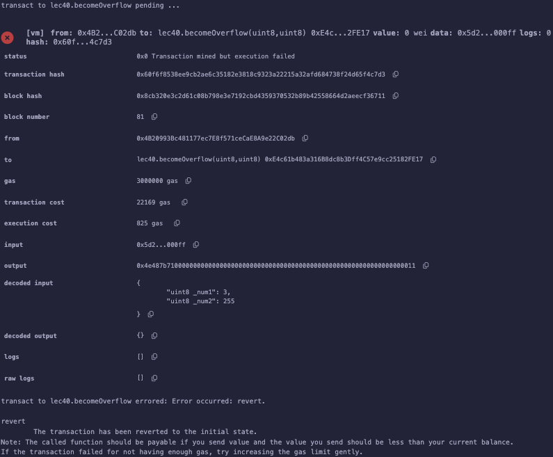

# 40강. library 라이브러리

## library

---

- 라이브러리(`library`): 스마트 컨트랙트와 유사하지만, 특정 기능을 모듈화하여 재사용할 수 있도록 설계된 특별한 형태의 컨트랙트다.
    - 코드의 중복을 줄이고, 가스 비용을 절감하며, 코드의 가독성과 유지보수성을 향상시킬 수 있다.

### 특징

---

1. 재사용성: 라이브러리는 블록체인에 배포된 후 다른 스마트 컨트랙트에서 호출하여 사용할 수 있으므로, 동일한 기능을 여러 번 구현할 필요가 없다.
2. 가스 비용 절감: 공통으로 사용되는 코드를 라이브러리로 분리하여 배포하면, 각 스마트 컨트랙트에 해당 코드를 포함시키는 것보다 가스 비용을 절감할 수 있다. 이는 스마트 컨트랙트의 크기가 가스 비용에 직접적인 영향을 미치기 때문이다.
3. 데이터 타입에 대한 적용: 라이브러리는 특정 데이터 타입에 대한 함수를 정의하고, 이를 해당 데이터 타입에 직접 적용할 수 있다. 이를 통해 코드의 가독성과 사용성을 높일 수 있다.

### 제한사항

---

1. Fallback 함수 정의 불가: 라이브러리 내에서는 `fallback` 함수를 정의할 수 없으며, 따라서 이더를 직접 수신하거나 보유할 수 없다.
2. 상속 불가: 라이브러리는 다른 컨트랙트로부터 상속을 받거나, 다른 컨트랙트를 상속할 수 없다.
3. Payable 함수 정의 불가: 라이브러리 내에서는 `payable` 함수를 정의할 수 없다.

## 예제

---

- lec40.sol
    
    ```solidity
    // SPDX-License-Identifier: GPL-3.0
    pragma solidity >=0.7.0 < 0.9.0;
    
    /*
    library: 기존에 만들던 스마트 컨트랙과 다른 종류의 스마트 컨트랙트라 할 수 있다. 
    라이브러리를 사용함으로써 몇가지 이점과 제한사항이 있다.
    
    이점
    1. 재사용: 블록체인에 라이브러리가 배포되면, 다른 스마트 컨트랙트들에 적용 가능.
    2. 가스 소비 줄임: 라이브러리는 재사용 가능한 코드, 즉 여러 스마트 컨트랙트에서 공통으로 쓰이는 코드를 따로 라이브러리 통해서 배포하기에,
    다른 스마트 컨트랙트에 명시를 해주는 것이 아니라, 라이브러리를 적용만 하면 되기에 가스 소비량을 줄일 수 있다.
    왜냐하면, 가스는 스마트 컨트랙트의 사이즈/길이에 영향을 많이 받기 때문이다.
    3. 데이터 타입 적용: 라이브러리의 기능들은 데이터 타입에 적용할 수 있기에, 좀 더 쉽게 사용할 수 있다.
    
    제한사항
    1. fallback 함수 불가: fallback 함수를 라이브러리 안에 정의를 못 하기에, 이더를 갖고 있을 수 없다.
    2. 상속 불가
    3. payable 함수 정의 불가 
    */
    //0.8 -> overflow revert
    // overflow: 0~255 -> 256 -> 0
    library SafeMath{
        //0~255;
        function add(uint8 a, uint8 b) internal pure returns (uint8) {
            require(a+b >= a , "SafeMath: addition overflow");
            return a + b;
        }
    }
    
    contract lec40{
        using SafeMath for uint8;
        uint8 public a; 
        
        function becomeOverflow(uint8 _num1,uint8 _num2) public  {
            // a = _num1.add(_num2);
            a = SafeMath.add(_num1 ,_num2);
        } 
    }
    
    ```
    
    - 솔리디티 0.8버전 이후부터는 overflow revert 에러가 발생한다.
        
        
